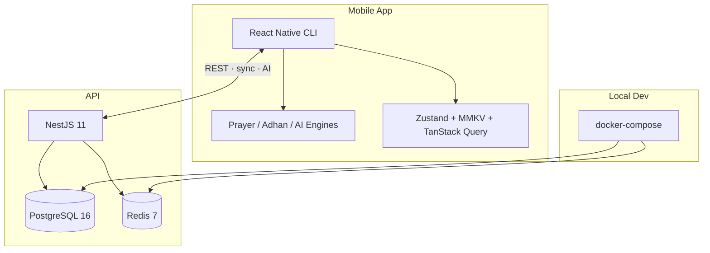

# AhlulBayt+

A Shia Ithna Ashari Islamic super app — prayer times, Quran, duas, ziyarat, Mafatih al-Jinan, calendar, AI guidance, and more — with offline-first worship and a NestJS backend.

**Monorepo layout:** `mobile/` (React Native app) · `api/` (NestJS REST API) · `docs/` (architecture & design)

---

## Table of Contents

- [Architecture](#architecture)
- [Repository Structure](#repository-structure)
- [Tech Stack](#tech-stack)
- [Features](#features)
- [Recent Development](#recent-development)
- [Getting Started](#getting-started)
- [Documentation](#documentation)
- [Environment & Secrets](#environment--secrets)
- [Mobile feature flags](#mobile-feature-flags)

---

## Architecture



### Design principles

1. **Offline-first worship** — Prayer times, Quran, duas, and ziyarat work without network after initial setup.
2. **On-device prayer engine** — Jafari method (Leva / Tehran / custom), high-latitude rules, manual offsets, astronomical sunset separate from Maghrib (+17 min red shafaq default).
3. **Scholarly guardrails** — AI is educational only; citations required; no fatwa issuance.
4. **Privacy by default** — Location used for prayer/qibla on device; optional sync to server.
5. **Single monorepo** — One git repository for mobile, API, and docs (no nested `mobile/.git`).

For full enterprise architecture (C4, NFRs, CI/CD, security), see [`docs/architecture/ARCHITECTURE.md`](docs/architecture/ARCHITECTURE.md).

---

## Repository Structure

```
AhlulBayt+/
├── mobile/                 # React Native CLI app (iOS + Android)
│   ├── android/            # Native Android project
│   ├── ios/                # Native iOS project
│   ├── assets/             # Images, fonts, adhan sounds
│   ├── scripts/            # Build helpers (e.g. sync-adhan-sounds)
│   └── src/
│       ├── core/           # API client, prayer engine, storage, analytics
│       ├── features/       # Feature modules (prayer, quran, ai, …)
│       ├── navigation/     # React Navigation (tabs + root stack)
│       ├── components/ui/  # Shared UI primitives
│       ├── theme/          # Design tokens
│       └── i18n/           # en · ar · ur (RTL)
├── api/                    # NestJS REST API
│   ├── src/                # Modules: auth, prayer, quran, ai, admin, …
│   ├── drizzle/            # SQL migrations & seeds
│   └── scripts/
├── docs/
│   ├── architecture/       # System design, engines, DB, notifications
│   └── design/             # Design system, screens, tokens
├── docker-compose.yml      # Postgres + Redis for local API dev
└── .gitignore              # Ignores node_modules, dist, builds, .env
```

### Mobile feature modules

| Module | Purpose |
|--------|---------|
| `prayer` | Prayer times screen, live countdown, completion tracking |
| `adhan` | Adhan scheduling, bundled voices, Notifee notifications |
| `quran` | Surah reader, audio player, search |
| `dua` / `ziyarat` / `sahifa` / `nahjul` | Worship content readers |
| `mafatih` | Mafatih al-Jinan hub + reader |
| `ai` | Ask AhlulBayt assistant (local + remote) |
| `calendar` | Islamic calendar & observances |
| `home` | Dashboard widgets (next prayer, weather, recommendations) |
| `auth` | Email, OAuth, guest sessions (incl. offline guest) |
| `settings` | Locale, marja, prayer method, notifications |
| `monetization` | Subscriptions & paywall |
| `notifications` | Local notification engine |

### API modules

| Module | Purpose |
|--------|---------|
| `auth` | JWT, OTP, Google/Apple OAuth |
| `prayer` | Server-side validation & config |
| `quran` / `duas` / `ziyarat` | Content catalogs & search |
| `ai` | AI chat (premium) |
| `calendar` | Events & observances |
| `sync` | Offline sync payloads |
| `subscriptions` | IAP entitlements & webhooks |
| `analytics` | Event ingest & rollups |
| `admin` | Content, users, notifications, audit |

---

## Tech Stack

| Layer | Technology |
|-------|------------|
| Mobile | React Native 0.85, React 19, TypeScript |
| Navigation | React Navigation 7 (tabs + native stack) |
| State | Zustand + MMKV persistence, TanStack Query |
| Notifications | Notifee (local adhan & reminders) |
| i18n | i18next — English, Arabic, Urdu (RTL) |
| Backend | NestJS 11, Drizzle ORM |
| Database | PostgreSQL 16 |
| Cache | Redis 7 |
| Local infra | Docker Compose (`postgres`, `redis`) |

---

## Features

### Prayer & Adhan

- Jafari prayer engine with imsak, fajr, sunrise, dhuhr, asr, **sunset**, maghrib (+ shafaq delay), isha, midnight
- Live `HH:MM:SS` countdown on Home and Prayer screens
- Prayer completion checkboxes (5 daily prayers)
- Adhan notifications with bundled sound (`assets/sounds/adhan/`) synced to Android `res/raw/` and iOS Xcode project via `npm run sync:adhan-sounds`

### Ask AhlulBayt (AI)

- Chat UI with streaming responses, suggested prompts, citation cards
- Local response engine (duas, ziyarat, prayer, calendar, FAQ) + optional remote API for premium users
- **Tappable source cards** — e.g. Mafatih al-Jinan opens the Mafatih hub
- Educational disclaimer; no fatwa

### Home & UI

- Safe-area aware screens, compact dashboard header
- Next prayer widget with timeline and live countdown
- Redesigned Prayer and Ask screens

### Auth

- Guest mode works offline (local guest session when API unavailable)
- Google / Apple / email + OTP flows

---

## Recent Development

Work completed through June 2026:

| Area | Changes |
|------|---------|
| **Monorepo** | Unified root git repo; removed nested `mobile/.git`; root + mobile `.gitignore` (excludes `node_modules`, `dist`, Android/iOS builds) |
| **Guest auth** | Offline “Continue as guest” via local session store |
| **Crash fix** | Raw text node in `AppProviders` (whitespace between JSX children) |
| **Adhan sound** | `azan.wav` registry, sync script, Android/iOS native bundling |
| **Prayer screen** | UI redesign, sunset row, fixed completion re-render, `HH:MM:SS` countdown |
| **Home screen** | Safe area, header spacing, next-prayer widget |
| **Ask screen** | Fixed bottom spacing, send button (paper-plane icon), tappable citation cards |
| **i18n** | Sunset + tap-to-open strings in en / ar / ur |

---

## Getting Started

### Prerequisites

- Node.js 20+
- Docker Desktop (for API database)
- Android Studio and/or Xcode (for mobile)
- CocoaPods (macOS, iOS)

### 1. Infrastructure

```bash
docker compose up -d
```

Starts PostgreSQL (`localhost:5432`) and Redis (`localhost:6379`).

### 2. API

```bash
cd api
cp .env.example .env
npm install
npm run db:migrate    # apply Drizzle migrations
npm run start:dev
```

### 3. Mobile

```bash
cd mobile
cp .env.example .env
npm install
npm run sync:adhan-sounds   # copy adhan wav to native projects
cd ios && pod install && cd ..   # macOS only
npm start
npm run android   # or npm run ios
```

Configure `API_BASE_URL` in `mobile/.env` to point at your local API.

### Useful scripts

| Command | Where | Description |
|---------|-------|-------------|
| `npm run typecheck` | `mobile/`, `api/` | TypeScript check |
| `npm run sync:adhan-sounds` | `mobile/` | Sync adhan assets to native projects |
| `npm run build` | `api/` | Compile NestJS to `dist/` |
| `npm run db:migrate` | `api/` | Run database migrations |

---

## Documentation

| Document | Description |
|----------|-------------|
| [`docs/architecture/README.md`](docs/architecture/README.md) | Architecture index |
| [`docs/architecture/ARCHITECTURE.md`](docs/architecture/ARCHITECTURE.md) | Full system architecture |
| [`docs/architecture/PRAYER_ENGINE.md`](docs/architecture/PRAYER_ENGINE.md) | Prayer calculation |
| [`docs/architecture/AI_ASSISTANT.md`](docs/architecture/AI_ASSISTANT.md) | AI assistant design |
| [`docs/architecture/ADHAN_NOTIFICATIONS.md`](docs/architecture/ADHAN_NOTIFICATIONS.md) | Adhan & notifications |
| [`docs/design/DESIGN_SYSTEM.md`](docs/design/DESIGN_SYSTEM.md) | UI tokens & components |
| [`mobile/README.md`](mobile/README.md) | Mobile-specific setup |

---

## Environment & Secrets

- Copy `.env.example` → `.env` in both `api/` and `mobile/`
- **Never commit** `.env`, keystores, or signing keys (covered by `.gitignore`)
- `api/.env.example` and `mobile/.env.example` are tracked as templates

---

## Mobile feature flags

Some mobile behaviour is controlled by **compile-time flags** in TypeScript (not `.env`). Change the file, rebuild the app, and you’re done.

| Flag | File | Current | When `false` |
|------|------|---------|----------------|
| **`SUBSCRIPTIONS_ENABLED`** | `mobile/src/features/monetization/config.ts` | `false` | No paywall UI (Settings upgrade card, More → Premium, paywall gates). Hadith **AI Summary** tab hidden. All entitlements treated as granted so nothing is paywall-blocked. Subscription bootstrap skipped. |
| **`NATIVE_AUDIO_ENABLED`** | `mobile/nativeAudio.config.js` (also `src/features/quran/audio/config.ts`) | `false` | Metro redirects `react-native-track-player` to a JS mock (no native crash). Audio hooks use stubs; Nahjul/Dua/Ziyarat audio bars hidden. |

**To launch subscriptions later:** set `SUBSCRIPTIONS_ENABLED = true` in `monetization/config.ts`, then rebuild.

**To re-enable native audio later:** set `NATIVE_AUDIO_ENABLED: true` in `mobile/nativeAudio.config.js`, restart Metro with cache reset (`npm start -- --reset-cache`), switch hooks to `*Native` exports, and rebuild.

After changing Metro config or feature flags, run:

```bash
cd mobile
npm start -- --reset-cache
```

Details: [`mobile/README.md`](mobile/README.md#feature-flags).

---

## License

See [`mobile/LICENSE`](mobile/LICENSE) for mobile app licensing. API is private (`"private": true` in `package.json`).

---

*AhlulBayt+ — worship, knowledge, and community for the followers of Ahlul Bayt (as).*
