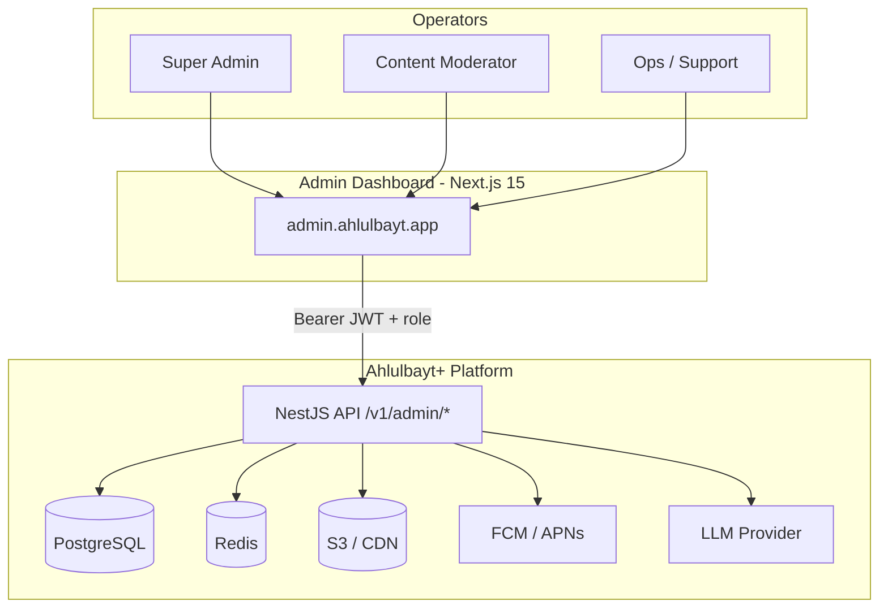
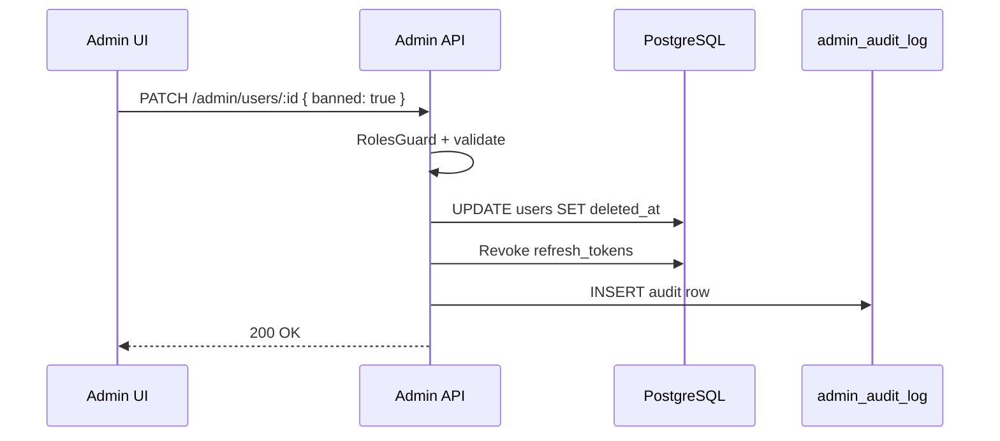
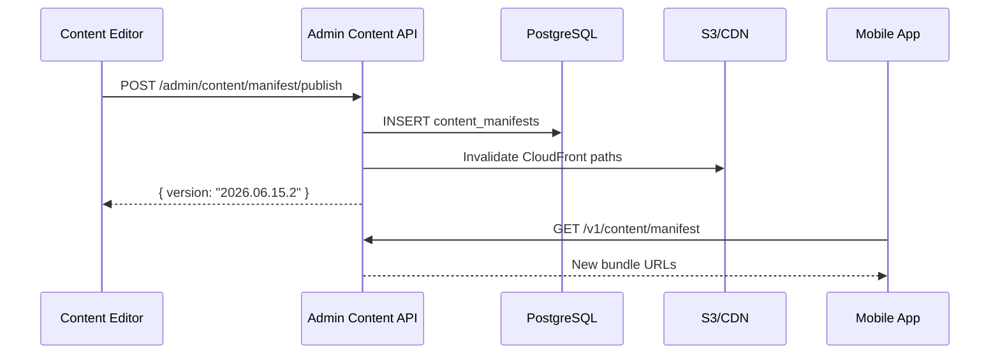

# AhlulBayt+ Super Admin Dashboard — Architecture

**Classification:** Internal — Platform Engineering  
**Version:** 1.0 · June 2026  
**Companion:** [BACKEND.md](./BACKEND.md) · [POSTGRES_DESIGN.md](./POSTGRES_DESIGN.md)

---

## 1. Overview

The Super Admin Dashboard is an **internal web console** for platform operators to manage users, monitor analytics, send broadcast notifications, curate worship content, and control AI behavior. It is **not** part of the mobile app — it runs as a separate deployable (`admin.ahlulbayt.app`) backed by privileged API routes (`/v1/admin/*`).

### Design principles

| Principle | Implementation |
|-----------|----------------|
| Least privilege | RBAC: `moderator` < `admin` < `super_admin` |
| Audit everything | Append-only `admin_audit_log` on every mutating action |
| Separate surface | Admin JWT uses same issuer but requires `role ∈ {admin, super_admin}` |
| No mobile exposure | Admin routes blocked at WAF; not in mobile API client |
| Read-heavy analytics | Redis cache + read replica for dashboard queries |

---

## 2. System Context



---

## 3. Container Architecture

```
┌─────────────────────────────────────────────────────────────────┐
│  admin/                    Next.js 15 App Router                │
│  ├── app/(auth)/login      Admin SSO / email+OTP                │
│  ├── app/(dashboard)/      Shell layout + nav                   │
│  │   ├── users/            User search, tier, ban, impersonate   │
│  │   ├── analytics/        MAU, retention, feature usage        │
│  │   ├── notifications/   Broadcast + segment push              │
│  │   ├── content/          Manifest, duas, calendar, bundles     │
│  │   └── ai/               Rate limits, prompts, RAG corpus     │
│  └── lib/api/              Typed client → /v1/admin/*          │
└─────────────────────────────────────────────────────────────────┘
                              │
                              ▼
┌─────────────────────────────────────────────────────────────────┐
│  api/src/admin/            NestJS AdminModule                   │
│  ├── guards/roles.guard    JWT + role check                     │
│  ├── audit/                AdminAuditService                    │
│  ├── users/                CRUD, tier override, soft-delete     │
│  ├── analytics/            Aggregates from analytics_events     │
│  ├── notifications/        Broadcast jobs, segment filters      │
│  ├── content/            Manifest publish, catalog CRUD         │
│  └── ai/                   Config, rate limits, knowledge chunks│
└─────────────────────────────────────────────────────────────────┘
```

---

## 4. RBAC Matrix

| Action | moderator | admin | super_admin |
|--------|:---------:|:-----:|:-----------:|
| View users (read-only) | ✓ | ✓ | ✓ |
| Edit user tier / ban | — | ✓ | ✓ |
| Delete user (GDPR) | — | — | ✓ |
| View analytics | ✓ | ✓ | ✓ |
| Export analytics CSV | — | ✓ | ✓ |
| Send broadcast notification | — | ✓ | ✓ |
| Edit content catalog | ✓ | ✓ | ✓ |
| Publish content manifest | — | ✓ | ✓ |
| Purge CDN bundle | — | — | ✓ |
| View AI conversations | — | ✓ | ✓ |
| Edit AI config / prompts | — | — | ✓ |
| Manage admin users | — | — | ✓ |

Roles stored on `users.role`. Promotion to `admin` requires existing `super_admin`.

---

## 5. Feature Modules

### 5.1 Users

**Purpose:** Support, abuse response, subscription disputes, GDPR.

| Capability | API | Data |
|------------|-----|------|
| Search / filter | `GET /v1/admin/users?q=&tier=&role=` | `users` |
| User detail | `GET /v1/admin/users/:id` | users + preferences + subscriptions + devices |
| Update tier/role | `PATCH /v1/admin/users/:id` | `users.tier`, `users.role` |
| Soft-delete | `DELETE /v1/admin/users/:id` | `users.deleted_at` |
| Subscription history | `GET /v1/admin/users/:id/subscriptions` | `subscriptions`, `subscription_events` |

**UI screens:** User list (DataTable) · User detail drawer · Ban/tier actions with confirm modal.

### 5.2 Analytics

**Purpose:** Product health, feature adoption, monetization funnel.

| Metric | Source | Refresh |
|--------|--------|---------|
| DAU / MAU | `analytics_events` | 5 min cache |
| Signups / guests | `users.created_at` | Real-time |
| Premium conversion | `subscriptions` | 15 min |
| Feature usage | `event_name` aggregates | Hourly rollups |
| AI query volume | `ai_messages` + `ai_rate_limits` | 5 min |
| Sync volume | `sync_changelog` row count | Daily |

| API | Description |
|-----|-------------|
| `GET /v1/admin/analytics/overview` | KPI cards |
| `GET /v1/admin/analytics/events?from=&to=` | Time-series |
| `GET /v1/admin/analytics/features` | Top events by name |

**Future:** Materialized views `analytics_daily_rollups` for fast charts.

### 5.3 Notifications

**Purpose:** Platform broadcasts (Eid, Muharram, app updates) — not per-user prayer adhan.

| Capability | API | Flow |
|------------|-----|------|
| List campaigns | `GET /v1/admin/notifications/campaigns` | |
| Create draft | `POST /v1/admin/notifications/campaigns` | Segment JSON |
| Schedule send | `POST /v1/admin/notifications/campaigns/:id/send` | BullMQ → FCM |
| Preview segment | `POST /v1/admin/notifications/preview` | Count matching devices |

**Segments:** `{ locale, tier, platform, timezone, muharram_mode }`  
**Data:** New table `notification_campaigns` (phase 2 migration).

### 5.4 Content Management

**Purpose:** Curate catalogs without redeploying mobile app.

| Capability | API | Notes |
|------------|-----|-------|
| List duas / ziyarat / calendar | `GET /v1/admin/content/:domain` | Paginated |
| CRUD catalog entry | `POST/PATCH/DELETE /v1/admin/content/:domain/:id` | Requires migration 0003 |
| Manifest editor | `GET/POST /v1/admin/content/manifest` | Version bump → CDN invalidation |
| Bundle upload | `POST /v1/admin/content/bundles` | Presigned S3 URL |
| Publish | `POST /v1/admin/content/manifest/publish` | Bumps `content_manifests.version` |

**Workflow:**

```
Editor saves draft → Staging manifest → Review → Publish → CloudFront invalidation
                                                      → Mobile pulls on next sync
```

### 5.5 AI Controls

**Purpose:** Safety, cost control, RAG corpus management.

| Capability | API | Config |
|------------|-----|--------|
| Global config | `GET/PATCH /v1/admin/ai/config` | provider, model, max_tokens |
| Rate limits | `GET /v1/admin/ai/rate-limits` | Per-tier daily caps |
| Blocked patterns | `GET/PUT /v1/admin/ai/guardrails` | Regex list in Redis |
| Conversation audit | `GET /v1/admin/ai/conversations` | Paginated, PII-redacted |
| Knowledge chunks | `GET/POST/DELETE /v1/admin/ai/knowledge` | pgvector RAG corpus |
| Reindex embeddings | `POST /v1/admin/ai/knowledge/reindex` | Background job |

**Kill switch:** `AI_ENABLED=false` env → all `/v1/ai/chat` returns 503 with local-only hint.

---

## 6. API Surface (`/v1/admin/*`)

All routes require `Authorization: Bearer <JWT>` and `role ∈ {admin, super_admin}` unless noted.

### Users
```
GET    /v1/admin/users
GET    /v1/admin/users/:id
PATCH  /v1/admin/users/:id          # admin+
DELETE /v1/admin/users/:id          # super_admin only
GET    /v1/admin/users/:id/subscriptions
```

### Analytics
```
GET    /v1/admin/analytics/overview
GET    /v1/admin/analytics/events
GET    /v1/admin/analytics/features
```

### Notifications
```
GET    /v1/admin/notifications/campaigns
POST   /v1/admin/notifications/campaigns
POST   /v1/admin/notifications/campaigns/:id/send
POST   /v1/admin/notifications/preview
```

### Content
```
GET    /v1/admin/content/manifest
POST   /v1/admin/content/manifest/publish
GET    /v1/admin/content/:domain
POST   /v1/admin/content/:domain
PATCH  /v1/admin/content/:domain/:id
DELETE /v1/admin/content/:domain/:id
```

### AI
```
GET    /v1/admin/ai/config
PATCH  /v1/admin/ai/config          # super_admin
GET    /v1/admin/ai/conversations
GET    /v1/admin/ai/rate-limits
GET    /v1/admin/ai/guardrails
PUT    /v1/admin/ai/guardrails      # super_admin
GET    /v1/admin/ai/knowledge
POST   /v1/admin/ai/knowledge
DELETE /v1/admin/ai/knowledge/:id
```

### Audit
```
GET    /v1/admin/audit              # super_admin — own audit trail
```

---

## 7. Security

### Authentication

1. Admin users are regular `users` rows with `role = admin | super_admin`
2. Same JWT flow as mobile; dashboard stores tokens in **httpOnly cookies** (not localStorage)
3. Optional: Google Workspace SSO restricted to `@ahlulbayt.app` domain

### Network

- Admin dashboard hosted on separate subdomain
- WAF rule: `/v1/admin/*` only from admin VPC + office IP allowlist
- Rate limit: 30 req/min per admin user (stricter than mobile)

### Audit log

Every mutating admin action writes to `admin_audit_log`:

```sql
CREATE TABLE admin_audit_log (
    id          BIGSERIAL PRIMARY KEY,
    actor_id    UUID NOT NULL REFERENCES users(id),
    action      VARCHAR(50) NOT NULL,   -- user.ban, manifest.publish
    target_type VARCHAR(30),
    target_id   VARCHAR(100),
    payload     JSONB,
    ip_address  INET,
    created_at  TIMESTAMPTZ NOT NULL DEFAULT NOW()
);
```

Retention: 2 years (compliance).

### Sensitive operations

| Operation | Extra guard |
|-----------|-------------|
| User hard-delete | super_admin + 2FA (future) |
| Manifest publish | admin + audit + Slack webhook |
| AI guardrails change | super_admin + audit |
| Role promotion | super_admin only |

---

## 8. Frontend Stack (Recommended)

| Layer | Choice | Rationale |
|-------|--------|-----------|
| Framework | Next.js 15 App Router | SSR for auth, API routes as BFF optional |
| UI | shadcn/ui + Tailwind | Data tables, forms, charts |
| Charts | Recharts or Tremor | Analytics dashboards |
| Tables | TanStack Table | User/content lists |
| Forms | React Hook Form + Zod | Matches mobile patterns |
| Auth | NextAuth or custom cookie | httpOnly JWT from `/v1/auth/login` |
| State | TanStack Query | Server state for admin API |

### Layout wireframe

```
┌──────────────────────────────────────────────────────────┐
│  ☪ AhlulBayt+ Admin          [Search]    Admin ▾  Logout │
├────────────┬─────────────────────────────────────────────┤
│  Dashboard │  Overview KPIs                              │
│  Users     │  ┌─────┐ ┌─────┐ ┌─────┐ ┌─────┐           │
│  Analytics │  │ MAU │ │ DAU │ │ Prem│ │ AI  │           │
│  Notifs    │  └─────┘ └─────┘ └─────┘ └─────┘           │
│  Content   │  [Chart: signups 30d]                       │
│  AI        │  [Chart: feature usage]                     │
│  Audit     │                                             │
└────────────┴─────────────────────────────────────────────┘
```

---

## 9. Data Flow Diagrams

### User ban flow



### Manifest publish flow



---

## 10. Deployment

```
┌─────────────────┐     ┌─────────────────┐
│  Vercel / ECS   │     │  ECS Fargate    │
│  admin web      │────►│  NestJS API     │
│  (Next.js)      │     │  (same cluster) │
└─────────────────┘     └────────┬────────┘
                                 │
                    ┌────────────┼────────────┐
                    ▼            ▼            ▼
                 Aurora       Redis         S3
```

| Env | Admin URL | Notes |
|-----|-----------|-------|
| dev | `localhost:3001` | `MONETIZATION_DEV_MODE`, mock analytics |
| staging | `admin-staging.ahlulbayt.app` | Synthetic data only |
| prod | `admin.ahlulbayt.app` | IP allowlist + MFA |

---

## 11. Implementation Phases

| Phase | Scope | Status |
|-------|-------|--------|
| **P0** | Architecture doc + Admin API scaffold + audit log | This doc + `api/src/admin/` |
| **P1** | Next.js dashboard shell + Users + Analytics pages | |
| **P2** | Notification campaigns + BullMQ worker | |
| **P3** | Content CMS (DB-backed catalogs) + manifest publisher | |
| **P4** | AI admin (guardrails UI, RAG upload, conversation audit) | |
| **P5** | SSO, 2FA, IP allowlist, Slack alerts | |

---

## 12. File Map (Implemented — P0)

```
api/src/admin/
├── admin.module.ts
├── guards/roles.guard.ts
├── decorators/roles.decorator.ts
├── audit/admin-audit.service.ts
├── users/admin-users.controller.ts
├── users/admin-users.service.ts
├── analytics/admin-analytics.controller.ts
├── analytics/admin-analytics.service.ts
├── notifications/admin-notifications.controller.ts
├── notifications/admin-notifications.service.ts
├── content/admin-content.controller.ts
├── content/admin-content.service.ts
├── ai/admin-ai.controller.ts
└── ai/admin-ai.service.ts

api/drizzle/migrations/0009_admin.sql
docs/architecture/ADMIN_DASHBOARD.md
```

---

*Document owner: Platform Architecture · Version 1.0 · June 2026*
