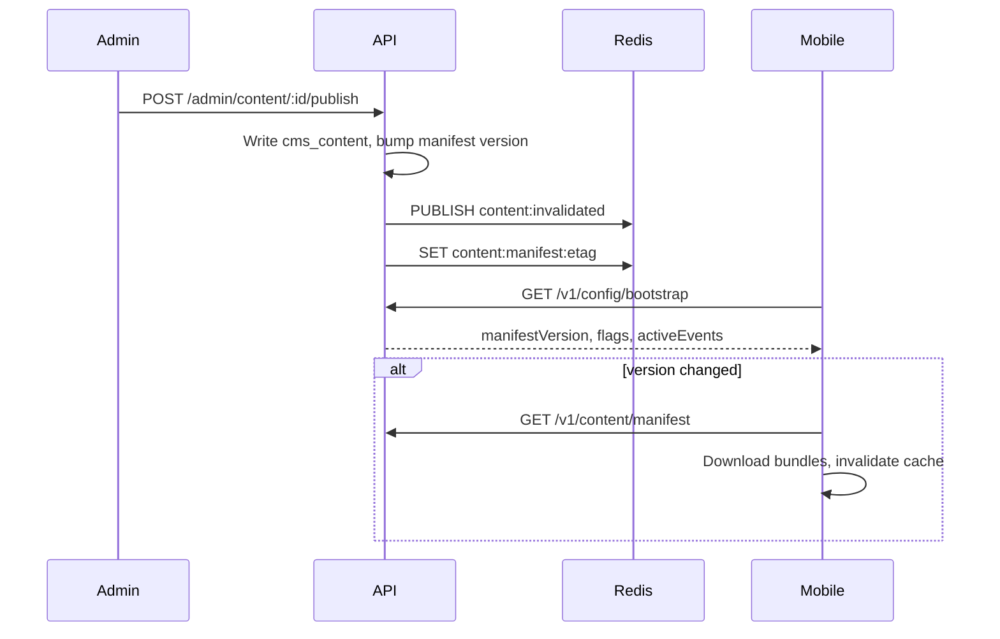
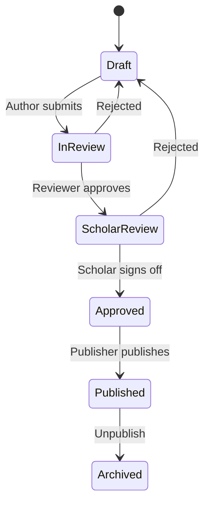

# Admin Platform Rebuild
## Enterprise Control Center — Audit, Architecture & Roadmap

---

## Executive summary

The admin dashboard (`admin/`) is a **Phase 1 read-only shell**. The API (`api/`) has forward-looking schema and partial services. The mobile app (`mobile/`) is **offline-first** with bundled TypeScript catalogs. **Admin changes do not reach the mobile app today.**

This document defines the rebuild: Postgres as source of truth, manifest-based offline sync, scholar-gated CMS, and realtime invalidation so publish → mobile visibility within seconds.

---

## 1. Dashboard audit (current state)

| Module | Route | Status | Notes |
|--------|-------|--------|-------|
| Overview | `/dashboard` | PARTIAL | KPIs live; charts broken (shape mismatch → placeholder data) |
| Users | `/users` | PARTIAL | Read-only; API supports search/PATCH/DELETE |
| Analytics | `/analytics` | PARTIAL | Overview only; retention/prayer endpoints unused |
| Screen Analytics | `/analytics/screens` | PARTIAL | PostHog embed when env configured |
| Notifications | `/notifications` | PARTIAL | List only; create disabled; send is stub |
| CMS | `/cms` | STUB | No API calls |
| Guides | `/guides` | STUB | API returns `{ status: 'stub' }` |
| Islamic Events | `/events` | PARTIAL | Read-only `islamic_events` |
| Media | `/media` | PARTIAL | List only; upload disabled |
| Feature Flags | `/flags` | PARTIAL | Read-only; no write API |
| AI Center | `/ai` | STUB | API exists; UI unwired |
| Platform Health | `/health` | PARTIAL | API/Postgres real; Redis/R2/FCM/PostHog stub |
| API Logs | `/logs` | MISSING | Nav 404; controller files missing in API |
| Security | `/security` | PARTIAL | Events list; overview stub |
| Audit | `/audit` | PARTIAL | Read-only |
| Settings / RBAC | `/settings`, `/settings/rbac` | PARTIAL | Matrix display; no mutations |

**Cross-cutting:** silent error handling on all pages; no `loading.tsx` / `error.tsx`; cookie-only middleware (no JWT expiry check); read-only API client.

---

## 2. Missing features (prioritized)

### P0 — Blockers

- `cms_content` CRUD + publish API (table exists, zero service usage)
- Mobile manifest consumption (duas/ziyarat downloaded but repositories ignore them)
- `GET /v1/flags` + mobile bootstrap
- FCM device registration (`POST /v1/notifications/devices` never called from mobile)
- `AdminLogsController` / `AdminLogsService` (imported, files missing)
- Scholar review workflow
- Real notification delivery worker

### P1 — Core CMS

- Guide step editor (ar/en/ur, media, reorder)
- Islamic events CRUD + unify with public calendar API
- Media upload (R2 presign), versioning
- Feature flag write + rollout evaluation
- Notification templates, scheduling, delivery tracking
- Admin write UIs + token refresh

### P2 — Enterprise ops

- Analytics funnels wired to existing endpoints
- API request log middleware + `/logs` page
- DB-backed RBAC (`PermissionsGuard` on all routes)
- Health probes (Redis, R2, FCM)
- Campaign A/B testing

### P3 — Scale

- Admin invites + MFA
- Localization workflow
- Analytics export
- Collaborative editing

---

## 3. Broken features

| Issue | Location | Impact |
|-------|----------|--------|
| Chart data shape mismatch | `dashboard/page.tsx` ↔ `ChartPlaceholder` | Real chart data never renders |
| `/logs` route missing | `sidebar.tsx` | 404 |
| Expired JWT | `middleware.ts` | Silent empty states |
| AdminLogs import | `admin.module.ts` | Build may fail |
| Manifest publish stub | `admin-content.service.ts` | Mobile manifest unchanged |
| Campaign send stub | `admin-notifications.service.ts` | No push delivery |
| Dual event pipelines | `islamic_events` vs `shiaEvents.ts` | Admin edits invisible |
| RBAC mismatch | Audit vs matrix permissions | Inconsistent access |

---

## 4. Information architecture (target)

```
Overview          Live KPIs, alerts, recent activity
Users             List, search, tiers, segments, support
Analytics         Engagement, retention, funnels, screens
Notifications     Campaigns, templates, schedules, A/B, stats
Content           Quran meta, Hadith, Duas, Ziyarat, Amaal, Events
Guides            Prayer, Wudu, Ghusl, Learning (step editor)
Islamic Events    Seasonal engines (Muharram, Ramadan, Ghadeer…)
Media Library     Upload, version, preview, attach
Feature Flags     Toggle, rollout rules, overrides
AI Center         Config, guardrails, conversation review
Platform Health   API, DB, Redis, R2, FCM, queues
API Logs          Request/response, latency, filters
Security          Failed logins, blocked devices, rate limits
Settings          RBAC, team, integrations
```

Each module: **list → detail → edit → workflow → audit trail**.

---

## 5. Database schema

### Existing (`0012_admin_platform.sql`)

| Table | Wired to API? |
|-------|---------------|
| `cms_content`, `content_citations` | No |
| `feature_flags`, `flag_overrides` | Read-only |
| `islamic_events` | Read-only |
| `media_assets` | List-only |
| `notification_campaigns`, `notification_templates`, `notification_deliveries` | Partial |
| `api_request_logs`, `security_events` | No / partial |
| RBAC tables | Read-only |

### New tables (migration `0014`)

```sql
-- Scholar workflow
CREATE TABLE cms_content_reviews (
    id UUID PRIMARY KEY DEFAULT gen_random_uuid(),
    content_id UUID NOT NULL REFERENCES cms_content(id) ON DELETE CASCADE,
    reviewer_id UUID NOT NULL REFERENCES users(id),
    stage VARCHAR(20) NOT NULL CHECK (stage IN ('reviewer','scholar','publisher')),
    verdict VARCHAR(20) NOT NULL CHECK (verdict IN ('approved','rejected','changes_requested')),
    notes TEXT,
    created_at TIMESTAMPTZ NOT NULL DEFAULT NOW()
);

CREATE TABLE cms_content_versions (
    id UUID PRIMARY KEY DEFAULT gen_random_uuid(),
    content_id UUID NOT NULL REFERENCES cms_content(id) ON DELETE CASCADE,
    version INTEGER NOT NULL,
    body_snapshot JSONB NOT NULL,
    published_by UUID REFERENCES users(id),
    created_at TIMESTAMPTZ NOT NULL DEFAULT NOW(),
    UNIQUE (content_id, version)
);

-- Manifest versioning
CREATE TABLE content_manifests (
    id UUID PRIMARY KEY DEFAULT gen_random_uuid(),
    version INTEGER NOT NULL UNIQUE,
    checksum VARCHAR(64) NOT NULL,
    published_at TIMESTAMPTZ NOT NULL DEFAULT NOW(),
    published_by UUID REFERENCES users(id)
);

CREATE TABLE content_manifest_entries (
    manifest_id UUID NOT NULL REFERENCES content_manifests(id) ON DELETE CASCADE,
    bundle_key VARCHAR(120) NOT NULL,
    url TEXT NOT NULL,
    sha256 VARCHAR(64) NOT NULL,
    size_bytes BIGINT NOT NULL,
    PRIMARY KEY (manifest_id, bundle_key)
);
```

Extend `cms_content.status` CHECK to: `draft`, `in_review`, `scholar_review`, `approved`, `published`, `archived`.

Unify calendar: migrate `calendar_events` + `islamic_events` into `cms_content` type `event` with seasonal `metadata` JSONB.

---

## 6. API architecture

```
Admin Dashboard (Next.js)
    │ Bearer JWT (admin role)
    ▼
NestJS /v1
    ├── Admin CMS      CRUD, publish, review workflow
    ├── Notifications  Worker + FCM + delivery tracking
    ├── Analytics      Ingest (mobile) + query (admin)
    ├── Flags          Admin write + public evaluation
    └── Media          R2 presign + asset catalog
    │
    ▼
PostgreSQL (source of truth) + Redis (cache, flags, pub/sub)
    │
    ▼ Public read APIs
Mobile (offline-first, manifest pull)
```

### New public endpoints

| Method | Path | Purpose |
|--------|------|---------|
| `GET` | `/v1/config/bootstrap` | Flags + manifest version + active events |
| `GET` | `/v1/flags` | Evaluated flags for user/device |
| `GET` | `/v1/content/manifest` | Versioned bundle manifest (enhance existing) |
| `GET` | `/v1/calendar/events` | DB-backed events (replace static TS) |
| `GET` | `/v1/guides/:id` | CMS guide bundles |
| `POST` | `/v1/notifications/devices` | FCM token registration |

### Admin write endpoints (to implement)

| Domain | Routes |
|--------|--------|
| CMS | `POST/PATCH/DELETE /v1/admin/content/*`, `POST .../publish`, `.../submit-review`, `.../approve` |
| Flags | `PATCH /v1/admin/flags/:key`, `POST /v1/admin/flags/:key/overrides` |
| Events | `POST/PATCH/DELETE /v1/admin/events/*` |
| Guides | `POST/PATCH/DELETE /v1/admin/guides/*`, step reorder |
| Media | `POST /v1/admin/media/upload-url`, `DELETE /v1/admin/media/:id` |
| Notifications | Wire send to FCM worker; template CRUD |

### Realtime (Phase 2)

- `GET /v1/sync/stream` — SSE for manifest/flag invalidation
- Redis `PUBLISH content:invalidated`, `flags:changed`, `events:activated`

---

## 7. Realtime sync architecture



| Mechanism | Purpose |
|-----------|---------|
| Manifest versioning | Monotonic version; mobile polls with `If-None-Match` |
| Redis pub/sub | Push invalidation to connected clients |
| SSE stream | Optional sub-second updates |
| Cache keys | `content:manifest`, `flags:eval:{userId}` |

**Target:** admin publish → mobile visible within **≤30 seconds** (poll on foreground + 60s interval).

---

## 8. Mobile integration plan

| Current | Target | Change |
|---------|--------|--------|
| `duaRepository` → bundled | Manifest cache first | Wire `contentPullStrategy` downloads |
| `ziyaratRepository` → bundled | Same | Mirror `quranBundleStorage` |
| `shiaEvents.ts` | `GET /v1/calendar/events` | Replace bundled calendar |
| `worshipGuideRepository` | `GET /v1/guides/:id` | CMS-backed |
| `dailyContent.ts` | Scheduled `cms_content` | Admin-managed daily items |
| Compile-time flags | `GET /v1/flags` | Remote with local cache |
| FCM local only | `POST /v1/notifications/devices` | Register on auth |
| MMKV notification prefs | `PUT /v1/notifications/preferences` | Bidirectional sync |

### Bootstrap sequence

1. Auth → register FCM device token
2. `GET /v1/config/bootstrap`
3. If manifest stale → pull changed bundles
4. Apply remote flags
5. Re-render home with API-driven seasonal events

---

## 9. CMS architecture

### Content types (`cms_content.content_type`)

| Type | Body schema | Mobile consumer |
|------|-------------|-----------------|
| `quran_meta` | surah intro, names | Quran hub |
| `hadith` | text, chain, grading | Hadith module |
| `dua` | ar/en/ur, transliteration | Dua module |
| `ziyarat` | ar/en/ur, site refs | Ziyarat module |
| `event` | hijri date, season, banners | Home + Calendar |
| `amaal` | steps, refs | Worship |
| `guide_step` | ar/en/ur, media refs, order | Prayer Academy |

### Publish workflow



Islamic content **cannot** skip scholar review. `content_citations.verification_status` must be `verified` before scholar approval.

### Media library

1. Admin requests presigned URL → `POST /v1/admin/media/upload-url`
2. Client uploads to R2
3. `media_assets` row created with version
4. Attach `media_id` in `cms_content.body` JSONB
5. Preview before publish; version history via `cms_content_versions`

---

## 10. Production roadmap

| Sprint | Duration | Deliverables |
|--------|----------|--------------|
| **1 — Foundation** | 2 wk | Fix AdminLogs; chart contract; error boundaries; token refresh; write API client; `GET /v1/flags`; FCM registration |
| **2 — CMS Core** | 3 wk | `cms_content` CRUD; CMS UI; scholar workflow; manifest publish; wire dua/ziyarat repos |
| **3 — Guides & Events** | 2 wk | Guide editor; events CRUD; unify calendar; home banner injection |
| **4 — Notifications** | 2 wk | Templates; FCM worker; scheduling; delivery tracking; composer UI |
| **5 — Flags & Media** | 2 wk | Flag rollout engine; R2 upload; media UI |
| **6 — Analytics & Ops** | 2 wk | Wire charts; API logs; security overview; health probes |
| **7 — RBAC & E2E** | 1 wk | DB-backed permissions; admin invites; publish→mobile E2E test |

### Definition of done (per sprint)

- No mock data on shipped pages
- All metrics from backend APIs
- Admin write → mobile read verified in E2E
- Audit log entry for every publish/mutation

---

## Related documents

| Doc | Scope |
|-----|-------|
| [QURAN_DATA_INTEGRITY.md](./QURAN_DATA_INTEGRITY.md) | Verified Tanzil corpus (separate from CMS; Arabic not editable via admin) |
| [AUTH.md](./AUTH.md) | Admin JWT, roles, refresh |
| [ENGINES.md](./ENGINES.md) | Mobile content engines |

---

## Root cause

Admin, API, and mobile were built as **parallel prototypes**:

- Admin → read-only lists against partial API
- API → schema ahead of services
- Mobile → bundled catalogs, minimal API consumption

**Rebuild principle:** one backend, one source of truth, manifest sync, scholar-gated publish, realtime invalidation.
