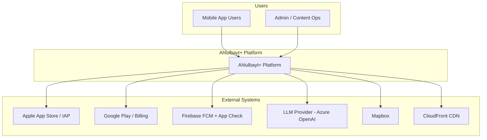
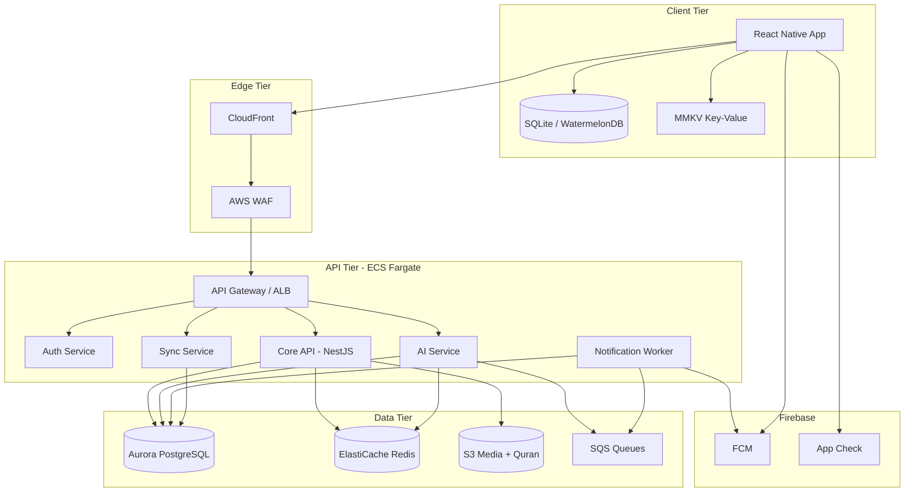
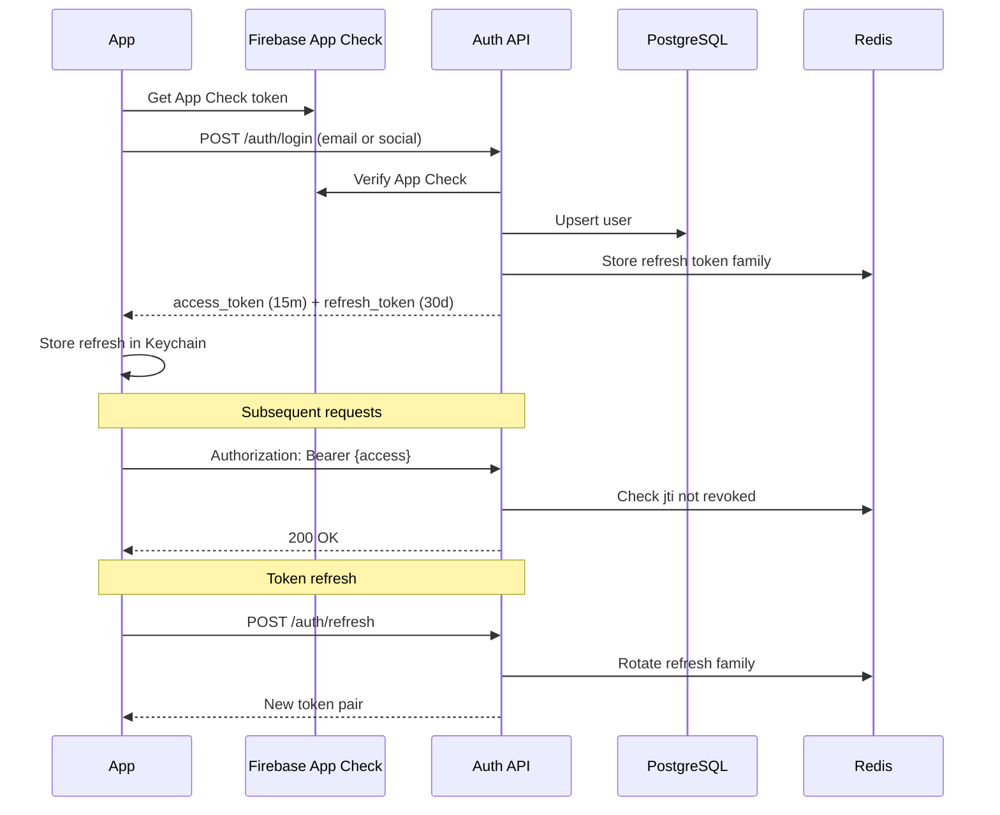
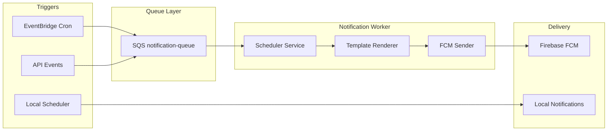
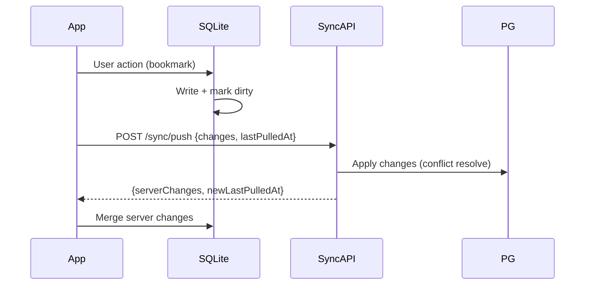
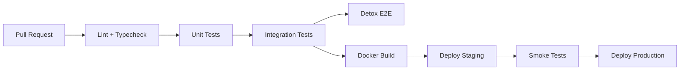
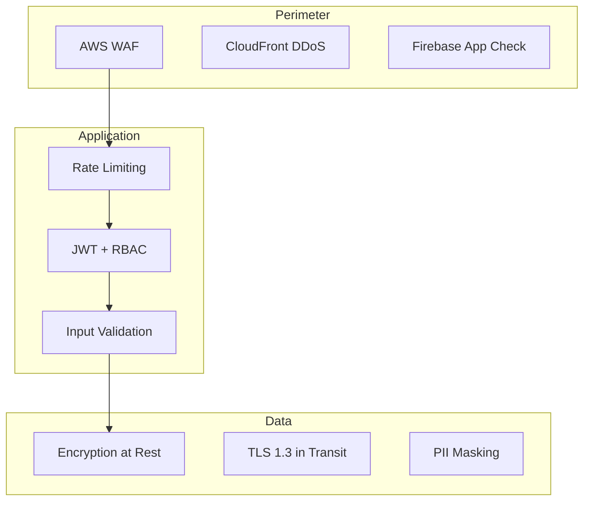

# Ahlulbayt+ System Architecture
## Enterprise Architecture Document v1.0

**Product:** Ahlulbayt+ — Shia Ithna Ashari Islamic Super App  
**Classification:** Internal — Engineering  
**Author:** Platform Architecture  
**Last Updated:** June 2026

---

## Table of Contents

1. [Executive Summary](#1-executive-summary)
2. [System Context (C4 Level 1)](#2-system-context-c4-level-1)
3. [Container Architecture (C4 Level 2)](#3-container-architecture-c4-level-2)
4. [Mobile Architecture](#4-mobile-architecture)
5. [Backend Architecture](#5-backend-architecture)
6. [Authentication](#6-authentication)
7. [Notification System](#7-notification-system)
8. [Offline Mode](#8-offline-mode)
9. [Analytics](#9-analytics)
10. [CI/CD](#10-cicd)
11. [Security](#11-security)
12. [Scalability](#12-scalability)

> **Companion docs:** [DATABASE_SCHEMA.md](./DATABASE_SCHEMA.md) · [ENGINES.md](./ENGINES.md) · [INFRASTRUCTURE.md](./INFRASTRUCTURE.md) · [ADMIN_DASHBOARD.md](./ADMIN_DASHBOARD.md)

---

## 1. Executive Summary

Ahlulbayt+ is a **super app** combining worship tools (prayer, qibla, Quran, duas, ziyarat), community features, AI-assisted learning, and premium subscriptions. The architecture prioritizes:

- **Sub-50ms prayer time lookups** via on-device calculation + Redis-cached server validation
- **99.9% API availability** for sync, community, and AI features
- **Full offline worship** for Quran, duas, and prayer schedules (7-day prefetch)
- **Global scale** targeting 10M+ MAU across MENA, South Asia, and Western diaspora

### Non-Functional Requirements

| Attribute | Target |
|-----------|--------|
| API p99 latency | < 200ms (read) · < 800ms (AI stream first token) |
| Mobile cold start | < 2.5s to Home (P95) |
| Offline coverage | 100% prayer/Quran/dua core · 80% ziyarat with prefetch |
| RPO / RTO | 1h / 15min (Aurora) |
| Data residency | EU + US regions; user-selectable where required |

---

## 2. System Context (C4 Level 1)



### Actor Summary

| Actor | Interaction |
|-------|-------------|
| Believer (mobile) | Worship, read, community, AI Q&A |
| Content curator | Upload majlis, verify calendar events |
| Marja liaison | Approve calculation defaults (read-only portal) |
| Payment provider | Subscription validation webhooks |

---

## 3. Container Architecture (C4 Level 2)



### Service Boundaries

| Service | Responsibility | Scaling |
|---------|----------------|---------|
| **core-api** | Users, subscriptions, content metadata, calendar, community | HPA on CPU 60% |
| **auth-api** | Token issuance, OAuth, session management | Fixed 2–4 replicas |
| **ai-api** | RAG pipeline, streaming responses, rate limits | GPU-adjacent workers + queue |
| **notification-worker** | Scheduled adhan, event reminders, campaign push | SQS consumer auto-scale |
| **sync-api** | Bookmarks, qadha, reading progress, settings | Sticky sessions via user shard |
| **content-pipeline** | Quran/audio ingestion, CDN invalidation | Batch jobs on EventBridge |

---

## 4. Mobile Architecture

### 4.1 Technology Choices

| Concern | Library | Rationale |
|---------|---------|-----------|
| Framework | React Native 0.76 + New Architecture | Fabric/TurboModules for 60fps Quran scroll |
| Navigation | React Navigation 7 (native stack) | RTL-aware, deep linking |
| State (server) | TanStack Query v5 | Cache, offline mutations, stale-while-revalidate |
| State (local) | Zustand | Lightweight UI + settings |
| Persistence | WatermelonDB + SQLite | Relational offline store, lazy sync |
| Fast KV | react-native-mmkv | Prayer offsets, tokens, feature flags |
| i18n | i18next + react-i18next | AR/UR/EN with RTL layout mirroring |
| Forms | React Hook Form + Zod | Marja settings validation |
| Maps | @rnmapbox/maps | Ziyarat offline packs |
| Sensors | react-native-sensors | Qibla compass |
| Location | react-native-geolocation-service | Prayer location |
| Push | @react-native-firebase/messaging | FCM |
| Security | react-native-keychain | Token storage |
| OTA | Expo Updates or CodePush (eval) | Non-native JS bundle hotfix |

### 4.2 Layered Architecture (Clean + Feature Modules)

```
apps/mobile/
├── src/
│   ├── app/                    # App shell, providers, navigation
│   │   ├── App.tsx
│   │   ├── Navigation.tsx
│   │   └── Providers.tsx
│   ├── features/               # Vertical slices
│   │   ├── prayer/
│   │   │   ├── screens/
│   │   │   ├── components/
│   │   │   ├── hooks/
│   │   │   ├── services/       # PrayerEngine wrapper
│   │   │   └── store/
│   │   ├── quran/
│   │   ├── dua/
│   │   ├── ziyarat/
│   │   ├── qibla/
│   │   ├── calendar/
│   │   ├── muharram/
│   │   ├── ai/
│   │   ├── community/
│   │   ├── premium/
│   │   └── settings/
│   ├── core/                   # Cross-cutting
│   │   ├── api/                # Axios + interceptors
│   │   ├── auth/
│   │   ├── analytics/
│   │   ├── i18n/
│   │   ├── theme/
│   │   ├── offline/
│   │   └── notifications/
│   ├── engines/                # Pure TypeScript — no RN deps
│   │   ├── prayer/             # Jafari calculation
│   │   ├── qibla/
│   │   └── hijri/
│   └── data/                   # WatermelonDB models + migrations
│       ├── schema/
│       ├── models/
│       └── sync/
└── packages/
    └── shared-types/           # Monorepo shared with API
```

### 4.3 Provider Tree

```tsx
<SafeAreaProvider>
  <ThemeProvider>           {/* Dark / Light / Muharram */}
    <I18nextProvider>       {/* RTL via I18nManager */}
      <QueryClientProvider> {/* TanStack Query */}
        <AuthProvider>      {/* Firebase + JWT */}
          <OfflineProvider> {/* NetInfo + sync queue */}
            <AnalyticsProvider>
              <Navigation />
            </AnalyticsProvider>
          </OfflineProvider>
        </AuthProvider>
      </QueryClientProvider>
    </I18nextProvider>
  </ThemeProvider>
</SafeAreaProvider>
```

### 4.4 Navigation Structure

| Navigator | Screens |
|-----------|---------|
| Root Stack | Splash, Onboarding, MainTabs, PremiumModal, AIChat |
| Main Tabs | Home, Prayer, AI (FAB), Quran, More |
| More Stack | Dua, Ziyarat, Calendar, Qibla, Community, Settings |
| Quran Stack | SurahList, Reader, Search, Bookmarks |
| Prayer Stack | Timetable, AdhanSettings, QadhaTracker |

**Deep linking:** `ahlulbayt://{module}/{id}` unified via React Navigation linking config + Firebase Dynamic Links fallback.

### 4.5 Native Modules (TurboModules)

| Module | Purpose |
|--------|---------|
| `PrayerEngineModule` | WASM/JSI bridge for sub-ms prayer calc batch |
| `QiblaSensorModule` | Fused magnetometer + accelerometer smoothing |
| `AdhanAudioModule` | Background audio session, lock screen controls |
| `WidgetBridgeModule` | iOS WidgetKit / Android Glance prayer widgets |

### 4.6 Performance Budgets

| Screen | JS thread budget | Target FPS |
|--------|------------------|------------|
| Quran Reader | < 8ms/frame | 60 |
| Prayer Home | < 4ms/frame | 60 |
| AI Chat stream | < 12ms/frame | 60 |

**Techniques:** `FlashList` for surah lists, `react-native-reanimated` for prayer ring, memoized ayah cells, Hermes bytecode precompile.

---

## 5. Backend Architecture

### 5.1 Monorepo Structure (NestJS)

```
apps/
├── api/                        # Main HTTP API
├── ai-worker/                  # SQS consumer for heavy AI jobs
├── notification-worker/        # Push scheduler
└── content-ingest/             # Admin pipeline

packages/
├── shared-types/
├── prayer-engine/              # Shared TS lib (mobile + server)
├── qibla-engine/
├── database/                   # Prisma or Drizzle schema
└── auth/

infra/
├── terraform/                  # AWS modules
└── docker/
```

### 5.2 NestJS Module Map

```
AppModule
├── ConfigModule (AWS Secrets Manager)
├── ThrottlerModule (Redis-backed rate limit)
├── AuthModule
│   ├── JwtStrategy
│   ├── FirebaseStrategy (App Check verification)
│   └── Guards: JwtAuthGuard, PremiumGuard, AdminGuard
├── UsersModule
├── SubscriptionsModule (Apple/Google webhooks)
├── PrayerModule (validation, mosque overrides)
├── QuranModule (metadata API — content on S3)
├── ContentModule (dua, ziyarat, calendar)
├── SyncModule (bookmarks, qadha, progress)
├── CommunityModule (events, majlis)
├── AiModule (RAG, streaming SSE)
├── NotificationsModule (enqueue only)
├── AnalyticsModule (server-side events)
└── HealthModule (/health, /ready)
```

### 5.3 API Design Standards

| Standard | Implementation |
|----------|----------------|
| Protocol | REST JSON · AI streaming via SSE |
| Versioning | `/v1/` URI prefix |
| Pagination | Cursor-based `?cursor=&limit=` |
| Errors | RFC 7807 Problem Details |
| Idempotency | `Idempotency-Key` header on POST (subscriptions, sync) |
| Compression | Brotli via CloudFront |

### 5.4 Representative Endpoints

```
POST   /v1/auth/register
POST   /v1/auth/login
POST   /v1/auth/refresh
DELETE /v1/auth/sessions/{id}

GET    /v1/users/me
PATCH  /v1/users/me/preferences

GET    /v1/prayer/validate          # Server-side validation of client calc
GET    /v1/prayer/mosques/nearby
POST   /v1/prayer/qadha
GET    /v1/prayer/qadha

GET    /v1/quran/surahs
GET    /v1/quran/ayahs?surah=2&from=1&to=50
GET    /v1/quran/search?q=

GET    /v1/content/duas
GET    /v1/content/ziyarat
GET    /v1/content/calendar/events?year=1447

POST   /v1/sync/push                # Client → server delta
GET    /v1/sync/pull?since={token}

POST   /v1/ai/chat                  # SSE stream
POST   /v1/ai/lecture/summarize     # Premium, async job

POST   /v1/subscriptions/verify
POST   /v1/webhooks/apple
POST   /v1/webhooks/google

POST   /v1/notifications/register-device
PATCH  /v1/notifications/preferences
```

### 5.5 Inter-Service Communication

| Pattern | Use Case |
|---------|----------|
| Sync HTTP | API → Redis, API → PostgreSQL |
| SQS | AI summarize, bulk push, content ingest |
| EventBridge | Scheduled jobs (Hijri midnight, Ramadan mode) |
| Outbox pattern | Reliable notification enqueue from API |

### 5.6 Caching Strategy (Redis)

| Key Pattern | TTL | Purpose |
|-------------|-----|---------|
| `prayer:{lat}:{lng}:{date}:{method}` | 24h | Validated prayer times |
| `user:prefs:{userId}` | 1h | Settings hot path |
| `quran:meta:surahs` | 7d | Surah index |
| `calendar:events:{hijriYear}` | 30d | Event list |
| `ai:rate:{userId}` | 24h | Daily question count |
| `session:{jti}` | token TTL | Revocation list |

---

## 6. Authentication

### 6.1 Auth Flow Overview



### 6.2 Identity Providers

| Method | Implementation |
|--------|----------------|
| Email + password | bcrypt (cost 12), email verification via SES |
| Apple Sign In | Required for iOS App Store |
| Google Sign In | OAuth 2.0 PKCE |
| Anonymous | Guest mode — local-only, upgradeable |
| Phone OTP | Optional (Twilio) for MENA markets |

### 6.3 Token Design

| Token | Format | Lifetime | Storage |
|-------|--------|----------|---------|
| Access | JWT (RS256) | 15 min | Memory only |
| Refresh | Opaque UUID | 30 days | Keychain / EncryptedSharedPrefs |
| App Check | Firebase | 1h | Attached to auth requests |

**JWT Claims:**
```json
{
  "sub": "user_uuid",
  "email": "user@example.com",
  "tier": "premium|free",
  "marja": "sistani",
  "locale": "ar",
  "jti": "unique_token_id",
  "iat": 1718123456,
  "exp": 1718124356
}
```

### 6.4 Authorization Model (RBAC)

| Role | Permissions |
|------|-------------|
| `user` | Standard app features |
| `premium` | AI unlimited, offline maps, family plan |
| `moderator` | Community content review |
| `content_admin` | Calendar, dua metadata |
| `super_admin` | Full admin panel |

Implemented via NestJS `@Roles()` decorator + CASL ability factory.

### 6.5 Family Plan

- Primary subscriber holds `subscription_owner_id`
- Up to 5 `family_members` linked via invite code
- RevenueCat or native StoreKit/Play Billing with server receipt validation

---

## 7. Notification System

### 7.1 Architecture



### 7.2 Notification Categories

| Category | Channel | Scheduling |
|----------|---------|------------|
| Adhan | FCM data + local | **Local primary** — computed on-device 7 days ahead |
| Pre-adhan alarm | Local | User offset (5–30 min) |
| Calendar event | FCM | Server cron at user-local 08:00 day before |
| Muharram daily | FCM | 1–10 Muharram themed payload |
| Qadha reminder | FCM | Weekly if pending > 0 |
| Community majlis | FCM | Event-specific opt-in |
| AI job complete | FCM silent | Lecture summary ready |

### 7.3 Adhan Strategy (Critical Path)

**Primary: On-device scheduling** (no server dependency for worship)

1. `PrayerEngine` computes 7 days of times at midnight + on location change
2. `react-native-notifee` schedules exact alarms (Android `SCHEDULE_EXACT_ALARM` permission)
3. iOS: `UNCalendarNotificationTrigger` per prayer
4. FCM used only for **config updates** (new adhan audio URL, disable remote)

### 7.4 FCM Payload Schema

```json
{
  "message": {
    "token": "device_fcm_token",
    "data": {
      "type": "calendar_event",
      "event_id": "uuid",
      "deeplink": "ahlulbayt://calendar/1447-07-15"
    },
    "android": { "priority": "high" },
    "apns": {
      "payload": { "aps": { "sound": "default", "mutable-content": 1 } }
    }
  }
}
```

### 7.5 User Preferences (stored PostgreSQL + synced)

```typescript
interface NotificationPreferences {
  adhan_enabled: Record<PrayerName, boolean>;
  pre_adhan_minutes: number;
  calendar_events: boolean;
  muharram_daily: boolean;
  qadha_weekly: boolean;
  community: boolean;
  quiet_hours: { start: string; end: string };
}
```

---

## 8. Offline Mode

### 8.1 Offline Tiers

| Tier | Content | Storage | Sync |
|------|---------|---------|------|
| **Tier 0 — Always local** | Prayer engine, Qibla, Hijri converter | Bundled JS | None |
| **Tier 1 — Default offline** | Quran text, top 50 duas, 30-day calendar | SQLite ~15MB | Weekly delta |
| **Tier 2 — User prefetch** | Full Mafatih, ziyarat audio, maps | Up to 500MB | On-demand |
| **Tier 3 — Premium** | Full library, AI cache, lecture PDFs | Up to 2GB | Background WiFi |

### 8.2 Sync Architecture (WatermelonDB)



### 8.3 Conflict Resolution

| Entity | Strategy |
|--------|----------|
| Bookmarks | Last-write-wins (timestamp) |
| Qadha records | Server wins on duplicate day+prayer |
| Reading progress | Max ayah index wins |
| Settings | Field-level merge (user preference) |

### 8.4 Content Versioning

- Manifest: `GET /v1/content/manifest` returns `{version, bundles[]}`
- Bundles: gzip JSON on S3 + CloudFront
- Mobile: compare `content_version` in MMKV; download delta on WiFi

### 8.5 Network Awareness

```typescript
// TanStack Query offlineFirst config
{
  networkMode: 'offlineFirst',
  gcTime: Infinity,
  staleTime: 24 * 60 * 60 * 1000,
  retry: (count, error) => error.status !== 401 && count < 3,
}
```

**UI:** `NetInfo` banner — subtle, never blocks worship screens.

---

## 9. Analytics

### 9.1 Analytics Stack

| Layer | Tool | Data |
|-------|------|------|
| Product | PostHog (self-hosted on AWS) | Events, funnels, feature flags |
| Performance | Firebase Performance + Sentry | Crashes, traces, ANR |
| Business | Internal warehouse (S3 → Athena) | Subscriptions, retention |
| Content | Custom pipeline | Quran completion, dua plays |

### 9.2 Event Taxonomy

```
app.opened
onboarding.completed
prayer.viewed
prayer.adhan_scheduled
prayer.qadha_marked
quran.ayah_read {surah, ayah, duration_ms}
quran.bookmark_added
dua.opened {dua_id}
dua.audio_played {dua_id, reciter}
ziyarat.opened {ziyarat_id}
ai.question_asked {mode, tokens}
ai.citation_clicked {source_id}
calendar.event_viewed {event_id}
premium.paywall_viewed {trigger}
premium.subscribed {plan, trial}
muharram.mode_entered
```

### 9.3 Privacy Controls

- **Default:** Aggregated analytics, no PII in event properties
- **Opt-out:** Settings → Privacy → disable analytics
- **Never collected:** Dua text read, AI question content (hashed ID only), precise location
- **GDPR:** Data export + deletion via `/v1/users/me/data`

### 9.4 Feature Flags

PostHog flags for:
- `ai_lecture_mode`
- `community_beta`
- `new_muharram_ui`
- `prayer_method_leva_default`

Evaluated on app launch; cached in MMKV 4h.

---

## 10. CI/CD

### 10.1 Pipeline Overview



### 10.2 Repository & Branching

| Branch | Purpose |
|--------|---------|
| `main` | Production-ready |
| `develop` | Integration |
| `feature/*` | Feature branches |
| `release/*` | Release candidates |

**Strategy:** Trunk-based with short-lived feature branches; `main` auto-deploys staging; production requires tagged release + approval.

### 10.3 GitHub Actions Workflows

| Workflow | Trigger | Actions |
|----------|---------|---------|
| `ci-mobile.yml` | PR touching `apps/mobile` | ESLint, tsc, Jest, Detox (shard) |
| `ci-api.yml` | PR touching `apps/api` | ESLint, tsc, Jest, Supertest e2e |
| `deploy-staging.yml` | Push to `main` | ECR push, ECS rolling deploy |
| `deploy-prod.yml` | Tag `v*` | Blue/green ECS, migration gate |
| `content-sync.yml` | Weekly cron | Quran manifest rebuild, CDN invalidation |

### 10.4 Mobile Release

| Platform | Tool | Cadence |
|----------|------|---------|
| iOS | Fastlane + TestFlight → App Store | Bi-weekly |
| Android | Fastlane + Play Internal → Production | Bi-weekly |
| OTA (JS) | Expo Updates | Hotfix anytime (no native changes) |

### 10.5 Database Migrations

- **Tool:** Drizzle ORM migrations
- **Gate:** `drizzle-kit migrate` runs in CI before deploy
- **Rollback:** Down migrations required for breaking changes
- **Zero-downtime:** Expand-contract pattern for column changes

### 10.6 Infrastructure as Code

- **Terraform** modules per environment (`staging`, `prod`)
- **State:** S3 backend + DynamoDB lock
- **Secrets:** AWS Secrets Manager → injected as ECS task env

---

## 11. Security

### 11.1 Defense in Depth



### 11.2 Security Controls

| Control | Implementation |
|---------|----------------|
| WAF rules | OWASP Top 10, geo-block anomalies, rate limit /ai/* |
| API auth | JWT RS256, short-lived, refresh rotation |
| App attestation | Firebase App Check (Play Integrity / App Attest) |
| Secrets | AWS Secrets Manager, never in repo |
| DB encryption | Aurora AES-256, KMS CMK |
| S3 | SSE-S3, bucket policies, no public ACLs |
| PII | Email encrypted at rest (pgcrypto), location never stored server-side by default |
| AI prompts | Logged as hash only; no training on user data |
| Dependency scan | Snyk / Dependabot on every PR |
| SAST | Semgrep in CI |
| Pen test | Annual third-party + pre-launch |

### 11.3 Threat Model (STRIDE Summary)

| Threat | Mitigation |
|--------|------------|
| Spoofed prayer times API | Client-side primary; server validate only |
| AI fatwa injection | System prompt guardrails + no fiqh in corpus |
| Subscription fraud | Server receipt validation, webhook signatures |
| Token theft | Short TTL, refresh rotation, Keychain storage |
| Scraping Quran API | CloudFront signed URLs for audio; rate limits |

### 11.4 Compliance

| Standard | Scope |
|----------|-------|
| GDPR | EU users — consent, export, delete |
| COPPA | No accounts under 13 without parental consent |
| PCI | No card data — Apple/Google handle payments |
| SOC 2 Type II | Target Year 2 post-launch |

---

## 12. Scalability

### 12.1 Growth Projections & Capacity

| Metric | Year 1 | Year 3 |
|--------|--------|--------|
| MAU | 500K | 10M |
| DAU | 150K | 3M |
| API RPS (peak) | 2K | 40K |
| AI queries/day | 50K | 2M |
| S3 storage | 500GB | 10TB |

### 12.2 Scaling Strategies

| Component | Strategy |
|-----------|----------|
| API (ECS) | HPA: CPU 60%, min 3 / max 50 tasks per region |
| Aurora | Read replicas (2), connection pooling via PgBouncer |
| Redis | Cluster mode, 3 shards, replica per shard |
| S3 + CloudFront | Global edge; no origin scaling concern |
| AI workers | SQS depth-based auto-scale, max 100 workers |
| PostgreSQL writes | Partition `analytics_events` by month |

### 12.3 Multi-Region

| Region | Role |
|--------|------|
| `eu-west-1` | Primary (EU users) |
| `us-east-1` | Primary (Americas) |
| `me-south-1` | Read replica + CloudFront origin (MENA latency) |

**Active-active:** API stateless; Aurora Global Database for DR; Redis Global Datastore for session.

### 12.4 Cost Optimization

- Prayer/Qibla on-device → saves 80% of would-be API load
- CloudFront caching for Quran static bundles (cache hit > 95%)
- S3 Intelligent-Tiering for audio archive
- Spot instances for AI batch workers
- Reserved capacity for Aurora after steady state

### 12.5 Resilience Patterns

| Pattern | Application |
|---------|-------------|
| Circuit breaker | AI provider failover (Azure → backup) |
| Bulkhead | Separate ECS service for AI vs core API |
| Retry + backoff | SQS consumers, FCM delivery |
| Graceful degradation | AI offline → cached FAQ; community offline → hide tab |
| Chaos testing | Quarterly ECS task kill drills (staging) |

---

## Appendix A: Technology Decision Log

| Decision | Choice | Alternatives Considered | Rationale |
|----------|--------|-------------------------|-----------|
| Mobile framework | React Native | Flutter, native | Team expertise, OTA, shared TS engines |
| ORM | Drizzle | Prisma | Lighter, SQL-transparent |
| Offline DB | WatermelonDB | Realm, raw SQLite | Sync protocol, RN performance |
| LLM hosting | Azure OpenAI | Anthropic, self-host | Enterprise SLA, content filtering |
| Maps | Mapbox | Google Maps | Offline packs, custom style |
| Monorepo | Turborepo | Nx | Simpler, fast caching |

---

## Appendix B: Related Documents

- [DATABASE_SCHEMA.md](./DATABASE_SCHEMA.md) — Full PostgreSQL schema
- [ENGINES.md](./ENGINES.md) — Prayer, Qibla, Quran, AI engines
- [INFRASTRUCTURE.md](./INFRASTRUCTURE.md) — AWS + Firebase topology
- [../design/DESIGN_SYSTEM.md](../design/DESIGN_SYSTEM.md) — UI specifications

---

*Document owner: Platform Architecture · Version 1.0 · June 2026*
