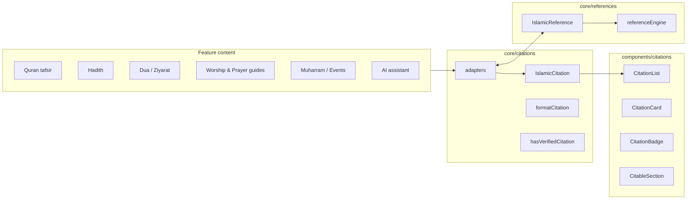

# Citation Engine

Universal scholarly citation layer for AhlulBayt+. Every Islamic claim in the app must ship citation metadata or an explicit unverified flag.

## Architecture



## Two-layer model

| Layer | Location | Purpose |
|-------|----------|---------|
| **IslamicCitation** | `core/citations` | Lightweight, feature-friendly shape for bundles and UI |
| **IslamicReference** | `core/references` | Rich canonical model with kinds, navigation, marja filtering |

Adapters in `core/citations/adapters.ts` convert between layers. Prefer `IslamicCitation` in new content bundles; use `citationToReference()` when navigation or marja filtering is needed.

## Core API

```ts
import {
  type IslamicCitation,
  type CitableContent,
  formatCitation,
  hasVerifiedCitation,
  requireCitationsOrUnverified,
  citationsFromReferences,
  citationsFromFiqhRefs,
  citationsFromMuharram,
  citationsFromAi,
  mergeCitations,
} from '@/core/citations';
```

### `IslamicCitation`

| Field | Required | Notes |
|-------|----------|-------|
| `source` | yes | Book or work title |
| `verified` | yes | `false` → Unverified badge |
| `volume`, `page`, `hadithNumber`, `narrator`, `scholar`, `note` | no | Displayed in `CitationCard` |
| `id` | no | Stable key for lists |

### Dev guard

Call `requireCitationsOrUnverified({ citations }, 'MyFeature.claimId')` in `__DEV__` when rendering scholarly claims. Warns if citations are missing.

## UI components

```tsx
import {
  CitationList,
  CitationCard,
  CitationBadge,
  UnverifiedDisclaimer,
  CitableSection,
} from '@/components/citations';

// Footer on any scholarly block
<CitableSection citations={step.citations} devContext="wudu.step.3">
  <Text>{step.body}</Text>
</CitableSection>

// Inline badge
<CitationBadge citation={{ source: 'Bihar al-Anwar', volume: 44, page: 93, verified: true }} />

// Compact list
<CitationList citations={citations} compact />
```

i18n keys live under `citations.*` (en / ar / ur).

## Integrated surfaces

| Surface | File | Citation source |
|---------|------|-----------------|
| Quran tafsir | `features/quran/components/TafsirPanel.tsx` | `quranTafsirReferences` + optional `tafsir.citations` |
| Hadith detail | `features/hadith/components/HadithReferenceCard.tsx` | `HadithReference` adapter + `entry.citations` |
| Dua reader | `features/dua/screens/DuaReaderScreen.tsx` | `duaSourceToReference` + `meta.citations` |
| Worship guide steps | `features/worship-guide/components/WorshipStepBlock.tsx` | `fiqhRefs` + `step.citations` (scholar mode) |
| Prayer academy steps | `features/prayer-academy/components/PrayerStepBlock.tsx` | `fiqhRefs` + `step.citations` |
| AI citations | `features/ai/components/AiCitationList.tsx` | `citationsFromAi` |
| Muharram / Karbala | `features/muharram/components/SourceCitationList.tsx` | `citationsFromMuharram` |

`components/references` (`ReferenceList`, `ReferenceCard`) remains for navigation-heavy flows (AI `CitationCards`, deep links). New scholarly footers should use `components/citations`.

## Content type coverage

| Content type | Status | Migration |
|--------------|--------|-----------|
| Quran / Tafsir | Integrated | Add `citations` to `AyahTafsir` bundles |
| Hadith | Integrated | Optional `citations` on `HadithEntry`; adapter covers `reference` |
| Duas | Integrated | Add `citations` to `DuaMeta` bundles |
| Ziyarat | Adapter ready | Use `ziyaratSourceToReference` → `citationsFromReferences` in reader |
| Worship (Wudu/Ghusl) | Integrated | Populate `citations` or keep `fiqhRefs` |
| Prayer guides | Integrated | Same as worship |
| Historical events | Bridged | `IslamicSourceCitation` → `citationsFromMuharram` |
| Amaal | Pending | Add `citations` to amaal step types |
| Ramadan widgets | Pending | `core/islamic-events` already has `EventReference`; bridge via `citationsFromReferences` |

## Adding citations to new content

1. Extend the feature type with `citations?: IslamicCitation[]` (additive).
2. Populate bundles with at least one citation per scholarly claim, or set `verified: false`.
3. Wrap claim UI in `CitableSection` or append `CitationList`.
4. In dev, pass `devContext` to `CitableSection` or call `requireCitationsOrUnverified`.
5. For deep links / marja filtering, convert with `citationToReference(cite, kind)`.

## Relationship to `core/references`

- Do **not** duplicate reference logic — adapters unify the models.
- `enforceContentReferences` / `enforceAiReferences` in `core/references` remain the server-side and AI policy layer.
- Field labels: `citations.*` for the new UI; `references.*` retained for `ReferenceCard` and kinds.
