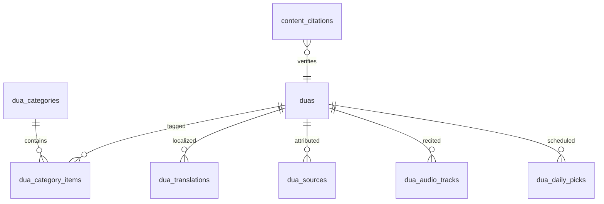

# Daily Life Duas Module
## Architecture — AhlulBayt+

**Principle:** All Arabic text, translations, and citations come from **verified sources** (Mafatih al-Jinan, Sahifa Sajjadiyya, Kamil al-Ziyarat, authenticated hadith collections). **Never AI-generate or hand-type dua bodies in production.**

---

## 1. Database structure

### Existing tables (extend)

| Table | Role |
|-------|------|
| `duas` | Master row per dua (slug, kind, category, audio, sort) |
| `dua_translations` | Per-locale body: Arabic, translation, transliteration |
| `content_citations` | Scholar-verified references (via `cms_content` workflow) |

### New tables (`0014_daily_life_duas.sql`)

```sql
dua_categories          -- hierarchical taxonomy (home, sleep, …)
dua_category_items      -- maps dua_id → category_id + sort_order
dua_sources             -- source book, narrator, hadith ref (1:N per dua)
dua_audio_tracks        -- reciter, s3_key, duration per dua
dua_daily_picks         -- curated “today’s dua” schedule (hijri/gregorian rules)
```

### `duas` column additions

| Column | Type | Purpose |
|--------|------|---------|
| `kind` | `major \| daily_life \| taqibat` | Separates Kumayl-scale vs situational |
| `situation_key` | VARCHAR | Machine key e.g. `entering_home` |
| `repeat_count` | SMALLINT | Optional 3×, 7×, 100× |
| `quick_action` | BOOLEAN | Show on home quick actions |
| `notification_rule` | JSONB | When to push (time, day, event) |
| `bundle_version` | INTEGER | Manifest sync version |
| `text_checksum` | VARCHAR(64) | Integrity vs source import |
| `verification_status` | ENUM | pending / verified / published |

### `dua_translations` additions

| Column | Purpose |
|--------|---------|
| `transliteration` | Latin transliteration (already exists) |
| `benefit` | Short benefit line (en/ur in JSONB `metadata`) |
| `narrator` | e.g. Imam al-Sadiq (as) |
| `source_book` | e.g. Mafatih al-Jinan, p. 412 |
| `source_ref` | Edition-specific locator |

### Entity relationship



---

## 2. Categories

Top-level categories (user-facing) with sub-situations:

| Category ID | Label (EN) | Sub-situations |
|-------------|------------|----------------|
| `home` | Home | entering_home, leaving_home |
| `sleep` | Sleep | before_sleeping, after_waking |
| `bathroom` | Bathroom | entering_bathroom, leaving_bathroom |
| `travel` | Travel | starting_journey, entering_vehicle, safe_travel |
| `food` | Food | before_eating, after_eating, drinking_water |
| `family` | Family | before_marriage, for_spouse, for_children |
| `work` | Work | before_work, seeking_rizq, success_in_work |
| `health` | Health | during_illness, visiting_sick, protection_health |
| `protection` | Protection | evil_eye, from_harm, from_fear |
| `prayer` | Prayer Related | adhan_response, after_prayer, before_prayer |

Each sub-situation maps to one `duas.slug` (e.g. `entering-home`).

**Quick actions (home):** morning_dua, evening_dua, travel_dua, home_dua — map to curated slugs, not separate categories.

---

## 3. Search architecture

### Offline (mobile)

| Layer | Implementation |
|-------|----------------|
| Index | `DailyLifeSearchIndex` — FTS on titles, tags, category, transliteration, translation |
| Tokenizer | Arabic normalization + Latin fold for transliteration |
| Scope | `kind === daily_life` + major duas optional merge |
| Ranking | Exact title > tag > category > body substring |
| Storage | MMKV inverted index rebuilt on manifest sync |

### Server (API)

| Endpoint | Search |
|----------|--------|
| `GET /v1/duas/search?q=` | Postgres `tsvector` on `dua_translations` + trigram on title |
| Filters | `category`, `situation`, `locale`, `kind=daily_life` |

### Cross-feature

- Mafatih index includes daily-life entries via shared `mafatih_ref`
- AI assistant cites via `duaSourceToReference()` — never paraphrase body

---

## 4. Offline strategy

```mermaid
flowchart LR
  subgraph sources [Verified sources]
    MAF[Mafatih al-Jinan licensed extract]
    SAH[Sahifa bundles]
  end

  subgraph ingest [api/scripts/duas]
    IMP[import-mafatih-daily-life.mjs]
    VAL[validate-dua-corpus.mjs]
  end

  subgraph mobile [Mobile]
    MAN[GET /v1/content/manifest]
    RNFS[DocumentDirectory/duas/*.json]
    REP[DailyLifeDuaRepository]
  end

  MAF --> IMP --> VAL --> CDN
  CDN --> MAN --> RNFS --> REP
  REP --> Bundled fallback metadata-only until import
```

| Tier | Content | When |
|------|---------|------|
| 1 | Bundled metadata catalog (no Arabic) | Always — browse categories |
| 2 | Bundled verified body JSON | Ship after scholar sign-off |
| 3 | Manifest delta download | WiFi / user opt-in |
| 4 | API fetch | Online fallback |

**Integrity:** `text_checksum` per bundle; build fails if count/checksum mismatch vs manifest.

---

## 5. UI screens

| Screen | Route | Purpose |
|--------|-------|---------|
| **Daily Life Hub** | `DailyLifeDuas` | Category grid, today’s dua, quick actions, search |
| **Category List** | `DailyLifeCategory` | `{ categoryId }` — sub-situation rows |
| **Dua Reader** | `DuaReader` | `{ duaId }` — shared reader (Arabic, ur, en, translit, audio, refs) |
| **Search** | `DailyLifeDuas` + inline search | Full-text across daily life corpus |

### Reader fields (required)

- Arabic (full, never truncated)
- Urdu + English translation
- Transliteration
- Audio bar (if `hasAudio`)
- References panel (`IslamicCitation[]`)
- Source book + narrator footer

### Home integration

- **Today's Dua** widget → `duaId` deep link
- **Quick actions:** Morning, Evening, Travel, Home → preset slugs

---

## 6. API design

Base: `/v1/duas`

| Method | Path | Description |
|--------|------|-------------|
| GET | `/` | List (`kind`, `category`, `locale`) |
| GET | `/categories` | Category tree |
| GET | `/daily-life` | All `kind=daily_life` metadata |
| GET | `/daily-life/today` | Scheduled pick (hijri + day rules) |
| GET | `/search` | Full-text (`q`, filters) |
| GET | `/recommend` | Contextual (time, day, season) |
| GET | `/:slug` | Metadata + available locales |
| GET | `/:slug/body` | Full bundle JSON (gzip) |
| GET | `/:slug/audio/:reciterId` | Signed URL |

### Response shape (body)

```typescript
{
  meta: {
    slug, kind, categories[], titles, sourceBook, narrator,
    citations[], hasAudio, repeatCount, verificationStatus
  },
  sections: [{ id, arabic, translations: { en, ur }, transliteration }],
  audio: [{ reciterId, url, durationSec }],
  bundleVersion, attribution
}
```

### Notifications (server → mobile rules)

| Rule key | Trigger | Dua slug | Requires citation |
|----------|---------|----------|-------------------|
| `daily_dua_morning` | 06:00 local | `morning-dhikr` | yes |
| `leaving_home` | Geofence exit (opt-in) | `leaving-home` | yes |
| `friday_dua` | Fri 12:00 | `dua_ahad` | yes |

Mobile `NOTIFICATION_RULES` extended with `citationRequired: true` — no push without verified `citations[]`.

---

## 7. Content ingestion (production)

1. License / extract from **Mafatih al-Jinan** (Farsi/Arabic edition per marja guidance)
2. Map to `situation_key` catalog
3. Scholar review → `verification_status = published`
4. `npm run duas:build && npm run duas:validate`
5. Upload bundles to CDN; bump manifest version

---

## 8. Implementation phases

| Phase | Deliverable |
|-------|-------------|
| **P0** | Schema, category catalog, hub UI, metadata-only browse |
| **P1** | Verified body import (Mafatih extract), reader audio |
| **P2** | Search index, notifications with citations |
| **P3** | Admin CMS (`cms_content` type `dua`), manifest sync |

---

## Related

- [MAFATIH.md](./MAFATIH.md)
- [OFFLINE_FIRST_SYNC.md](./OFFLINE_FIRST_SYNC.md)
- [QURAN_DATA_INTEGRITY.md](./QURAN_DATA_INTEGRITY.md) — same integrity principles
