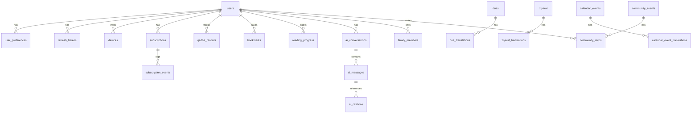

# AhlulBayt+ Database Schema

> **Authoritative design doc:** [POSTGRES_DESIGN.md](./POSTGRES_DESIGN.md) — ERD, relationships, index catalog, performance strategy, migration index.

## PostgreSQL 16 (Aurora) — Production Schema v2.0

**ORM:** Drizzle ORM  
**Migrations:** `packages/database/migrations/`  
**Conventions:** `snake_case` tables/columns · UUID v7 primary keys · `timestamptz` UTC

---

## Entity Relationship Overview



---

## 1. Identity & Auth

### `users`

```sql
CREATE TABLE users (
    id              UUID PRIMARY KEY DEFAULT gen_random_uuid(),
    email           VARCHAR(255) UNIQUE,
    email_verified  BOOLEAN NOT NULL DEFAULT FALSE,
    password_hash   VARCHAR(255),          -- NULL for social-only
    display_name    VARCHAR(100),
    avatar_url      TEXT,
    locale          VARCHAR(10) NOT NULL DEFAULT 'en',  -- en | ar | ur
    role            VARCHAR(20) NOT NULL DEFAULT 'user', -- user | moderator | admin
    tier            VARCHAR(20) NOT NULL DEFAULT 'free', -- free | premium
    marja           VARCHAR(30) NOT NULL DEFAULT 'sistani',
    is_anonymous    BOOLEAN NOT NULL DEFAULT FALSE,
    merged_into_id  UUID REFERENCES users(id),  -- guest → registered merge
    created_at      TIMESTAMPTZ NOT NULL DEFAULT NOW(),
    updated_at      TIMESTAMPTZ NOT NULL DEFAULT NOW(),
    deleted_at      TIMESTAMPTZ              -- soft delete (GDPR)
);

CREATE INDEX idx_users_email ON users(email) WHERE deleted_at IS NULL;
CREATE INDEX idx_users_tier ON users(tier) WHERE deleted_at IS NULL;
```

### `refresh_tokens`

```sql
CREATE TABLE refresh_tokens (
    id              UUID PRIMARY KEY DEFAULT gen_random_uuid(),
    user_id         UUID NOT NULL REFERENCES users(id) ON DELETE CASCADE,
    token_hash      VARCHAR(64) NOT NULL UNIQUE,  -- SHA-256 of opaque token
    family_id       UUID NOT NULL,                -- rotation family
    expires_at      TIMESTAMPTZ NOT NULL,
    revoked_at      TIMESTAMPTZ,
    device_id       UUID REFERENCES devices(id),
    created_at      TIMESTAMPTZ NOT NULL DEFAULT NOW()
);

CREATE INDEX idx_refresh_tokens_user ON refresh_tokens(user_id);
CREATE INDEX idx_refresh_tokens_family ON refresh_tokens(family_id);
```

### `devices`

```sql
CREATE TABLE devices (
    id              UUID PRIMARY KEY DEFAULT gen_random_uuid(),
    user_id         UUID NOT NULL REFERENCES users(id) ON DELETE CASCADE,
    platform        VARCHAR(10) NOT NULL,  -- ios | android
    fcm_token       TEXT,
    app_version     VARCHAR(20),
    os_version      VARCHAR(20),
    device_model    VARCHAR(100),
    timezone        VARCHAR(50) NOT NULL DEFAULT 'UTC',
    last_active_at  TIMESTAMPTZ,
    created_at      TIMESTAMPTZ NOT NULL DEFAULT NOW(),
    updated_at      TIMESTAMPTZ NOT NULL DEFAULT NOW(),

    UNIQUE(user_id, fcm_token)
);

CREATE INDEX idx_devices_fcm ON devices(fcm_token) WHERE fcm_token IS NOT NULL;
```

### `oauth_accounts`

```sql
CREATE TABLE oauth_accounts (
    id              UUID PRIMARY KEY DEFAULT gen_random_uuid(),
    user_id         UUID NOT NULL REFERENCES users(id) ON DELETE CASCADE,
    provider        VARCHAR(20) NOT NULL,  -- apple | google
    provider_id     VARCHAR(255) NOT NULL,
    created_at      TIMESTAMPTZ NOT NULL DEFAULT NOW(),

    UNIQUE(provider, provider_id)
);
```

### `otp_codes`

```sql
CREATE TABLE otp_codes (
    id              UUID PRIMARY KEY DEFAULT gen_random_uuid(),
    user_id         UUID REFERENCES users(id) ON DELETE CASCADE,
    email           VARCHAR(255) NOT NULL,
    code_hash       VARCHAR(64) NOT NULL,   -- SHA-256 of 6-digit code
    purpose         VARCHAR(30) NOT NULL,   -- email_verify | login | password_reset
    attempts        INTEGER NOT NULL DEFAULT 0,
    expires_at      TIMESTAMPTZ NOT NULL,
    verified_at     TIMESTAMPTZ,
    created_at      TIMESTAMPTZ NOT NULL DEFAULT NOW()
);

CREATE INDEX idx_otp_email ON otp_codes(email, purpose);
```

### `password_reset_tokens`

```sql
CREATE TABLE password_reset_tokens (
    id              UUID PRIMARY KEY DEFAULT gen_random_uuid(),
    user_id         UUID NOT NULL REFERENCES users(id) ON DELETE CASCADE,
    token_hash      VARCHAR(64) NOT NULL UNIQUE,
    expires_at      TIMESTAMPTZ NOT NULL,
    used_at         TIMESTAMPTZ,
    created_at      TIMESTAMPTZ NOT NULL DEFAULT NOW()
);

CREATE INDEX idx_reset_user ON password_reset_tokens(user_id);
```

---

## 2. User Preferences & Sync

### `user_preferences`

```sql
CREATE TABLE user_preferences (
    user_id                 UUID PRIMARY KEY REFERENCES users(id) ON DELETE CASCADE,

    -- Prayer
    prayer_method           VARCHAR(30) NOT NULL DEFAULT 'leva',
    prayer_offsets          JSONB NOT NULL DEFAULT '{}',  -- {"fajr": -10, "maghrib": 0}
    high_latitude_rule      VARCHAR(20) DEFAULT 'angle_based',

    -- Appearance
    theme                   VARCHAR(20) NOT NULL DEFAULT 'dark',
    muharram_mode           VARCHAR(20) NOT NULL DEFAULT 'auto',  -- auto | on | off

    -- Quran
    quran_translation_id    UUID,
    quran_font_size         SMALLINT NOT NULL DEFAULT 28,
    quran_display_mode      VARCHAR(20) DEFAULT 'stacked',  -- stacked | arabic_only

    -- Notifications (mirrors mobile for server-side FCM)
    notification_prefs      JSONB NOT NULL DEFAULT '{}',

    -- Privacy
    analytics_enabled       BOOLEAN NOT NULL DEFAULT TRUE,
    location_sharing        BOOLEAN NOT NULL DEFAULT FALSE,

    -- Sync
    sync_token              VARCHAR(64),  -- last pulled watermark
    updated_at              TIMESTAMPTZ NOT NULL DEFAULT NOW()
);
```

### `sync_changelog`

Append-only log for WatermelonDB pull.

```sql
CREATE TABLE sync_changelog (
    id              BIGSERIAL PRIMARY KEY,
    user_id         UUID NOT NULL REFERENCES users(id) ON DELETE CASCADE,
    entity_type     VARCHAR(30) NOT NULL,  -- bookmark | qadha | reading_progress
    entity_id       UUID NOT NULL,
    operation       VARCHAR(10) NOT NULL,  -- create | update | delete
    payload         JSONB NOT NULL,
    created_at      TIMESTAMPTZ NOT NULL DEFAULT NOW()
);

CREATE INDEX idx_sync_changelog_user_time ON sync_changelog(user_id, id);
-- Retention: 90 days via pg_partman or cron delete
```

---

## 3. Subscriptions

### `subscriptions`

```sql
CREATE TABLE subscriptions (
    id                  UUID PRIMARY KEY DEFAULT gen_random_uuid(),
    user_id             UUID NOT NULL REFERENCES users(id),
    platform            VARCHAR(10) NOT NULL,  -- apple | google
    product_id          VARCHAR(100) NOT NULL,
    status              VARCHAR(20) NOT NULL,  -- active | expired | grace | cancelled
    original_tx_id      VARCHAR(255) UNIQUE,
    expires_at          TIMESTAMPTZ,
    is_trial            BOOLEAN NOT NULL DEFAULT FALSE,
    is_family_owner     BOOLEAN NOT NULL DEFAULT FALSE,
    created_at          TIMESTAMPTZ NOT NULL DEFAULT NOW(),
    updated_at          TIMESTAMPTZ NOT NULL DEFAULT NOW()
);

CREATE INDEX idx_subscriptions_user ON subscriptions(user_id);
CREATE INDEX idx_subscriptions_status ON subscriptions(status) WHERE status = 'active';
```

### `family_members`

```sql
CREATE TABLE family_members (
    id              UUID PRIMARY KEY DEFAULT gen_random_uuid(),
    owner_id        UUID NOT NULL REFERENCES users(id),
    member_id       UUID NOT NULL REFERENCES users(id),
    invite_code     VARCHAR(8),
    accepted_at     TIMESTAMPTZ,
    created_at      TIMESTAMPTZ NOT NULL DEFAULT NOW(),

    UNIQUE(owner_id, member_id)
);
```

### `subscription_events`

```sql
CREATE TABLE subscription_events (
    id              UUID PRIMARY KEY DEFAULT gen_random_uuid(),
    subscription_id UUID NOT NULL REFERENCES subscriptions(id),
    event_type      VARCHAR(30) NOT NULL,  -- purchased | renewed | refunded | expired
    raw_payload     JSONB,
    created_at      TIMESTAMPTZ NOT NULL DEFAULT NOW()
);
```

---

## 4. Worship Tracking

### `qadha_records`

```sql
CREATE TABLE qadha_records (
    id              UUID PRIMARY KEY DEFAULT gen_random_uuid(),
    user_id         UUID NOT NULL REFERENCES users(id) ON DELETE CASCADE,
    prayer          VARCHAR(10) NOT NULL,  -- fajr | dhuhr | asr | maghrib | isha
    missed_date     DATE NOT NULL,
    completed_at    TIMESTAMPTZ,
    notes           TEXT,
    created_at      TIMESTAMPTZ NOT NULL DEFAULT NOW(),
    updated_at      TIMESTAMPTZ NOT NULL DEFAULT NOW(),
    deleted_at      TIMESTAMPTZ,

    UNIQUE(user_id, prayer, missed_date)
);

CREATE INDEX idx_qadha_user_pending ON qadha_records(user_id)
    WHERE completed_at IS NULL AND deleted_at IS NULL;
```

### `bookmarks`

```sql
CREATE TABLE bookmarks (
    id              UUID PRIMARY KEY DEFAULT gen_random_uuid(),
    user_id         UUID NOT NULL REFERENCES users(id) ON DELETE CASCADE,
    content_type    VARCHAR(20) NOT NULL,  -- quran_ayah | dua | ziyarat
    content_ref     VARCHAR(100) NOT NULL, -- "2:255" | "dua_kumail" | "ziyarat_ashura"
    note            TEXT,
    created_at      TIMESTAMPTZ NOT NULL DEFAULT NOW(),
    deleted_at      TIMESTAMPTZ,

    UNIQUE(user_id, content_type, content_ref)
);

CREATE INDEX idx_bookmarks_user ON bookmarks(user_id) WHERE deleted_at IS NULL;
```

### `reading_progress`

```sql
CREATE TABLE reading_progress (
    id              UUID PRIMARY KEY DEFAULT gen_random_uuid(),
    user_id         UUID NOT NULL REFERENCES users(id) ON DELETE CASCADE,
    content_type    VARCHAR(20) NOT NULL,  -- quran | dua_collection
    surah           SMALLINT,              -- NULL for non-quran
    ayah            SMALLINT,
    progress_pct    REAL,                  -- 0.0 - 1.0 for collections
    updated_at      TIMESTAMPTZ NOT NULL DEFAULT NOW(),

    UNIQUE(user_id, content_type, COALESCE(surah, 0))
);
```

### `tasbih_sessions`

```sql
CREATE TABLE tasbih_sessions (
    id              UUID PRIMARY KEY DEFAULT gen_random_uuid(),
    user_id         UUID NOT NULL REFERENCES users(id) ON DELETE CASCADE,
    dhikr_type      VARCHAR(50) NOT NULL,
    target_count    INTEGER NOT NULL,
    current_count   INTEGER NOT NULL DEFAULT 0,
    completed_at    TIMESTAMPTZ,
    created_at      TIMESTAMPTZ NOT NULL DEFAULT NOW()
);
```

---

## 5. Content Catalog (Metadata — bulk text on S3)

### `quran_surahs`

```sql
CREATE TABLE quran_surahs (
    number          SMALLINT PRIMARY KEY,  -- 1-114
    name_arabic     VARCHAR(50) NOT NULL,
    name_english    VARCHAR(50) NOT NULL,
    name_translit   VARCHAR(50),
    revelation      VARCHAR(10) NOT NULL,  -- meccan | medinan
    ayah_count      SMALLINT NOT NULL,
    juz_start       SMALLINT,
    sort_order      SMALLINT NOT NULL
);
```

### `quran_translations`

```sql
CREATE TABLE quran_translations (
    id              UUID PRIMARY KEY DEFAULT gen_random_uuid(),
    code            VARCHAR(10) NOT NULL UNIQUE,  -- en_sistani | ur_fooladvand
    name            VARCHAR(100) NOT NULL,
    language        VARCHAR(5) NOT NULL,
    translator      VARCHAR(100),
    is_shia         BOOLEAN NOT NULL DEFAULT FALSE,
    s3_bundle_key   TEXT NOT NULL,         -- quran/translations/{code}/v3.json.gz
    bundle_version  INTEGER NOT NULL DEFAULT 1,
    is_premium      BOOLEAN NOT NULL DEFAULT FALSE
);
```

### `quran_ayahs` (reference index — full text in S3 bundles)

```sql
CREATE TABLE quran_ayahs (
    id              BIGSERIAL PRIMARY KEY,
    surah           SMALLINT NOT NULL REFERENCES quran_surahs(number),
    ayah            SMALLINT NOT NULL,
    juz             SMALLINT NOT NULL,
    hizb            SMALLINT,
    page_madinah    SMALLINT,
    has_sajdah      BOOLEAN NOT NULL DEFAULT FALSE,
    text_key        TEXT NOT NULL,         -- pointer into S3 Uthmani bundle

    UNIQUE(surah, ayah)
);

CREATE INDEX idx_quran_ayahs_juz ON quran_ayahs(juz);
-- Full-text search via separate tsvector column or OpenSearch
```

### `duas`

```sql
CREATE TABLE duas (
    id              UUID PRIMARY KEY DEFAULT gen_random_uuid(),
    slug            VARCHAR(100) NOT NULL UNIQUE,
    category        VARCHAR(50) NOT NULL,  -- daily | weekly | muharram | mafatih
    mafatih_ref     VARCHAR(50),           -- chapter.section reference
    title_key       VARCHAR(100) NOT NULL, -- i18n key
    repeat_count    SMALLINT,
    audio_s3_key    TEXT,
    audio_duration  INTEGER,
    sort_order      INTEGER NOT NULL DEFAULT 0,
    is_premium      BOOLEAN NOT NULL DEFAULT FALSE,
    created_at      TIMESTAMPTZ NOT NULL DEFAULT NOW()
);

CREATE INDEX idx_duas_category ON duas(category);
```

### `dua_translations`

```sql
CREATE TABLE dua_translations (
    id              UUID PRIMARY KEY DEFAULT gen_random_uuid(),
    dua_id          UUID NOT NULL REFERENCES duas(id) ON DELETE CASCADE,
    locale          VARCHAR(5) NOT NULL,   -- ar | en | ur
    title           TEXT NOT NULL,
    arabic_text     TEXT,                  -- may duplicate for non-ar locales
    translation     TEXT,
    transliteration TEXT,
    s3_body_key     TEXT,                  -- long duas stored in S3

    UNIQUE(dua_id, locale)
);
```

### `ziyarat`

```sql
CREATE TABLE ziyarat (
    id              UUID PRIMARY KEY DEFAULT gen_random_uuid(),
    slug            VARCHAR(100) NOT NULL UNIQUE,
    imam_ref        VARCHAR(50),           -- imam_husayn | imam_ali
    holy_site_id    UUID REFERENCES holy_sites(id),
    title_key       VARCHAR(100) NOT NULL,
    audio_s3_key    TEXT,
    recommended_days TEXT[],               -- {ashura, arbaeen, thursday}
    sort_order      INTEGER NOT NULL DEFAULT 0,
    is_premium      BOOLEAN NOT NULL DEFAULT FALSE
);
```

### `ziyarat_translations`

```sql
CREATE TABLE ziyarat_translations (
    id              UUID PRIMARY KEY DEFAULT gen_random_uuid(),
    ziyarat_id      UUID NOT NULL REFERENCES ziyarat(id) ON DELETE CASCADE,
    locale          VARCHAR(5) NOT NULL,
    title           TEXT NOT NULL,
    arabic_text     TEXT NOT NULL,
    translation     TEXT,
    transliteration TEXT,

    UNIQUE(ziyarat_id, locale)
);
```

### `holy_sites`

```sql
CREATE TABLE holy_sites (
    id              UUID PRIMARY KEY DEFAULT gen_random_uuid(),
    slug            VARCHAR(50) NOT NULL UNIQUE,
    name_key        VARCHAR(100) NOT NULL,
    latitude        DECIMAL(9,6) NOT NULL,
    longitude       DECIMAL(9,6) NOT NULL,
    country         VARCHAR(2),
    imam_ref        VARCHAR(50),
    mapbox_tile_id  VARCHAR(100)
);
```

---

## 6. Islamic Calendar

### `calendar_events`

```sql
CREATE TABLE calendar_events (
    id              UUID PRIMARY KEY DEFAULT gen_random_uuid(),
    slug            VARCHAR(100) NOT NULL UNIQUE,
    event_type      VARCHAR(20) NOT NULL,  -- wiladat | shahadat | holiday | other
    hijri_month     SMALLINT NOT NULL,     -- 1-12
    hijri_day       SMALLINT NOT NULL,
    imam_ref        VARCHAR(50),
    priority        SMALLINT NOT NULL DEFAULT 0,
    amaal_dua_ids   UUID[],
    amaal_ziyarat_ids UUID[],
    created_at      TIMESTAMPTZ NOT NULL DEFAULT NOW()
);

CREATE INDEX idx_calendar_events_hijri ON calendar_events(hijri_month, hijri_day);
```

### `calendar_event_translations`

```sql
CREATE TABLE calendar_event_translations (
    id              UUID PRIMARY KEY DEFAULT gen_random_uuid(),
    event_id        UUID NOT NULL REFERENCES calendar_events(id) ON DELETE CASCADE,
    locale          VARCHAR(5) NOT NULL,
    title           TEXT NOT NULL,
    description     TEXT,

    UNIQUE(event_id, locale)
);
```

### `hijri_date_overrides`

Community moon-sighting overrides (optional).

```sql
CREATE TABLE hijri_date_overrides (
    id              UUID PRIMARY KEY DEFAULT gen_random_uuid(),
    region_code     VARCHAR(10) NOT NULL,  -- IQ | IR | US-NA
    gregorian_date  DATE NOT NULL,
    hijri_year      SMALLINT NOT NULL,
    hijri_month     SMALLINT NOT NULL,
    hijri_day       SMALLINT NOT NULL,
    source          VARCHAR(100),
    confirmed_at    TIMESTAMPTZ NOT NULL DEFAULT NOW(),

    UNIQUE(region_code, gregorian_date)
);
```

---

## 7. AI

### `ai_conversations`

```sql
CREATE TABLE ai_conversations (
    id              UUID PRIMARY KEY DEFAULT gen_random_uuid(),
    user_id         UUID NOT NULL REFERENCES users(id) ON DELETE CASCADE,
    mode            VARCHAR(20) NOT NULL DEFAULT 'general',  -- general | lecture | quran
    title           VARCHAR(200),
    created_at      TIMESTAMPTZ NOT NULL DEFAULT NOW(),
    updated_at      TIMESTAMPTZ NOT NULL DEFAULT NOW(),
    deleted_at      TIMESTAMPTZ
);

CREATE INDEX idx_ai_conversations_user ON ai_conversations(user_id, updated_at DESC);
```

### `ai_messages`

```sql
CREATE TABLE ai_messages (
    id              UUID PRIMARY KEY DEFAULT gen_random_uuid(),
    conversation_id UUID NOT NULL REFERENCES ai_conversations(id) ON DELETE CASCADE,
    role            VARCHAR(10) NOT NULL,  -- user | assistant | system
    content_hash    VARCHAR(64) NOT NULL,  -- SHA-256 — not raw content
    token_count     INTEGER,
    model           VARCHAR(50),
    latency_ms      INTEGER,
    created_at      TIMESTAMPTZ NOT NULL DEFAULT NOW()
);

CREATE INDEX idx_ai_messages_conversation ON ai_messages(conversation_id, created_at);
```

### `ai_citations`

```sql
CREATE TABLE ai_citations (
    id              UUID PRIMARY KEY DEFAULT gen_random_uuid(),
    message_id      UUID NOT NULL REFERENCES ai_messages(id) ON DELETE CASCADE,
    source_type     VARCHAR(20) NOT NULL,  -- book | hadith | quran
    source_id       VARCHAR(100) NOT NULL,
    source_title    TEXT,
    excerpt_hash    VARCHAR(64),
    relevance_score REAL
);
```

### `ai_rate_limits`

```sql
CREATE TABLE ai_rate_limits (
    user_id         UUID NOT NULL REFERENCES users(id),
    date            DATE NOT NULL,
    query_count     INTEGER NOT NULL DEFAULT 0,

    PRIMARY KEY (user_id, date)
);
```

### `ai_knowledge_chunks` (RAG corpus — pgvector)

```sql
CREATE EXTENSION IF NOT EXISTS vector;

CREATE TABLE ai_knowledge_chunks (
    id              UUID PRIMARY KEY DEFAULT gen_random_uuid(),
    source_type     VARCHAR(20) NOT NULL,
    source_id       VARCHAR(100) NOT NULL,
    source_title    TEXT NOT NULL,
    chunk_index     INTEGER NOT NULL,
    content         TEXT NOT NULL,
    embedding       vector(1536),          -- text-embedding-3-small
    metadata        JSONB NOT NULL DEFAULT '{}',
    created_at      TIMESTAMPTZ NOT NULL DEFAULT NOW()
);

CREATE INDEX idx_ai_chunks_embedding ON ai_knowledge_chunks
    USING ivfflat (embedding vector_cosine_ops) WITH (lists = 100);
CREATE INDEX idx_ai_chunks_source ON ai_knowledge_chunks(source_type, source_id);
```

---

## 8. Community

### `community_events`

```sql
CREATE TABLE community_events (
    id              UUID PRIMARY KEY DEFAULT gen_random_uuid(),
    organizer_id    UUID NOT NULL REFERENCES users(id),
    title           VARCHAR(200) NOT NULL,
    description     TEXT,
    event_type      VARCHAR(30) NOT NULL,  -- majlis | lecture | ashura
    starts_at       TIMESTAMPTZ NOT NULL,
    ends_at         TIMESTAMPTZ,
    location_name   VARCHAR(200),
    latitude        DECIMAL(9,6),
    longitude       DECIMAL(9,6),
    is_virtual      BOOLEAN NOT NULL DEFAULT FALSE,
    stream_url      TEXT,
    status          VARCHAR(20) NOT NULL DEFAULT 'pending',  -- pending | approved | rejected
    created_at      TIMESTAMPTZ NOT NULL DEFAULT NOW()
);

CREATE INDEX idx_community_events_time ON community_events(starts_at)
    WHERE status = 'approved';
```

### `community_rsvps`

```sql
CREATE TABLE community_rsvps (
    id              UUID PRIMARY KEY DEFAULT gen_random_uuid(),
    event_id        UUID NOT NULL REFERENCES community_events(id) ON DELETE CASCADE,
    user_id         UUID NOT NULL REFERENCES users(id) ON DELETE CASCADE,
    created_at      TIMESTAMPTZ NOT NULL DEFAULT NOW(),

    UNIQUE(event_id, user_id)
);
```

---

## 9. Analytics (Partitioned)

### `analytics_events`

```sql
CREATE TABLE analytics_events (
    id              BIGSERIAL,
    user_id         UUID,                  -- NULL for anonymous
    event_name      VARCHAR(50) NOT NULL,
    properties      JSONB NOT NULL DEFAULT '{}',
    platform        VARCHAR(10),
    app_version     VARCHAR(20),
    created_at      TIMESTAMPTZ NOT NULL DEFAULT NOW(),

    PRIMARY KEY (id, created_at)
) PARTITION BY RANGE (created_at);

-- Monthly partitions created via pg_partman
-- CREATE TABLE analytics_events_2026_06 PARTITION OF analytics_events
--     FOR VALUES FROM ('2026-06-01') TO ('2026-07-01');

CREATE INDEX idx_analytics_events_name ON analytics_events(event_name, created_at);
```

---

## 10. Mosque Overrides

### `mosques`

```sql
CREATE TABLE mosques (
    id              UUID PRIMARY KEY DEFAULT gen_random_uuid(),
    name            VARCHAR(200) NOT NULL,
    latitude        DECIMAL(9,6) NOT NULL,
    longitude       DECIMAL(9,6) NOT NULL,
    address         TEXT,
    country         VARCHAR(2),
    prayer_times    JSONB,                 -- override times per prayer
    method          VARCHAR(30),
    verified        BOOLEAN NOT NULL DEFAULT FALSE,
    created_at      TIMESTAMPTZ NOT NULL DEFAULT NOW()
);

CREATE INDEX idx_mosques_geo ON mosques
    USING GIST (ll_to_earth(latitude::float8, longitude::float8));
-- Requires earthdistance + cube extensions
```

---

## 11. Content Manifest

### `content_manifests`

```sql
CREATE TABLE content_manifests (
    id              UUID PRIMARY KEY DEFAULT gen_random_uuid(),
    version         VARCHAR(20) NOT NULL UNIQUE,  -- 2026.06.1
    bundles         JSONB NOT NULL,               -- [{key, version, size, sha256}]
    published_at    TIMESTAMPTZ NOT NULL DEFAULT NOW()
);
```

---

## Indexing Strategy Summary

| Table | Index Type | Purpose |
|-------|------------|---------|
| `users.email` | B-tree partial | Login lookup |
| `sync_changelog` | B-tree (user_id, id) | Pull sync |
| `ai_knowledge_chunks.embedding` | IVFFlat | RAG similarity |
| `mosques` | GiST earthdistance | Nearby mosque |
| `analytics_events` | Range partition | Write scalability |

---

## Migration Policy

1. All migrations reversible where possible
2. Breaking changes use expand-contract (add column → dual write → migrate → drop old)
3. Seed data for `quran_surahs`, `calendar_events` in `seeds/` directory
4. Production migrations run via ECS one-off task before deploy

---

*Document owner: Platform Architecture · Version 1.0 · June 2026*
