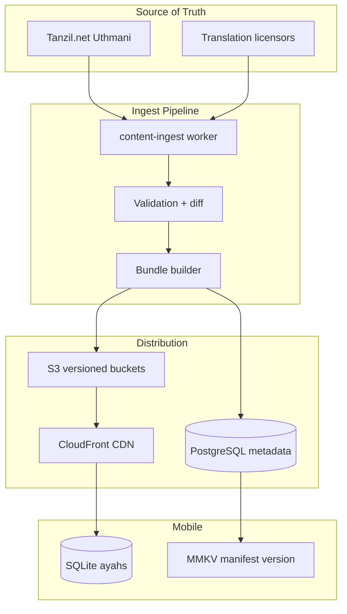
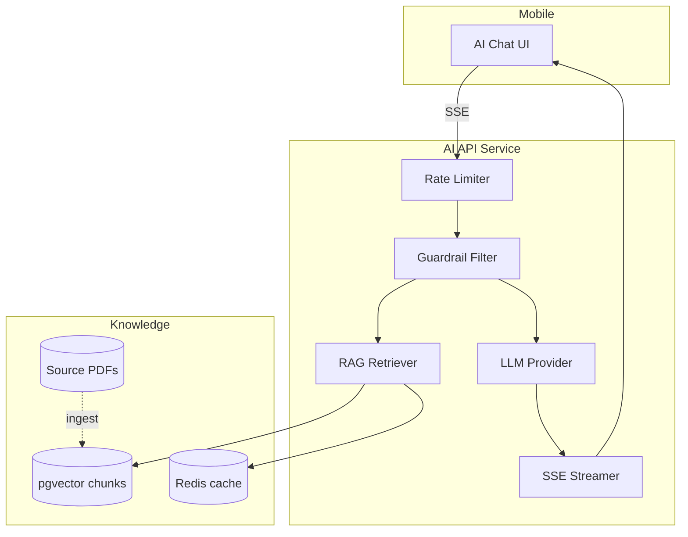

# Ahlulbayt+ Domain Engines
## Prayer · Qibla · Quran · AI — Technical Specification v1.0

Shared TypeScript packages consumed by **React Native** (on-device) and **NestJS** (validation/batch). Single source of truth prevents Sunni/Jafari drift between client and server.

```
packages/
├── prayer-engine/      # Jafari prayer times
├── qibla-engine/       # Great-circle bearing + sensor fusion
├── hijri-engine/       # Hijri ↔ Gregorian conversion
└── ai-pipeline/        # RAG + guardrails (server only)
```

---

## 1. Prayer Times Engine

### 1.1 Design Goals

| Goal | Target |
|------|--------|
| Calculation latency | < 1ms single day · < 10ms 30-day batch |
| Accuracy | ±1 min vs Leva Institute reference |
| Offline | Zero network dependency |
| Marja support | Config-driven, not code forks |

### 1.2 Jafari Calculation Rules

| Prayer | Rule | Jafari Specific |
|--------|------|-----------------|
| Fajr | Sun depression angle | Leva: 16° · Tehran: 17.7° |
| Sunrise | Solar zenith | Standard astronomical |
| Dhuhr | Solar noon + offset | +5 min after zenith (configurable) |
| Asr | Shadow factor | Factor **1** (Shafi'i/Jafari, not Hanafi 2) |
| Maghrib | Sunset + delay | **+17 min** after theoretical sunset (red shafaq) |
| Isha | Sun depression | Leva: 14° · Red shafaq |
| Midnight | Juridical end of Isha | `(Fajr - Sunset) / 2` — **not** `(Sunrise - Sunset) / 2` |
| Imsak | Pre-Fajr fast stop | Fajr - 10 min (Sistani community default) |

### 1.3 Calculation Methods (Enum)

```typescript
enum PrayerMethod {
  LEVA_INSTITUTE = 'leva',       // Sistani default
  TEHRAN = 'tehran',             // Iran / Khamenei
  JAFARI = 'jafari',             // Generic 16°/14°
  CUSTOM = 'custom',
}

interface PrayerConfig {
  method: PrayerMethod;
  madhab: 'jafari';
  asrShadowFactor: 1;
  maghribDelayMinutes: 17;
  dhuhrOffsetMinutes: 5;
  imsakOffsetMinutes: -10;
  highLatitudeRule: 'angle_based' | 'one_seventh' | 'middle_of_night';
  manualOffsets: Partial<Record<PrayerName, number>>;
}
```

### 1.4 Core Algorithm

```typescript
// packages/prayer-engine/src/calculate.ts

export interface PrayerTimes {
  fajr: Date;
  sunrise: Date;
  dhuhr: Date;
  asr: Date;
  maghrib: Date;
  isha: Date;
  midnight: Date;
  imsak: Date;
}

export interface FadilahWindow {
  prayer: PrayerName;
  start: Date;
  end: Date;           // fadilah (mustahab) end
  remainingMs: number;
}

export function calculatePrayerTimes(
  date: Date,
  coordinates: { latitude: number; longitude: number },
  config: PrayerConfig,
  timezone: string,
): PrayerTimes;

export function calculateFadilahWindows(
  times: PrayerTimes,
  config: PrayerConfig,
): FadilahWindow[];

export function batchCalculate(
  from: Date,
  days: number,
  coordinates: Coordinates,
  config: PrayerConfig,
  timezone: string,
): Map<string, PrayerTimes>;
```

**Astronomical library:** `suncalc` fork or `adhan-js` base with Jafari overrides — validated against [moonsighting.com](https://www.moonsighting.com/how-we.html) reference tables.

### 1.5 High Latitude Handling

Above 48.5° latitude, standard angles fail. Rules per config:

| Rule | Behavior |
|------|----------|
| `angle_based` | Use configured angles with minimum floor |
| `one_seventh` | Night divided into 7 parts for Fajr/Isha |
| `middle_of_night` | Fajr at last 1/7 of night |

### 1.6 Mobile Integration

```typescript
// apps/mobile/src/features/prayer/services/PrayerService.ts

class PrayerService {
  async getToday(): Promise<PrayerTimes> {
    const coords = await LocationService.getCoords(); // cached 24h
    const config = await PreferencesStore.getPrayerConfig();
    return calculatePrayerTimes(new Date(), coords, config, RNLocalize.getTimeZone());
  }

  async scheduleAdhanNotifications(): Promise<void> {
    const batch = batchCalculate(new Date(), 7, coords, config, tz);
    await NotifeeService.schedulePrayerAlarms(batch);
  }
}
```

**Trigger recalculation:**
- Location change > 5km
- Midnight local time
- User changes marja/method
- DST transition

### 1.7 Server Role

Server does **not** compute per-request for scale. It:

1. Validates client-submitted times against server calc (fraud/anomaly detection)
2. Caches `prayer:{geohash6}:{date}:{method}` in Redis for mosque API
3. Serves mosque override times from `mosques` table

---

## 2. Qibla Engine

### 2.1 Design Goals

| Goal | Target |
|------|--------|
| Bearing accuracy | ±2° (device calibrated) |
| Update rate | 30fps UI, 60Hz sensor sampling |
| Offline | Fully on-device |
| Multi-target | Kaaba, Karbala, Najaf, Mashhad |

### 2.2 Great Circle Bearing

```typescript
// packages/qibla-engine/src/bearing.ts

const KAABA = { latitude: 21.422487, longitude: 39.826206 };

export function calculateQiblaBearing(
  from: { latitude: number; longitude: number },
  to: { latitude: number; longitude: number } = KAABA,
): number;  // 0-360° from true north

export const HOLY_SITES = {
  kaaba: KAABA,
  karbala: { latitude: 32.615829, longitude: 44.024627 },
  najaf: { latitude: 31.996121, longitude: 44.314538 },
  samarra: { latitude: 34.198889, longitude: 43.874167 },
  mashhad: { latitude: 36.288333, longitude: 59.615278 },
} as const;
```

**Formula:** Initial bearing via spherical law of cosines.

### 2.3 Compass Sensor Fusion

```typescript
// apps/mobile/src/engines/qibla/SensorFusion.ts

interface QiblaState {
  qiblaBearing: number;      // true north bearing to target
  deviceHeading: number;     // fused heading
  needleRotation: number;    // qiblaBearing - deviceHeading
  accuracy: 'high' | 'medium' | 'low' | 'uncalibrated';
  calibrationHint: string | null;
}

class QiblaSensorModule {
  // Complementary filter: accelerometer (tilt) + magnetometer (heading)
  // Low-pass magnetometer α = 0.15
  // Reject readings when |magneticField| outside 20-70 µT
  start(target: HolySiteKey, callback: (state: QiblaState) => void): void;
  stop(): void;
}
```

### 2.4 UI Calibration Flow

1. Detect low `accuracy` → show figure-8 calibration overlay
2. Magnetic interference warning (metal surfaces, speakers)
3. Map fallback when `accuracy === 'uncalibrated'` — arrow on Mapbox pointing to target

### 2.5 Distance Display

```typescript
function haversineDistance(from: Coordinates, to: Coordinates): number; // km
```

Show: "4,832 km to Kaaba" / "٢,١٠٣ كم إلى كربلاء"

---

## 3. Quran Data Architecture

### 3.1 Storage Topology



### 3.2 S3 Bucket Structure

```
s3://ahlulbayt-content/
├── quran/
│   ├── uthmani/v3/surah-{001-114}.json.gz
│   ├── translations/
│   │   ├── en_shakir/v2/bundle.json.gz
│   │   ├── ur_fooladvand/v1/bundle.json.gz
│   │   └── ...
│   ├── audio/
│   │   ├── al_afasy/{surah}/{ayah}.mp3
│   │   └── ...
│   └── subjects/v1/index.json.gz      # 2000+ categorized verses
├── duas/
│   └── bodies/{dua_id}/{locale}.json.gz
├── ziyarat/
│   └── bodies/{ziyarat_id}/{locale}.json.gz
├── audio/
│   └── reciters/{reciter_id}/{content_id}.mp3
└── manifests/
    └── latest.json
```

### 3.3 Bundle Format (Uthmani Surah)

```json
{
  "surah": 2,
  "name_arabic": "البقرة",
  "ayahs": [
    {
      "ayah": 1,
      "text": "الٓمٓ",
      "juz": 1,
      "page": 2,
      "sajdah": false,
      "bismillah_before": true
    }
  ],
  "meta": {
    "version": 3,
    "sha256": "abc123...",
    "generated_at": "2026-06-01T00:00:00Z"
  }
}
```

### 3.4 Mobile SQLite Schema (WatermelonDB)

```typescript
// apps/mobile/src/data/schema.ts

tableSchema({
  name: 'quran_ayahs',
  columns: [
    { name: 'surah', type: 'number', isIndexed: true },
    { name: 'ayah', type: 'number' },
    { name: 'text_uthmani', type: 'string' },
    { name: 'juz', type: 'number', isIndexed: true },
    { name: 'page', type: 'number' },
    { name: 'has_sajdah', type: 'boolean' },
  ],
});

tableSchema({
  name: 'quran_translations',
  columns: [
    { name: 'surah', type: 'number' },
    { name: 'ayah', type: 'number' },
    { name: 'locale', type: 'string' },
    { name: 'text', type: 'string' },
  ],
});
```

### 3.5 Search Architecture

| Layer | Implementation |
|-------|----------------|
| On-device | SQLite FTS5 (`quran_fts`) for offline search |
| Server | OpenSearch cluster for cross-user analytics + web future |

```sql
-- Mobile FTS virtual table
CREATE VIRTUAL TABLE quran_fts USING fts5(
  surah, ayah, arabic, translation,
  content='quran_ayahs', content_rowid='id'
);
```

### 3.6 Shia-Specific Quran Features

| Feature | Implementation |
|---------|----------------|
| Bismillah between 9→10 | `bismillah_before: false` on Surah 10:1 |
| Sajdah ayahs | `has_sajdah` flag + notification on read |
| Verse prostration counter | Local `sajdah_log` table |
| Subject index | Denormalized `quran_subjects` table from S3 bundle |

### 3.7 Audio Streaming

- **Format:** MP3 128kbps (offline) · AAC 64kbps (stream)
- **Delivery:** CloudFront signed URLs (1h expiry, Premium offline = 7d)
- **Sync:** Word timestamps in JSON sidecar for karaoke highlight (Premium)

---

## 4. AI Architecture

### 4.1 System Overview



### 4.2 RAG Pipeline

```typescript
// packages/ai-pipeline/src/rag.ts

interface RAGConfig {
  embeddingModel: 'text-embedding-3-small';
  topK: 8;
  minSimilarity: 0.72;
  reranker: 'cohere-rerank-v3' | null;
}

async function retrieve(query: string, config: RAGConfig): Promise<Chunk[]> {
  const embedding = await embed(query);
  const candidates = await db.query(`
    SELECT id, content, source_title, source_id,
           1 - (embedding <=> $1) AS similarity
    FROM ai_knowledge_chunks
    WHERE 1 - (embedding <=> $1) > $2
    ORDER BY embedding <=> $1
    LIMIT $3
  `, [embedding, config.minSimilarity, config.topK]);
  return candidates;
}
```

### 4.3 Knowledge Corpus Sources

| Source | Type | Chunks (est.) |
|--------|------|---------------|
| Nahjul Balagha | book | 15K |
| Sahifa Sajjadia | book | 8K |
| Usul al-Kafi (selected) | hadith | 50K |
| Al-Islam.org articles | article | 100K |
| Quran tafsir (Shia) | tafsir | 80K |
| **Excluded** | fiqh rulings | 0 — never in corpus |

**Ingest:** PDF/HTML → chunk (512 tokens, 64 overlap) → embed → pgvector.

### 4.4 System Prompt (Guardrails)

```
You are Ahlulbayt+ AI, a knowledgeable companion for Shia Ithna Ashari Muslims.

RULES:
1. Answer ONLY from provided context citations. If insufficient, say so.
2. NEVER issue fatwa, wajib/mustahab/haram rulings, or personal religious verdicts.
3. For fiqh questions, direct users to their marja's official website.
4. Always revere Ahlul Bayt (AS) with proper honorifics.
5. Cite sources using [1], [2] notation matching context chunks.
6. Decline political agitation, sectarian attacks, or gossip about scholars.
7. Respond in the user's language (Arabic, Urdu, or English).
```

### 4.5 Modes

| Mode | Input | Processing |
|------|-------|------------|
| `general` | Text question | RAG + stream |
| `lecture` | Audio/video URL or upload | Whisper transcribe → chunk summarize → SQS async |
| `quran_reflection` | Surah:ayah | Fetch ayah + tafsir chunks only |
| `book_generation` | Lecture series ID | Multi-step pipeline → PDF on S3 (Premium) |

### 4.6 Streaming Protocol (SSE)

```
POST /v1/ai/chat
Accept: text/event-stream

event: token
data: {"content": "The"}

event: citation
data: {"index": 1, "source_id": "nahj_1_12", "title": "Nahjul Balagha, Sermon 1"}

event: done
data: {"message_id": "uuid", "tokens": 342}
```

### 4.7 Rate Limiting

| Tier | Limit | Window |
|------|-------|--------|
| Free | 10 queries | 24h rolling |
| Premium | 500 queries | 24h rolling |
| Lecture summarize | 3 jobs | 24h (Premium) |

Redis key: `ai:rate:{userId}:{date}` · HTTP 429 with `Retry-After`.

### 4.8 Privacy

- User messages: store `content_hash` only (SHA-256)
- Conversation list: titles auto-generated, deletable
- No training on user data (contractual + pipeline enforcement)
- Prompt injection filter before RAG retrieval

### 4.9 Failover

```
Primary:   Azure OpenAI GPT-4o
Fallback:  Azure OpenAI GPT-4o-mini (degraded mode banner)
Offline:   Cached FAQ embeddings for top 100 questions
```

---

## 5. Hijri Engine

```typescript
// packages/hijri-engine/src/convert.ts

interface HijriDate {
  year: number;
  month: number;
  day: number;
}

function gregorianToHijri(date: Date, offset?: HijriOffset): HijriDate;
function hijriToGregorian(hijri: HijriDate): Date;
function getIslamicEvents(hijri: HijriDate): CalendarEvent[];
```

**Default:** Umm al-Qura algorithm + optional `hijri_date_overrides` from server per region.

---

## 6. Engine Testing Strategy

| Engine | Unit Tests | Golden Files |
|--------|------------|--------------|
| Prayer | 500+ cases (lat/lon grid) | `fixtures/leva_baghdad_2026.json` |
| Qibla | Bearing math | `fixtures/bearing_nyc_to_kaaba.json` |
| Hijri | Conversion edge cases | `fixtures/hijri_ramadan_2026.json` |
| Quran bundle | Schema validation | JSON Schema per bundle version |
| AI RAG | Retrieval precision@5 | `eval/questions_100.jsonl` |

**CI gate:** Prayer engine must match reference within ±60 seconds for 99.5% of fixtures.

---

*Document owner: Platform Architecture · Version 1.0 · June 2026*
