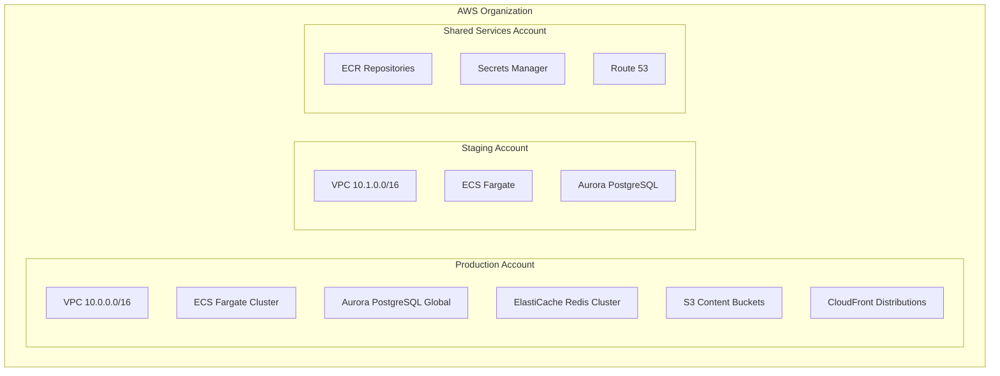
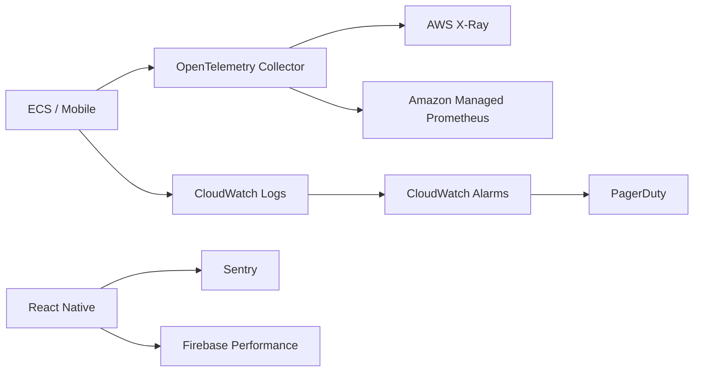

# Ahlulbayt+ Infrastructure
## AWS · Firebase · Observability — v1.0

---

## 1. AWS Account Topology



### Environment Matrix

| Resource | Staging | Production |
|----------|---------|------------|
| ECS tasks (core-api) | 2 | 3–50 (HPA) |
| Aurora ACU | 2–4 | 8–64 |
| Redis nodes | 1 | 3 shards × 2 replicas |
| CloudFront | 1 distro | 3 distros (geo) |
| WAF | Basic | Full OWASP + rate rules |

---

## 2. Network Architecture

### VPC Layout (per environment)

| Subnet | CIDR | Purpose |
|--------|------|---------|
| `public-a/b/c` | /24 each | ALB, NAT Gateway |
| `private-app-a/b/c` | /24 each | ECS tasks |
| `private-data-a/b` | /24 each | Aurora, Redis |

**Security Groups:**
- `sg-alb`: 443 from 0.0.0.0/0
- `sg-ecs`: 3000 from sg-alb only
- `sg-aurora`: 5432 from sg-ecs only
- `sg-redis`: 6379 from sg-ecs only

**No public IPs on ECS tasks.** Egress via NAT Gateway.

### DNS

| Record | Target |
|--------|--------|
| `api.ahlulbayt.app` | ALB (prod) |
| `api.staging.ahlulbayt.app` | ALB (staging) |
| `cdn.ahlulbayt.app` | CloudFront |
| `ai.ahlulbayt.app` | ALB (AI service target group) |

---

## 3. Compute — ECS Fargate

### Task Definitions

| Service | CPU | Memory | Replicas |
|---------|-----|--------|----------|
| core-api | 1 vCPU | 2 GB | 3–30 |
| auth-api | 0.5 vCPU | 1 GB | 2–4 |
| ai-api | 2 vCPU | 4 GB | 2–20 |
| notification-worker | 0.5 vCPU | 1 GB | 1–10 |
| content-ingest | 1 vCPU | 2 GB | 0 (scheduled) |

### Deployment

- **Strategy:** Rolling update, `minimumHealthyPercent: 100`
- **Production:** Blue/green via CodeDeploy
- **Health check:** `GET /health` (liveness) · `GET /ready` (DB + Redis)

### Auto Scaling

```yaml
# core-api HPA policy
TargetTrackingScaling:
  - PredefinedMetricSpecification:
      PredefinedMetricType: ECSServiceAverageCPUUtilization
    TargetValue: 60.0
  - PredefinedMetricSpecification:
      PredefinedMetricType: ALBRequestCountPerTarget
    TargetValue: 1000.0
```

---

## 4. Data Stores

### Aurora PostgreSQL 16

| Setting | Value |
|---------|-------|
| Engine | aurora-postgresql 16.x |
| Mode | Serverless v2 (prod) / provisioned (staging) |
| Global Database | `eu-west-1` primary, `us-east-1` secondary |
| Backup | 35-day retention, continuous |
| Encryption | KMS CMK `alias/ahlulbayt-aurora` |
| Connection pool | PgBouncer sidecar, max 100 per task |

### ElastiCache Redis 7

| Setting | Value |
|---------|-------|
| Mode | Cluster mode enabled |
| Node type | `cache.r7g.large` (prod) |
| Shards | 3 |
| Replicas | 1 per shard |
| Eviction | `allkeys-lru` |
| Encryption | In-transit + at-rest |

### S3 Buckets

| Bucket | Purpose | Lifecycle |
|--------|---------|-----------|
| `ahlulbayt-content-prod` | Quran, duas, audio | Intelligent-Tiering |
| `ahlulbayt-uploads-prod` | User lecture uploads (AI) | Delete after 30d |
| `ahlulbayt-analytics-prod` | Event export parquet | Glacier after 90d |
| `ahlulbayt-terraform-state` | IaC state | Versioned |

**All buckets:** Block public access, SSE-KMS, access logging to `ahlulbayt-logs`.

---

## 5. CDN — CloudFront

### Distributions

| Distribution | Origin | Cache Behavior |
|--------------|--------|----------------|
| `cdn-content` | S3 content bucket | TTL 7d, gzip/br |
| `cdn-api` | ALB | TTL 0 (dynamic) |
| `cdn-audio` | S3 audio prefix | TTL 30d, signed URLs |

### Cache Policies

```
# Quran bundles — immutable versioned
Cache-Control: public, max-age=604800, immutable
Key: /quran/uthmani/v3/*

# API — no cache
Cache-Control: private, no-store
```

### Signed URLs (Premium Audio)

```typescript
// CloudFront signed URL generation (NestJS)
const url = getSignedUrl({
  url: `https://cdn.ahlulbayt.app/audio/${key}`,
  keyPairId: process.env.CF_KEY_PAIR_ID,
  privateKey: process.env.CF_PRIVATE_KEY,
  dateLessThan: addHours(new Date(), 1),
});
```

---

## 6. Firebase Integration

### Services Used

| Service | Purpose |
|---------|---------|
| **FCM** | Push notifications (calendar, community, AI jobs) |
| **App Check** | App attestation on auth endpoints |
| **Dynamic Links** | Deep link fallback (deprecated path → universal links) |
| **Crashlytics** | Mobile crash reporting (via RN Firebase) |
| **Performance** | Mobile trace monitoring |

### Firebase Project Structure

```
ahlulbayt-prod
├── Android app: com.ahlulbayt.app
├── iOS app: com.ahlulbayt.app
├── App Check: Play Integrity + App Attest enforced
└── FCM: Data messages for silent sync triggers
```

### App Check Verification (NestJS)

```typescript
@Injectable()
export class AppCheckGuard implements CanActivate {
  async canActivate(context: ExecutionContext): Promise<boolean> {
    const token = context.switchToHttp().getRequest().headers['x-firebase-appcheck'];
    if (!token) throw new UnauthorizedException();
    await admin.appCheck().verifyToken(token);
    return true;
  }
}
```

Applied to: `/v1/auth/*`, `/v1/ai/*`, `/v1/subscriptions/*`.

---

## 7. Message Queues

### SQS Queues

| Queue | Producer | Consumer | DLQ |
|-------|----------|----------|-----|
| `notification-queue` | API, EventBridge | notification-worker | yes |
| `ai-jobs-queue` | AI API | ai-worker | yes |
| `content-ingest-queue` | Admin, cron | content-ingest | yes |
| `analytics-queue` | API (batched) | analytics-writer | yes |

**Visibility timeout:** 5 min (AI jobs: 15 min)  
**Max receive:** 3 → DLQ → CloudWatch alarm

### EventBridge Rules

| Rule | Schedule | Target |
|------|----------|--------|
| `hijri-midnight` | `cron(0 * * * ? *)` hourly check | notification-queue (per-timezone batch) |
| `content-manifest-rebuild` | `cron(0 3 ? * SUN *)` | content-ingest-queue |
| `analytics-rollup` | `cron(0 4 * * ? *)` | analytics-writer |
| `subscription-reconcile` | `cron(0 */6 * * ? *)` | core-api internal |

---

## 8. Observability

### Stack



### Key Dashboards

| Dashboard | Metrics |
|-----------|---------|
| API Health | RPS, p50/p99 latency, 5xx rate, ECS CPU |
| Prayer (device) | Adhan schedule success rate (analytics) |
| AI | Tokens/min, RAG latency, rate limit hits |
| Business | DAU, premium conversions, churn |
| Infra | Aurora ACU, Redis memory, SQS depth |

### Alerting Thresholds

| Alert | Condition | Severity |
|-------|-----------|----------|
| API 5xx | > 1% for 5 min | P1 |
| API p99 | > 2s for 10 min | P2 |
| Aurora CPU | > 80% for 15 min | P2 |
| Redis memory | > 85% | P2 |
| SQS DLQ depth | > 0 | P2 |
| AI provider error | > 5% for 5 min | P1 |

### Structured Logging

```json
{
  "level": "info",
  "service": "core-api",
  "trace_id": "abc123",
  "user_id": "uuid",
  "method": "GET",
  "path": "/v1/quran/surahs",
  "status": 200,
  "duration_ms": 45
}
```

**PII:** Never log email, AI content, or coordinates.

### SLOs

| SLI | SLO | Error Budget (30d) |
|-----|-----|-------------------|
| API availability | 99.9% | 43.2 min downtime |
| API latency p99 | < 200ms reads | 1% of requests |
| Push delivery | 95% within 60s | 5% |

---

## 9. Secrets Management

| Secret | Store | Rotation |
|--------|-------|----------|
| JWT private key | Secrets Manager | 90 days |
| Aurora credentials | Secrets Manager | 30 days auto |
| Firebase service account | Secrets Manager | Manual |
| CloudFront signing key | Secrets Manager | Annual |
| Apple/Google IAP keys | Secrets Manager | Manual |
| Azure OpenAI key | Secrets Manager | 90 days |

**ECS injection:** Task definition `secrets` block → env vars at runtime.

---

## 10. Disaster Recovery

| Scenario | RPO | RTO | Procedure |
|----------|-----|-----|-----------|
| AZ failure | 0 | < 5 min | Multi-AZ Aurora + ECS |
| Region failure | 1h | 15 min | Failover to secondary region (Aurora Global) |
| Data corruption | 1h | 1h | Point-in-time restore |
| S3 content loss | 0 | < 1h | Versioning + cross-region replication |

**DR drill:** Quarterly staging failover test.

---

## 11. Cost Estimate (Production Steady State)

| Service | Monthly (est.) |
|---------|----------------|
| ECS Fargate (avg 10 tasks) | $800 |
| Aurora Serverless v2 | $1,200 |
| ElastiCache Redis | $600 |
| CloudFront (10TB transfer) | $400 |
| S3 (5TB) | $120 |
| SQS + EventBridge | $50 |
| WAF | $100 |
| Azure OpenAI (2M queries) | $3,000 |
| **Total** | **~$6,300/mo** |

At 10M MAU with 80% on-device worship: API cost per user ~$0.0006/mo.

---

## 12. Terraform Module Map

```
infra/terraform/
├── modules/
│   ├── vpc/
│   ├── ecs-service/
│   ├── aurora/
│   ├── elasticache/
│   ├── s3-cloudfront/
│   ├── sqs/
│   ├── waf/
│   └── monitoring/
├── environments/
│   ├── staging/
│   │   └── main.tf
│   └── production/
│       ├── eu-west-1/
│       └── us-east-1/
└── global/
    ├── route53/
    └── ecr/
```

---

*Document owner: Platform Architecture · Version 1.0 · June 2026*
