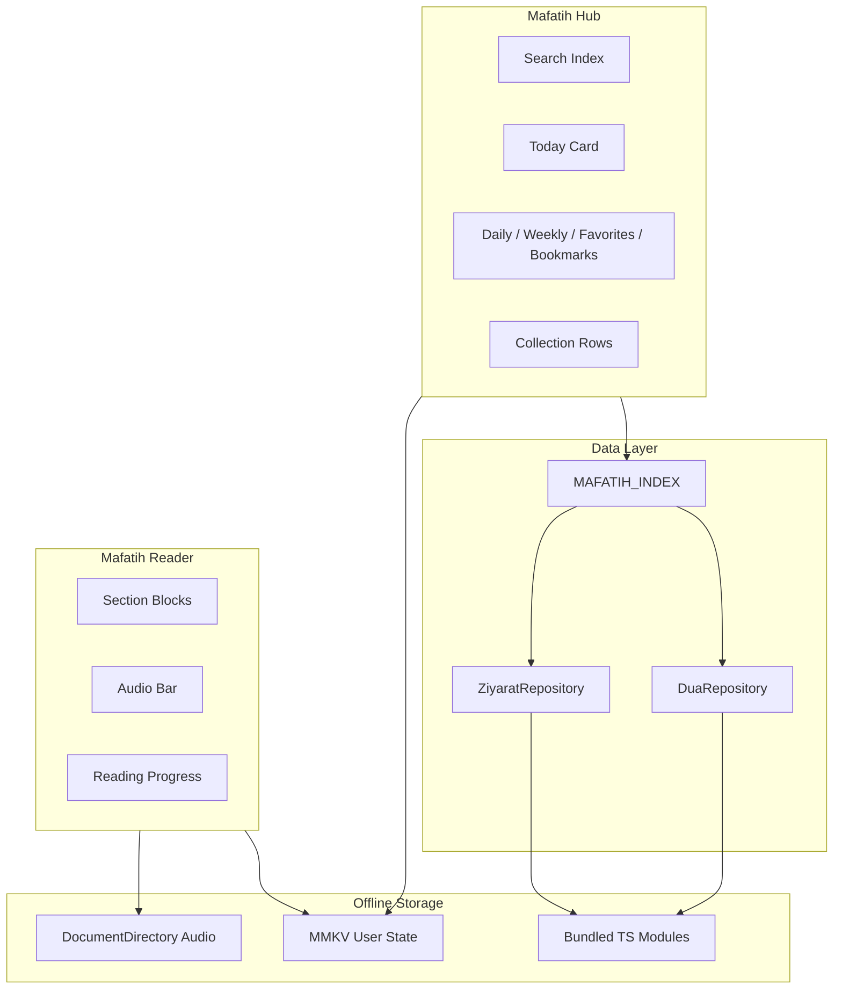

# Mafatih al-Jinan Module

Unified devotional library for AhlulBayt+ — duas, ziyarat, and amaal aligned with the printed *Mafatih al-Jinan* index.

---

## Overview



---

## Content Model

### Unified reference

```
MafatihRef = "dua:dua_kumail" | "ziyarat:ziyarat_ashura" | "amaal:..."
```

| Field | Purpose |
|-------|---------|
| `ref` | Stable cross-module identifier |
| `kind` | `dua` \| `ziyarat` \| `amaal` |
| `mafatihRef` | Printed book section e.g. `1.14`, `3.1` |
| `collectionId` | `mafatih_al_jinan`, `kamil_al_ziyarat`, etc. |
| `chapterId` | Part 1–4 index chapter |
| `schedule` | `daily` \| `weekly` \| `monthly` \| `occasion` |
| `bundled` | Text ships in app bundle (offline) |

### Current catalog (12 entries)

| Ref | Mafatih § | Chapter |
|-----|-----------|---------|
| `dua:dua_kumail` | 1.14 | Duas & Munajat |
| `dua:dua_tawassul` | 1.22 | Duas & Munajat |
| `dua:dua_ahad` | 1.8 | Duas & Munajat |
| `dua:dua_nudba` | 1.16 | Duas & Munajat |
| `dua:dua_sabah` | 1.5 | Duas & Munajat |
| `dua:dua_mashlool` | 1.12 | Duas & Munajat |
| `ziyarat:ziyarat_ashura` | 3.1 | Ziyarat |
| `ziyarat:ziyarat_waritha` | 3.2 | Ziyarat |
| `ziyarat:ziyarat_aminullah` | 3.8 | Ziyarat |
| `ziyarat:ziyarat_arbaeen` | 3.3 | Ziyarat |
| `ziyarat:ziyarat_jamia_kabira` | 3.12 | Ziyarat |
| `ziyarat:ziyarat_ale_yasin` | 3.5 | Ziyarat |

### Mafatih index structure (mirrors printed book)

1. **Duas & Munajat** — supplications
2. **Aamal** — daily / weekly / monthly acts *(future expansion)*
3. **Ziyarat** — visitations
4. **Namaaz** — prayer cross-links *(future)*

---

## Database Architecture

### Server (PostgreSQL) — sync source of truth

```sql
-- Unified content registry
CREATE TABLE mafatih_entries (
    id              UUID PRIMARY KEY DEFAULT gen_random_uuid(),
    ref             VARCHAR(80) NOT NULL UNIQUE,  -- dua:dua_kumail
    kind            VARCHAR(20) NOT NULL,         -- dua | ziyarat | amaal
    content_id      VARCHAR(80) NOT NULL,
    slug            VARCHAR(100) NOT NULL,
    mafatih_ref     VARCHAR(50),                -- 1.14, 3.1
    collection_id   VARCHAR(50) NOT NULL,
    chapter_id      VARCHAR(50) NOT NULL,
    schedule        VARCHAR(20) NOT NULL,
    title_key       VARCHAR(100) NOT NULL,
    section_count   SMALLINT NOT NULL DEFAULT 0,
    estimated_min   SMALLINT,
    has_audio       BOOLEAN NOT NULL DEFAULT FALSE,
    audio_s3_key    TEXT,
    sort_order      INTEGER NOT NULL DEFAULT 0,
    bundle_version  INTEGER NOT NULL DEFAULT 1,
    is_premium      BOOLEAN NOT NULL DEFAULT FALSE,
    created_at      TIMESTAMPTZ NOT NULL DEFAULT NOW()
);

CREATE INDEX idx_mafatih_kind ON mafatih_entries(kind);
CREATE INDEX idx_mafatih_schedule ON mafatih_entries(schedule);
CREATE INDEX idx_mafatih_collection ON mafatih_entries(collection_id);

-- Full-text search corpus (server-side)
CREATE TABLE mafatih_search_corpus (
    ref             VARCHAR(80) PRIMARY KEY REFERENCES mafatih_entries(ref),
    search_vector   TSVECTOR,
    updated_at      TIMESTAMPTZ NOT NULL DEFAULT NOW()
);

CREATE INDEX idx_mafatih_fts ON mafatih_search_corpus USING GIN(search_vector);

-- User bookmarks (server sync)
CREATE TABLE user_mafatih_bookmarks (
    id              UUID PRIMARY KEY DEFAULT gen_random_uuid(),
    user_id         UUID NOT NULL REFERENCES users(id) ON DELETE CASCADE,
    ref             VARCHAR(80) NOT NULL,
    section_id      VARCHAR(50),
    label           TEXT,
    created_at      TIMESTAMPTZ NOT NULL DEFAULT NOW(),
    UNIQUE(user_id, ref, section_id)
);

-- User favorites
CREATE TABLE user_mafatih_favorites (
    user_id         UUID NOT NULL REFERENCES users(id) ON DELETE CASCADE,
    ref             VARCHAR(80) NOT NULL,
    created_at      TIMESTAMPTZ NOT NULL DEFAULT NOW(),
    PRIMARY KEY(user_id, ref)
);

-- Section bodies (long content on S3)
CREATE TABLE mafatih_sections (
    id              UUID PRIMARY KEY DEFAULT gen_random_uuid(),
    ref             VARCHAR(80) NOT NULL REFERENCES mafatih_entries(ref),
    section_id      VARCHAR(50) NOT NULL,
    sort_order      INTEGER NOT NULL,
    title_en        TEXT,
    title_ur        TEXT,
    arabic_text     TEXT NOT NULL,
    translation_en  TEXT,
    translation_ur  TEXT,
    is_sacred       BOOLEAN NOT NULL DEFAULT FALSE,
    s3_body_key     TEXT,
    UNIQUE(ref, section_id)
);
```

### Mobile (Phase 1 — bundled + MMKV)

| Layer | Implementation | Offline |
|-------|----------------|---------|
| **Content index** | `MAFATIH_INDEX` in TS | ✅ Always |
| **Section bodies** | `features/dua/data/bundled/*`, `features/ziyarat/data/bundled/*` | ✅ Always |
| **Search** | `MafatihSearchIndex` in-memory | ✅ Always |
| **Bookmarks** | MMKV `ahlulbayt-mafatih-bookmarks` | ✅ |
| **Favorites** | MMKV `ahlulbayt-mafatih-favorites` | ✅ |
| **Reader prefs** | MMKV `ahlulbayt-mafatih-reader` | ✅ |
| **Offline pins** | MMKV `ahlulbayt-mafatih-offline` | ✅ |
| **Audio** | RNFS `dua-audio/`, `ziyarat-audio/` | ✅ On download |

### Mobile (Phase 2 — WatermelonDB / SQLite)

```typescript
// Future on-device schema
tableSchema({
  name: 'mafatih_entries',
  columns: [
    { name: 'ref', type: 'string', isIndexed: true },
    { name: 'kind', type: 'string', isIndexed: true },
    { name: 'mafatih_ref', type: 'string' },
    { name: 'search_text', type: 'string' },
    { name: 'bundle_version', type: 'number' },
  ],
});

tableSchema({
  name: 'mafatih_sections',
  columns: [
    { name: 'ref', type: 'string', isIndexed: true },
    { name: 'section_id', type: 'string' },
    { name: 'arabic', type: 'string' },
    { name: 'translation_en', type: 'string', isOptional: true },
    { name: 'translation_ur', type: 'string', isOptional: true },
  ],
});

// FTS5 virtual table
CREATE VIRTUAL TABLE mafatih_fts USING fts5(
  ref, arabic, translation_en, translation_ur, search_text,
  content='mafatih_sections', content_rowid='id'
);
```

---

## Search Architecture

```
Query → normalize → score MAFATIH_INDEX metadata
                 → scan bundled section text
                 → merge & rank by score
                 → return MafatihSearchResult[]
```

| Match source | Weight |
|--------------|--------|
| Title match | 0.50 |
| Metadata / description | 0.35 |
| Mafatih § ref | 0.25 |
| Section body text | 0.40 |

Phase 2: replace in-memory scan with SQLite FTS5 + server OpenSearch for analytics.

---

## UI Architecture

### Screens

| Screen | Route | Purpose |
|--------|-------|---------|
| **Mafatih Hub** | `Mafatih` | Search, today card, filters, collections, entry list |
| **Mafatih Reader** | `MafatihReader` | Unified reader for any `MafatihRef` |

Legacy routes `Duas`, `Ziyarat` remain for direct deep links.

### Hub layout

```
┌─────────────────────────────────────┐
│  Mafatih al-Jinan                   │
│  [ 🔍 Search duas, ziyarat… ]       │
├─────────────────────────────────────┤
│  TODAY · Recommended                │
│  ┌─────────────────────────────────┐│
│  │  Dua Kumayl · § 1.14            ││
│  └─────────────────────────────────┘│
├─────────────────────────────────────┤
│  [All|Daily|Weekly|♥|★]             │
├─────────────────────────────────────┤
│  Collections: Mafatih · Kamil…      │
├─────────────────────────────────────┤
│  Entry rows with ♥ ★ ↓ badges       │
└─────────────────────────────────────┘
```

### Reader layout

- Gold progress bar (reading position)
- Toolbar: display mode, EN/UR, focus mode, font size
- Section blocks with sacred gold styling
- Header: ♥ favorite + ★ bookmark
- Audio bar (delegates to dua/ziyarat audio engines)

---

## Offline Strategy

| Tier | Content | Size (est.) |
|------|---------|-------------|
| **Tier 1 — Default** | All bundled text (12 entries) | ~200 KB |
| **Tier 2 — User download** | Audio MP3 per entry | ~5–15 MB each |
| **Tier 3 — Prefetch pack** | Full Mafatih corpus | ~15 MB text |

Text is **always offline** for bundled entries. Audio requires explicit download via reader audio bar.

---

## File Map

```
mobile/src/features/mafatih/
├── types.ts
├── constants/index.ts       # MAFATIH_INDEX, collections, chapters
├── engine/
│   ├── mafatihRepository.ts
│   └── mafatihSearchIndex.ts
├── stores/
│   ├── mafatihBookmarkStore.ts
│   ├── mafatihFavoriteStore.ts
│   ├── mafatihReaderStore.ts
│   └── mafatihOfflineStore.ts
├── hooks/
│   ├── useMafatihHub.ts
│   ├── useMafatihSearch.ts
│   └── useMafatihReader.ts
├── components/
│   ├── MafatihSearchBar.tsx
│   ├── MafatihTodayCard.tsx
│   ├── MafatihFilterTabs.tsx
│   ├── MafatihEntryRow.tsx
│   └── MafatihSectionBlock.tsx
└── screens/
    ├── MafatihHubScreen.tsx
    └── MafatihReaderScreen.tsx
```

Content bodies remain in `features/dua/` and `features/ziyarat/` — `MafatihRepository.getBundle()` delegates to them.

---

## API (Future)

```
GET  /v1/content/mafatih              # Full index
GET  /v1/content/mafatih/search?q=    # Server FTS
GET  /v1/content/mafatih/:ref         # Entry + sections
POST /v1/sync/mafatih/bookmarks       # Push bookmarks
POST /v1/sync/mafatih/favorites       # Push favorites
```

---

## Roadmap

| Phase | Deliverable |
|-------|-------------|
| **1 (now)** | Unified hub, search, bookmarks, favorites, offline text |
| **2** | Aamal chapter, Sahifa entries, SQLite FTS5 |
| **3** | Server sync, delta bundles, full Mafatih corpus |
| **4** | Custom Mafatih (Premium), repeat counters, PDF export |

---

## Related

- [SCREEN_SPECIFICATIONS.md §5](../design/SCREEN_SPECIFICATIONS.md)
- [DATABASE_SCHEMA.md](./DATABASE_SCHEMA.md) — `duas`, `ziyarat` tables
- [ARCHITECTURE.md §8.1](./ARCHITECTURE.md) — offline tiers
