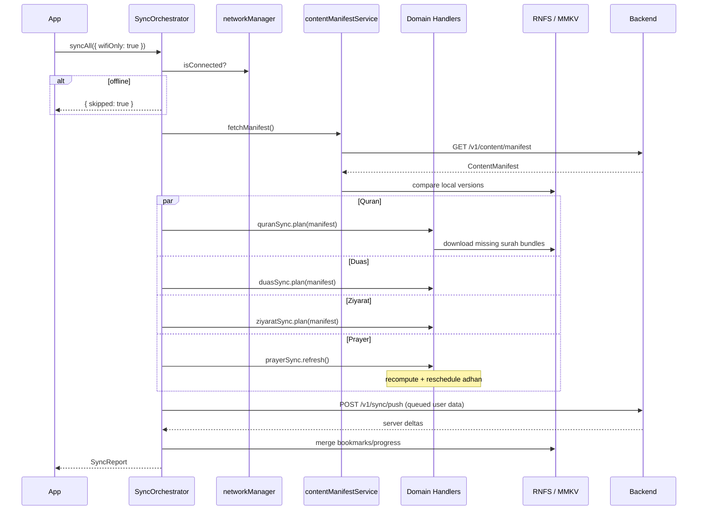

# Offline-First Architecture & Synchronization Strategy
## Quran · Duas · Ziyarat · Prayer Times — v1.0

**Product:** AhlulBayt+ Mobile  
**Scope:** Worship-critical content that must work without network  
**Last Updated:** June 2026

> Companion: [ARCHITECTURE.md](./ARCHITECTURE.md) §8 · [PRAYER_ENGINE.md](./PRAYER_ENGINE.md)

---

## 1. Design Principles

| Principle | Implementation |
|-----------|----------------|
| **Local-first reads** | UI always reads from on-device stores; network updates caches in background |
| **Compute where possible** | Prayer times = pure math + cached GPS — no server dependency |
| **Bundle the essentials** | Ship text/metadata in app binary for instant first launch |
| **Sync the long tail** | Full Quran, audio, catalog updates via manifest + delta downloads |
| **Graceful degradation** | Missing remote bundle → show bundled stub + download CTA |
| **User data syncs up** | Bookmarks, progress, qadha push when online (separate from content pull) |

---

## 2. Storage Architecture

```
┌─────────────────────────────────────────────────────────────────────┐
│                         READ PATH (always local)                     │
├─────────────────────────────────────────────────────────────────────┤
│  UI → Repository → [ Bundled TS | MMKV cache | RNFS files ]         │
└─────────────────────────────────────────────────────────────────────┘
                              ▲
                              │ sync pull (background)
┌─────────────────────────────────────────────────────────────────────┐
│                         SYNC LAYER                                   │
│  SyncOrchestrator → domain handlers → manifest compare → RNFS write  │
└─────────────────────────────────────────────────────────────────────┘
                              ▲
                              │ WiFi / user action / reconnect
┌─────────────────────────────────────────────────────────────────────┐
│                         NETWORK (optional)                           │
│  GET /v1/content/manifest · GET /v1/sync/pull · POST /v1/sync/push  │
└─────────────────────────────────────────────────────────────────────┘
```

### Storage tiers (mobile)

| Tier | Technology | Contents | Size |
|------|------------|----------|------|
| **T0 — Bundled** | TypeScript modules in APK/IPA | Prayer engine, Hijri, partial Quran (Al-Fatiha+), top duas/ziyarat, calendar | ~5–15 MB |
| **T1 — MMKV** | `react-native-mmkv` | Settings, download indexes, sync tokens, manifest versions, bookmarks | < 1 MB |
| **T2 — Document FS** | `react-native-fs` | Quran surah JSON, dua/ziyarat bundles, audio MP3s | 50–500 MB user |
| **T3 — Future SQLite** | WatermelonDB (planned) | Full-text search index, unified content DB, sync dirty flags | 100+ MB |

**Current codebase:** T0 + T1 + T2. Repositories (`QuranRepository`, `DuaRepository`, `ZiyaratRepository`) abstract the source.

---

## 3. Domain Profiles

### 3.1 Prayer Times — **Compute-only (Tier 0)**

```
GPS / saved location (MMKV)
        │
        ▼
PrayerEngine (pure TS, no RN deps)
        │
        ▼
7-day timetable cache (in-memory + MMKV fingerprint)
        │
        ▼
Adhan / NotificationEngine schedule
```

| Aspect | Strategy |
|--------|----------|
| **Offline guarantee** | 100% — calculation never requires network |
| **Sync type** | None for times; optional `GET /v1/prayer/validate` for anomaly logging |
| **Invalidation** | Location change > 5 km, method/offset change, midnight rollover, DST |
| **Cache key** | `{lat, lng, method, offsets, dateRange}` |
| **Storage** | `locationStore` (MMKV), `prayerStore` (MMKV) |

**Sync handler role:** Recompute local timetable + reschedule notifications — not a remote pull.

---

### 3.2 Quran — **Bundle + Manifest Delta**

```
┌──────────────┐     ┌─────────────────┐     ┌──────────────────┐
│ SURAH_METADATA│     │ BUNDLED_SURAHS  │     │ RNFS quran/      │
│ (all 114 meta)│     │ (partial text)  │     │ surah-{n}.json   │
└──────────────┘     └─────────────────┘     │ audio/{reciter}/ │
        │                     │               └──────────────────┘
        └──────────┬──────────┘                        ▲
                   ▼                                   │
            QuranRepository.getSurah()          manifest pull + download
```

| Layer | Offline | Sync |
|-------|---------|------|
| Surah metadata (names, counts, juz) | ✅ Bundled | Manifest bump only |
| Ayah text (Arabic + translations) | ⚠️ Partial bundled | Per-surah bundle download |
| Word-by-word / tafsir | ❌ Optional | Premium bundle packs |
| Audio recitation | ❌ On-demand | Per-surah MP3 via `audioDownloadService` |
| Bookmarks / last read | ✅ MMKV | Push to `/v1/sync/push` |
| AI semantic search index | ✅ Bundled topics | Topic pack delta |

**Read priority:** Memory cache → RNFS file → Bundled TS → Placeholder stub.

---

### 3.3 Duas — **Bundle + Catalog Sync**

| Layer | Offline | Sync |
|-------|---------|------|
| Catalog (`DUA_CATALOG`) | ✅ Bundled | Server catalog diff → merge metadata |
| Full text (`DuaBundle`) | ✅ Bundled per entry | Bundle version in manifest |
| Audio | ❌ On-demand | `duaDownloadService` → RNFS |
| Bookmarks | ✅ MMKV (`duaBookmarkStore`) | Push sync |

**Recommended prefetch:** Top 20 duas text (bundled) + user-downloaded audio packs.

---

### 3.4 Ziyarat — **Bundle + Catalog Sync**

Same pattern as Duas:

| Layer | Offline | Sync |
|-------|---------|------|
| Catalog | ✅ Bundled | Catalog diff |
| Text sections | ✅ `BUNDLED_ZIYARAT` | Bundle delta |
| Audio recitation | ❌ On-demand | `ziyaratDownloadService` |
| Bookmarks | ✅ MMKV | Push sync |

---

## 4. Synchronization Strategy Matrix

| Domain | Direction | Trigger | Payload | Conflict resolution |
|--------|-----------|---------|---------|---------------------|
| **Prayer times** | Local only | Location/method/midnight | — | N/A |
| **Quran text** | Pull | Manifest change, user tap | gzip JSON per surah | Server version wins |
| **Quran audio** | Pull | User download, WiFi prefetch | MP3 per surah/reciter | Re-download if hash mismatch |
| **Duas catalog** | Pull | App update, weekly background | Metadata JSON | Merge by `id`, server wins on conflict |
| **Duas bundles** | Pull | Manifest | gzip JSON per dua | Version compare |
| **Duas audio** | Pull | User download | MP3 | Local path registry |
| **Ziyarat catalog** | Pull | Same as duas | Metadata JSON | Merge by `id` |
| **Ziyarat bundles** | Pull | Manifest | gzip JSON | Version compare |
| **Ziyarat audio** | Pull | User download | MP3 | Local path registry |
| **Bookmarks (all)** | Push + Pull | Reconnect, app foreground | Delta CRUD | Last-write-wins (LWW) |
| **Reading progress** | Push + Pull | Ayah scroll exit | `{surah, ayah, ts}` | Max ayah index wins |
| **Download registry** | Local | Download complete | File paths + hashes | Local authoritative |

---

## 5. Content Manifest Protocol

Central manifest enables one sync pass for all worship content:

```typescript
interface ContentManifest {
  version: string;           // e.g. "2026.06.12"
  generatedAt: string;       // ISO8601
  bundles: ContentBundle[];
}

interface ContentBundle {
  domain: 'quran' | 'duas' | 'ziyarat';
  id: string;                // e.g. "surah-002", "dua_kumail", "ziyarat_ashura"
  version: number;           // monotonic integer
  sha256: string;
  url: string;               // CloudFront signed URL
  sizeBytes: number;
  compression: 'gzip' | 'none';
  optional: boolean;         // false = recommended prefetch
}
```

**Client flow:**

1. Compare `manifest.version` with MMKV `content.manifest.version`
2. For each bundle where `localVersion < remote.version` → enqueue download
3. Verify `sha256` after download → write to RNFS → update local version registry
4. Invalidate repository memory cache for affected IDs

**Endpoint:** `GET /v1/content/manifest?locale=en&platform=ios`

---

## 6. Sync Orchestration



### Trigger schedule

| Trigger | Action |
|---------|--------|
| App launch (foreground) | `prayerSync` always; content pull if manifest stale > 24h |
| Network reconnect | Flush `syncQueue` (user data) + optional manifest check |
| User: "Download all" | Full manifest apply for domain, WiFi required |
| User: per-item download | Single bundle / audio file |
| Weekly (background) | Manifest check on WiFi; prefetch `optional: false` bundles |
| App update | Bundled baseline may jump; manifest reconciles delta |

---

## 7. Domain Sync Handlers

```
mobile/src/core/offline/
├── types.ts                    # Manifest, SyncReport, SyncDomain
├── contentManifestService.ts   # Fetch, compare, local version registry
├── syncOrchestrator.ts         # Coordinates all domains
├── syncQueue.ts                # User-data push queue (existing)
├── network.ts                  # Connectivity (existing)
└── strategies/
    ├── prayerSyncStrategy.ts   # Recompute + notification reschedule
    ├── quranSyncStrategy.ts    # Text bundle downloads
    ├── duasSyncStrategy.ts     # Catalog + bundle downloads
    └── ziyaratSyncStrategy.ts  # Catalog + bundle downloads
```

### Prayer sync (local)

```typescript
// No remote content — refresh compute pipeline
1. PrayerService.refreshLocationFromGps() // if permitted
2. batchCalculatePrayerTimes(7 days)
3. NotificationEngine.reschedule() // includes adhan
4. Persist fingerprint to MMKV
```

### Quran sync (pull)

```typescript
1. Load manifest bundles where domain === 'quran'
2. Filter: localVersion < remote.version
3. Priority: juz-30 surahs → user bookmarks → remainder
4. Download to DocumentDirectory/quran/text/surah-{n}.json
5. QuranRepository.invalidateCache(surah)
6. Audio: separate queue via quranDownloadStore (user-initiated)
```

### Duas / Ziyarat sync (pull)

```typescript
1. Catalog diff: new ids → show in UI with "new" badge
2. Updated bundles: download → merge into RNFS
3. Repository reads RNFS first, falls back to bundled
4. Audio remains explicit user download (large files)
```

---

## 8. User-Data Sync (Push + Pull)

Separate from content manifest — uses existing `syncQueue`:

```typescript
type SyncOperation = {
  type: 'bookmark' | 'qadha' | 'reading_progress' | 'settings';
  payload: Record<string, unknown>;
};
```

**Pull:** `GET /v1/sync/pull?since={token}` → merge server bookmarks/progress  
**Push:** `POST /v1/sync/push { operations[], deviceId }` → flush queue on reconnect

### Conflict rules

| Entity | Rule |
|--------|------|
| Quran bookmark | LWW by `updatedAt` |
| Dua/Ziyarat bookmark | LWW |
| Reading progress | `max(surah, ayah)` wins |
| Qadha record | Server wins on same day+prayer |
| Prayer location | Device wins (privacy) |

---

## 9. Offline UX Contract

| Screen | Offline behavior |
|--------|------------------|
| Prayer | Full timetable, countdown, qibla direction |
| Quran reader | Bundled surahs full text; others show download prompt |
| Quran audio | Play if downloaded; stream if online |
| Duas / Ziyarat reader | Full text from bundle; audio if downloaded |
| Search | Offline semantic index for bundled ayahs |

**Indicator:** Subtle `offline` caption on screens (existing pattern) — never block worship.

---

## 10. Implementation Roadmap

| Phase | Deliverable | Status |
|-------|-------------|--------|
| **P0** | Prayer engine + location cache + adhan schedule | ✅ Done |
| **P0** | Bundled dua/ziyarat/quran partial text | ✅ Done |
| **P0** | Audio download services (RNFS) | ✅ Done |
| **P1** | `SyncOrchestrator` + manifest types + domain strategies | 🔄 This doc + scaffold |
| **P1** | Manifest API + CDN bundles | Backend |
| **P2** | Full Quran text CDN bundles (114 surahs) | Content pipeline |
| **P2** | Background WiFi prefetch service | Mobile |
| **P3** | WatermelonDB unified store + FTS | Mobile |
| **P3** | Cross-device bookmark sync | Backend + mobile |

---

## 11. Security & Integrity

- Manifest served over HTTPS; bundle URLs are **CloudFront signed** (short TTL)
- `sha256` verified before replacing local files
- No executable content in bundles — JSON/text/audio only
- Location never uploaded unless user opts into mosque/community features
- Sync push requires authenticated JWT

---

## 12. Monitoring

| Metric | Target |
|--------|--------|
| Prayer screen load (offline) | < 50 ms |
| Quran surah open (bundled) | < 100 ms |
| Quran surah open (RNFS) | < 200 ms |
| Manifest sync success rate | > 99% on WiFi |
| Sync queue flush latency | < 5 s after reconnect |

---

*Document owner: Platform Architecture · v1.0 · June 2026*
