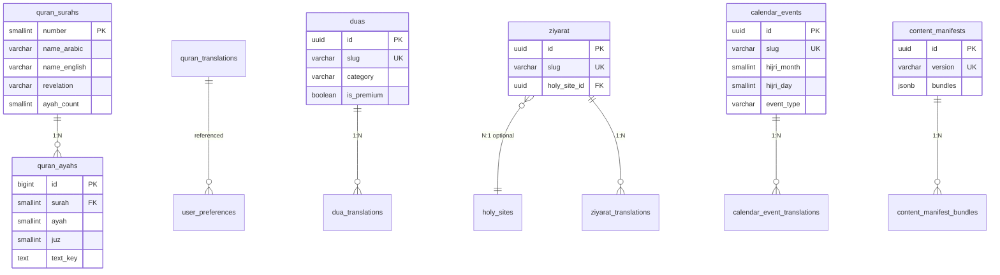
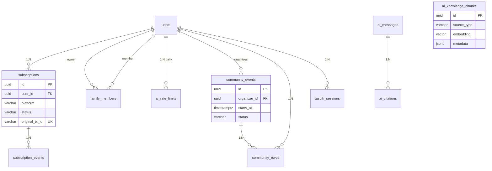

# AhlulBayt+ PostgreSQL Design

**Engine:** PostgreSQL 16 (Aurora RDS in production)  
**ORM:** Drizzle ORM · **Migrations:** `api/drizzle/migrations/`  
**Conventions:** `snake_case` · UUID PKs · `timestamptz` UTC · soft-delete via `deleted_at`

---

## 1. Entity Relationship Diagram

### Phase 1 — Implemented (Auth, User Data, Sync, AI)

```mermaid
erDiagram
    users ||--o| user_preferences : "1:1"
    users ||--o{ oauth_accounts : "1:N"
    users ||--o{ refresh_tokens : "1:N"
    users ||--o{ otp_codes : "1:N"
    users ||--o{ password_reset_tokens : "1:N"
    users ||--o{ devices : "1:N"
    users ||--o{ sync_changelog : "1:N append"
    users ||--o{ qadha_records : "1:N"
    users ||--o{ bookmarks : "1:N"
    users ||--o{ reading_progress : "1:N"
    users ||--o{ ai_conversations : "1:N"
    users ||--o| users : "guest merge"

    ai_conversations ||--o{ ai_messages : "1:N"

    users {
        uuid id PK
        varchar email UK
        boolean email_verified
        varchar password_hash
        varchar display_name
        varchar locale
        varchar role
        varchar tier
        varchar marja
        boolean is_anonymous
        uuid merged_into_id FK
        timestamptz deleted_at
    }

    user_preferences {
        uuid user_id PK_FK
        varchar prayer_method
        jsonb prayer_offsets
        jsonb notification_prefs
        varchar sync_token
    }

    sync_changelog {
        bigint id PK
        uuid user_id FK
        varchar entity_type
        uuid entity_id
        varchar operation
        jsonb payload
    }

    qadha_records {
        uuid id PK
        uuid user_id FK
        varchar prayer
        date missed_date
        timestamptz completed_at
    }

    bookmarks {
        uuid id PK
        uuid user_id FK
        varchar content_type
        varchar content_ref
    }

    ai_conversations {
        uuid id PK
        uuid user_id FK
        varchar title
    }

    ai_messages {
        uuid id PK
        uuid conversation_id FK
        varchar role
        text content
        jsonb metadata
    }
```

### Phase 2 — Content Catalog (CDN-backed metadata)



### Phase 3 — Subscriptions, AI RAG, Community



---

## 2. Relationships

### Cardinality & cascade rules

| Parent | Child | Type | ON DELETE | Notes |
|--------|-------|------|-----------|-------|
| `users` | `user_preferences` | 1:1 | CASCADE | Created on first prefs update |
| `users` | `oauth_accounts` | 1:N | CASCADE | UNIQUE(provider, provider_id) |
| `users` | `refresh_tokens` | 1:N | CASCADE | Rotation via `family_id` |
| `users` | `devices` | 1:N | CASCADE | Push token upsert by token |
| `users` | `sync_changelog` | 1:N | CASCADE | Append-only; 90-day retention |
| `users` | `qadha_records` | 1:N | CASCADE | Soft-delete; unique per prayer+date |
| `users` | `bookmarks` | 1:N | CASCADE | Soft-delete; unique per content ref |
| `users` | `reading_progress` | 1:N | CASCADE | One row per content+surah |
| `users` | `ai_conversations` | 1:N | CASCADE | Optional soft-delete |
| `users` | `users` | N:1 | SET NULL | Guest → registered merge |
| `ai_conversations` | `ai_messages` | 1:N | CASCADE | Ordered by created_at |
| `quran_surahs` | `quran_ayahs` | 1:N | RESTRICT | Surah number is natural PK |
| `duas` | `dua_translations` | 1:N | CASCADE | UNIQUE(dua_id, locale) |
| `ziyarat` | `ziyarat_translations` | 1:N | CASCADE | UNIQUE(ziyarat_id, locale) |
| `holy_sites` | `ziyarat` | 1:N | SET NULL | Optional site link |
| `calendar_events` | `calendar_event_translations` | 1:N | CASCADE | UNIQUE(event_id, locale) |
| `subscriptions` | `subscription_events` | 1:N | CASCADE | Audit trail for IAP |
| `ai_messages` | `ai_citations` | 1:N | CASCADE | RAG source references |
| `community_events` | `community_rsvps` | 1:N | CASCADE | UNIQUE(event_id, user_id) |

### Domain boundaries

```
┌─────────────────────────────────────────────────────────────────┐
│  IDENTITY          user-scoped data never crosses user_id       │
│  users · oauth · tokens · otp                                   │
├─────────────────────────────────────────────────────────────────┤
│  USER STATE        1:1 or low-cardinality per user              │
│  user_preferences · devices                                       │
├─────────────────────────────────────────────────────────────────┤
│  SYNC              append-only changelog → mobile WatermelonDB    │
│  sync_changelog · bookmarks · qadha · reading_progress          │
├─────────────────────────────────────────────────────────────────┤
│  CONTENT           read-heavy; bulk text on S3/CDN              │
│  quran_* · duas · ziyarat · calendar_* · content_manifests        │
├─────────────────────────────────────────────────────────────────┤
│  AI                conversations + optional pgvector RAG        │
│  ai_conversations · ai_messages · ai_citations · knowledge_chunks │
├─────────────────────────────────────────────────────────────────┤
│  MONETIZATION      Apple/Google IAP webhooks                      │
│  subscriptions · family_members · subscription_events             │
├─────────────────────────────────────────────────────────────────┤
│  COMMUNITY         moderated UGC events                           │
│  community_events · community_rsvps                             │
└─────────────────────────────────────────────────────────────────┘
```

---

## 3. Index Catalog

### Identity & auth

| Index | Table | Columns | Type | Purpose |
|-------|-------|---------|------|---------|
| `idx_users_email` | `users` | `email` | B-tree partial | Login lookup; `WHERE deleted_at IS NULL` |
| `idx_users_tier` | `users` | `tier` | B-tree partial | Premium feature gating |
| `idx_oauth_provider` | `oauth_accounts` | `provider, provider_id` | B-tree UNIQUE | OAuth lookup |
| `idx_refresh_user` | `refresh_tokens` | `user_id` | B-tree | Revoke all sessions |
| `idx_refresh_family` | `refresh_tokens` | `family_id` | B-tree | Rotation family invalidation |
| `idx_refresh_expires` | `refresh_tokens` | `expires_at` | B-tree partial | Cleanup job; `WHERE revoked_at IS NULL` |
| `idx_otp_email` | `otp_codes` | `email, purpose` | B-tree | OTP verification |
| `idx_reset_user` | `password_reset_tokens` | `user_id` | B-tree | Reset flow |

### User data & sync

| Index | Table | Columns | Type | Purpose |
|-------|-------|---------|------|---------|
| `idx_devices_user` | `devices` | `user_id` | B-tree | List user devices |
| `idx_devices_push_token` | `devices` | `push_token` | B-tree UNIQUE | Token upsert |
| `idx_sync_changelog_user_time` | `sync_changelog` | `user_id, id` | B-tree | **Critical:** pull sync cursor scan |
| `idx_sync_changelog_created` | `sync_changelog` | `created_at` | B-tree | Retention purge (90d) |
| `idx_qadha_user_pending` | `qadha_records` | `user_id` | B-tree partial | Pending qadha; `WHERE completed_at IS NULL AND deleted_at IS NULL` |
| `uq_qadha_user_prayer_date` | `qadha_records` | `user_id, prayer, missed_date` | UNIQUE partial | Idempotent create |
| `idx_bookmarks_user` | `bookmarks` | `user_id` | B-tree partial | Active bookmarks; `WHERE deleted_at IS NULL` |
| `uq_bookmarks_user_content` | `bookmarks` | `user_id, content_type, content_ref` | UNIQUE partial | Dedup |
| `idx_reading_progress_user` | `reading_progress` | `user_id, content_type` | B-tree | Resume reading |
| `uq_reading_progress` | `reading_progress` | `user_id, content_type, surah` | UNIQUE | One progress row |

### Content catalog

| Index | Table | Columns | Type | Purpose |
|-------|-------|---------|------|---------|
| `idx_quran_ayahs_surah_ayah` | `quran_ayahs` | `surah, ayah` | B-tree UNIQUE | Ayah lookup |
| `idx_quran_ayahs_juz` | `quran_ayahs` | `juz` | B-tree | Juz navigation |
| `idx_duas_category` | `duas` | `category, sort_order` | B-tree | Catalog browse |
| `idx_duas_slug` | `duas` | `slug` | B-tree UNIQUE | API by slug |
| `idx_ziyarat_slug` | `ziyarat` | `slug` | B-tree UNIQUE | API by slug |
| `idx_calendar_hijri` | `calendar_events` | `hijri_month, hijri_day` | B-tree | Today/upcoming events |
| `idx_content_manifest_version` | `content_manifests` | `version` | B-tree UNIQUE | Manifest fetch |

### AI

| Index | Table | Columns | Type | Purpose |
|-------|-------|---------|------|---------|
| `idx_ai_conversations_user` | `ai_conversations` | `user_id, updated_at DESC` | B-tree | History list |
| `idx_ai_messages_conversation` | `ai_messages` | `conversation_id, created_at` | B-tree | Thread load |
| `idx_ai_citations_message` | `ai_citations` | `message_id` | B-tree | Citation expand |
| `idx_ai_chunks_embedding` | `ai_knowledge_chunks` | `embedding` | IVFFlat | RAG cosine similarity |
| `idx_ai_chunks_source` | `ai_knowledge_chunks` | `source_type, source_id` | B-tree | Source filter |
| `pk_ai_rate_limits` | `ai_rate_limits` | `user_id, date` | PRIMARY KEY | Daily quota |

### Subscriptions & community

| Index | Table | Columns | Type | Purpose |
|-------|-------|---------|------|---------|
| `idx_subscriptions_user` | `subscriptions` | `user_id` | B-tree | User entitlements |
| `idx_subscriptions_active` | `subscriptions` | `status, expires_at` | B-tree partial | `WHERE status = 'active'` |
| `idx_subscriptions_tx` | `subscriptions` | `original_tx_id` | B-tree UNIQUE | Webhook idempotency |
| `idx_community_events_time` | `community_events` | `starts_at` | B-tree partial | Approved upcoming |
| `idx_mosques_geo` | `mosques` | `(lat, lng)` | GiST | Nearby mosque search |

---

## 4. Performance Strategy

### Read vs write profile

| Workload | Pattern | Strategy |
|----------|---------|----------|
| Auth login | Point lookup on email | Partial index on `users.email` |
| Sync pull | Range scan `(user_id, id > cursor)` | Composite index; batch limit 50 |
| Sync push | Batch insert changelog | No index needed on insert; async |
| Content catalog | Read-only, high cache hit | Redis 10m–24h TTL; CDN for bodies |
| AI chat | Insert conversation + 2 messages | Index on conversation_id only |
| AI RAG (phase 2) | Vector similarity | IVFFlat; limit top-k=10; pre-filter by source_type |
| Prayer qadha | Filter pending per user | Partial index excludes completed/deleted |
| Analytics | High-volume append | Range partitioning by month |

### Connection & pooling

```
Mobile/API ──► PgBouncer (transaction mode) ──► Aurora PostgreSQL
                    │
                    ├── pool_size: 20 per API instance
                    ├── max_client_conn: 200
                    └── statement_timeout: 30s
```

- **Drizzle** uses `pg.Pool` with `max: 20` per ECS task
- Read replicas for analytics queries only (future)
- No long-running transactions in request path

### Caching layers

| Layer | Data | TTL |
|-------|------|-----|
| Redis | Content manifest, dua/ziyarat catalogs | 10m – 1h |
| CDN | Quran/dua/ziyarat gzip bundles | Immutable (versioned URL) |
| App | Surah metadata (114 rows) | 24h |

### Sync changelog retention

```sql
-- Daily cron (or pg_cron)
DELETE FROM sync_changelog
WHERE created_at < NOW() - INTERVAL '90 days';
```

Mobile holds authoritative local state; server changelog is a **transport log**, not archive.

### Partitioning (analytics)

`analytics_events` partitioned by `created_at` month. New partitions created 1 month ahead via pg_partman or migration script. Drops partitions older than 13 months.

### Query budgets

| Endpoint | Target p95 | Max rows |
|----------|------------|----------|
| `GET /v1/sync/pull` | < 50ms | 50 |
| `GET /v1/quran/search` | < 200ms | 25 |
| `GET /v1/calendar/today` | < 30ms | 20 |
| AI RAG retrieval | < 300ms | 10 chunks |

### Vacuum & maintenance

- `autovacuum_vacuum_scale_factor = 0.05` on `sync_changelog`, `analytics_events`
- `REINDEX` IVFFlat after bulk embedding load
- Weekly `pg_stat_user_indexes` review for unused indexes

---

## 5. Migrations

### File layout

```
api/drizzle/migrations/
├── 0000_auth.sql                 ✅ Identity & auth
├── 0001_core_modules.sql         ✅ Preferences, sync, worship, AI
├── 0002_indexes_constraints.sql  ✅ Partial indexes, unique constraints
├── 0003_content_catalog.sql      Content metadata tables
├── 0004_subscriptions.sql        IAP & family sharing
├── 0005_ai_extended.sql          Citations, rate limits, pgvector RAG
├── 0006_community.sql            Events & RSVPs
├── 0007_analytics_mosques.sql    Partitioned analytics, geo mosques
└── README.md                     Run order & rollback notes
```

### Apply

```bash
cd api
export DATABASE_URL=postgresql://...
psql $DATABASE_URL -f drizzle/migrations/0000_auth.sql
psql $DATABASE_URL -f drizzle/migrations/0001_core_modules.sql
# ... sequential through 0007
```

Or via Drizzle Kit:

```bash
npm run db:migrate
```

### Migration policy

1. **Expand-contract** for breaking changes (add column → dual-write → backfill → drop old)
2. **Reversible** where possible — each file includes `-- DOWN` section in comments
3. **Idempotent** — `IF NOT EXISTS` on tables/indexes for safe re-run in dev
4. **Seed data** separate in `api/drizzle/seeds/` (surahs, calendar events)
5. **Production** — ECS one-off task runs migrations before rolling deploy

### Phase rollout

| Phase | Migrations | When |
|-------|------------|------|
| MVP | 0000 – 0002 | Now — auth, sync, indexes |
| Content DB | 0003 | When moving catalogs off static TS files |
| Premium | 0004 | Apple/Google IAP launch |
| AI RAG | 0005 | LLM + embedding search |
| Community | 0006 – 0007 | Social features, analytics |

---

## 6. Seed Data

| File | Rows | Description |
|------|------|-------------|
| `seeds/001_quran_surahs.sql` | 114 | Surah metadata |
| `seeds/002_calendar_events.sql` | ~50 | Wiladat, shahadat, Ghadeer, Ashura |
| `seeds/003_duas_catalog.sql` | ~200 | Mafatih slug references |
| `seeds/004_holy_sites.sql` | ~20 | Karbala, Najaf, Samarra, Mashhad |

Seeds are idempotent (`ON CONFLICT DO NOTHING`).

---

*Document owner: Platform Architecture · Version 2.0 · June 2026*
