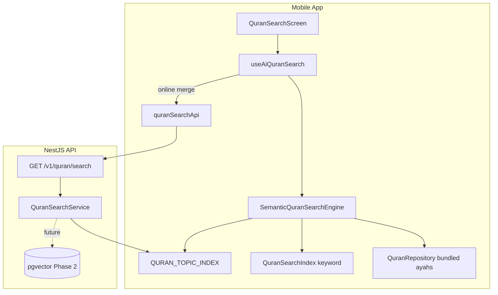

# AI Quran Semantic Search

Natural-language Quran search for AhlulBayt+. Users ask questions like *"Find verses about patience"* or *"Find verses about Imam Ali"* and receive ranked ayah results with relevance scores and match explanations.

---

## Goals

| Goal | Detail |
|------|--------|
| **Semantic** | Match by meaning and Islamic concepts, not exact Arabic/English words |
| **Shia-aware** | Topic index includes wilayah, Ahlul Bayt, Imam Ali (AS), Karbala themes |
| **Offline-first** | Full search works without network via on-device topic + text engine |
| **Hybrid** | Server augments local results when online (full corpus, embeddings in Phase 2) |
| **Explainable** | Each result shows match type (topic / semantic / keyword) and matched topics |

---

## Architecture Overview



---

## Search Pipeline (3 Layers)

### Layer 1 — Topic Index (Concept Retrieval)

Curated **Shia-aware topic → ayah mapping** with multilingual synonyms.

| Field | Purpose |
|-------|---------|
| `id` | Stable topic key (`patience`, `imam_ali`, `charity`) |
| `labels` | en / ur / ar display names |
| `synonyms` | Expanded phrases for matching ("sabr", "امام علی", "wilaya") |
| `ayahRefs` | Curated ayah references from tafsir tradition |
| `summary` | Shown when full ayah text not yet downloaded |

**Example topics:** patience, Imam Ali (AS), charity, Ahlul Bayt, justice, tawakkul.

**Location:** `mobile/src/features/quran/search/data/quranTopics.ts` (mirrored in `api/src/quran/data/quran-topics.ts`).

### Layer 2 — Local Semantic Scoring

On-device hybrid ranker without ML inference:

1. **Query normalization** — tokenize, strip diacritics, remove stop words ("find", "verses", "about")
2. **Synonym expansion** — if query hits any synonym in a group, expand to full group
3. **Topic matching** — cosine similarity + phrase overlap against topic documents
4. **Ayah text scoring** — cosine + keyword overlap on bundled ayah corpus (Arabic + en/ur/roman)
5. **Keyword fallback** — existing `QuranSearchIndex` substring match
6. **Merge & dedupe** — highest score wins; boost hybrid when topic + text align

**Engine:** `mobile/src/features/quran/search/engine/semanticSearchEngine.ts`

### Layer 3 — Server Augmentation (Phase 1)

`GET /v1/quran/search?q=&mode=semantic&limit=25`

Returns topic-ranked results from the same index. Mobile merges server-only refs when online.

**Phase 2 — pgvector embeddings:**

```sql
SELECT surah, ayah, arabic, translation_en,
       1 - (embedding <=> $query_embedding) AS score
FROM quran_ayah_embeddings
WHERE 1 - (embedding <=> $query_embedding) > 0.72
ORDER BY embedding <=> $query_embedding
LIMIT 25;
```

Embed with `text-embedding-3-small`; ingest all 6,236 ayahs + Shia tafsir snippets as separate chunks for reranking.

---

## API Contract

### Request

```
GET /v1/quran/search?q=Find+verses+about+patience&mode=semantic&limit=25
```

| Param | Type | Default | Description |
|-------|------|---------|-------------|
| `q` | string | required | Natural language query (min 2 chars) |
| `mode` | `semantic` \| `keyword` | `semantic` | Search mode |
| `limit` | int 1–50 | 25 | Max results |

### Response

```json
{
  "query": "Find verses about patience",
  "expandedTerms": ["patience", "sabr", "صبر", "persevere", "trial"],
  "matchedTopics": [
    { "id": "patience", "label": "Patience (Sabr)", "score": 0.91 }
  ],
  "results": [
    {
      "ref": "2:153",
      "surah": 2,
      "ayah": 153,
      "surahName": "Al-Baqarah",
      "snippetArabic": "…",
      "snippetTranslation": "O you who believe, seek help through patience and prayer…",
      "score": 0.87,
      "matchType": "topic",
      "matchedTopics": ["Patience (Sabr)"],
      "matchReason": "Matched topic: Patience (Sabr)"
    }
  ],
  "source": "server",
  "tookMs": 4
}
```

---

## Mobile UX

| Screen | Path |
|--------|------|
| Entry | Quran tab → **Search Quran** button |
| Search | `QuranSearchScreen` (modal stack route) |

**Features:**
- AI search bar with natural language placeholder
- Example query chips (patience, Imam Ali, charity, …)
- Matched topic pills above results
- Result cards: surah:ayah, Arabic snippet, translation, relevance %, match type

**Hook:** `useAiQuranSearch` — debounced local search + optional server merge.

---

## Data Dependencies

| Data | Status | Search impact |
|------|--------|---------------|
| Bundled Surah 1 + 2:255 | ✅ | Full text semantic scoring |
| Full 114 surahs | 🔜 CDN bundles | Expands Layer 2 coverage |
| Topic index (16 topics) | ✅ | Powers concept queries offline |
| FTS5 on-device | 🔜 WatermelonDB | Fast keyword layer |
| pgvector server | 🔜 | True embedding search at scale |

---

## Example Queries → Expected Topics

| User query | Matched topic | Sample ayahs |
|------------|---------------|--------------|
| Find verses about patience | `patience` | 2:153, 2:155, 3:200, 103:3 |
| Find verses about Imam Ali | `imam_ali` | 5:67, 33:33, 61:6, 42:23 |
| Find verses about charity | `charity` | 2:261, 2:267, 57:18, 76:8 |
| Verses about Ahlul Bayt | `ahlulbayt` | 33:33, 42:23, 5:67 |
| Verses on justice | `justice` | 4:58, 4:135, 16:90 |

---

## File Map

```
mobile/src/features/quran/search/
├── data/quranTopics.ts          # Topic index + example queries
├── engine/
│   ├── semanticSearchEngine.ts  # Hybrid local ranker
│   └── textSimilarity.ts        # Tokenize, cosine, expansion
├── hooks/useAiQuranSearch.ts    # Debounced search hook
├── services/quranSearchApi.ts   # Server fallback
├── components/
│   ├── SearchBar.tsx
│   └── SearchResultRow.tsx
├── screens/QuranSearchScreen.tsx
└── types.ts

api/src/quran/
├── quran.module.ts
├── quran.controller.ts
├── quran-search.service.ts
├── data/quran-topics.ts
├── dto/quran-search.dto.ts
└── utils/text-similarity.ts
```

---

## Roadmap

| Phase | Deliverable |
|-------|-------------|
| **1 (now)** | Topic index + hybrid local/server search + UI |
| **2** | Full ayah corpus bundles + FTS5 |
| **3** | pgvector embeddings + OpenAI query embed + Cohere rerank |
| **4** | Cross-lingual voice search ("صبر کے بارے میں آیات") |
| **5** | Personal search history + suggested follow-ups via AI chat |

---

## Related Docs

- [ENGINES.md §3.5](./ENGINES.md) — FTS5 + OpenSearch plan
- [DATABASE_SCHEMA.md](./DATABASE_SCHEMA.md) — `quran_ayahs`, `ai_knowledge_chunks`
- [ARCHITECTURE.md §API](./ARCHITECTURE.md) — `GET /v1/quran/search`
