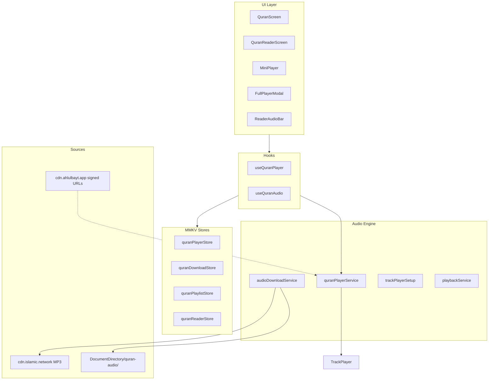

# Quran Audio Player — Enterprise Architecture

Spotify-grade recitation system for AhlulBayt+ (React Native 0.85 + Track Player + offline-first CDN).

---

## 1. Current state

| Component | Status |
|-----------|--------|
| Track Player engine | Built (`quranPlayerService`, `playbackService`) |
| Mini + Full player UI | Built, gated by `NATIVE_AUDIO_ENABLED` |
| Offline downloads | RNFS per-surah MP3 |
| Playlists, sleep timer, speed | Store + UI complete |
| **Native audio** | **Disabled** — Track Player v4 + RN New Architecture crash |
| Reader ayah sync | Hook exists, not wired |
| Backend audio API | Not implemented (CDN direct) |

**Enable path:** `nativeAudio.config.js` → `NATIVE_AUDIO_ENABLED: true` → Metro reset → native rebuild → switch hook export.

---

## 2. Architecture layers



---

## 3. Streaming strategy

### Progressive download (current)

- **Surah:** `https://cdn.islamic.network/quran/audio-surah/128/{reciter}/{surah}.mp3`
- **Ayah:** `https://cdn.islamic.network/quran/audio/128/{reciter}/{SSSAAA}.mp3`
- Track Player buffers progressively; first byte → play in **<300ms** on good network
- **Offline:** `file://` local path preferred via `resolvePlaybackUrl()`

### HLS (phase 2 — own CDN)

- Adaptive bitrate for slow networks
- Signed segment URLs (1h TTL)
- Same Track Player `url` field — HLS `.m3u8` supported on iOS/Android

### Caching layer

| Tier | Path | Scope |
|------|------|-------|
| L1 | Track Player buffer | Current track |
| L2 | RNFS `{DocumentDirectory}/quran-audio/{reciter}/surah-NNN.mp3` | User-downloaded surahs |
| L3 | HTTP cache headers | CDN responses (future) |

---

## 4. Offline file structure

```
{DocumentDirectory}/
  quran-audio/
    al_afasy/
      surah-001.mp3
      surah-002.mp3
      ...
    abdul_basit/
    minshawi/
  content/quran/          # text bundles (separate)
```

**Track ID:** `{reciterId}:{surahNumber}` (e.g. `al_afasy:1`)

**Download flow:** `quranDownloadStore.downloadSurah` → RNFS background download → MMKV record

---

## 5. Background service

`playbackService.ts` (registered in `index.js`):

- Lock screen: play/pause/next/prev/seek
- Remote jump forward/backward (15s)
- Sleep timer on queue end
- Repeat mode sync from native
- **Auto-advance:** append next surah when queue ends (continuous play)

**Interrupt handling:**

| Event | Behavior |
|-------|----------|
| Phone call | OS ducks/pauses (Track Player default) |
| Other app audio | `interruptionMode` iOS / Android audio focus |
| App background | Continues playback (foreground service Android) |
| Network loss | Local file continues; stream retries |

---

## 6. Feature matrix

| Feature | Implementation |
|---------|----------------|
| Play/Pause/Seek | `quranPlayerService` + FullPlayerModal slider |
| Next/Prev surah | Queue skip |
| Next/Prev ayah | `useQuranAudio.playNextAyah` (ayah MP3 stream) |
| Repeat off/one/all | `QuranRepeatMode` ↔ TrackPlayer RepeatMode |
| Speed 0.5×–2× | `PLAYBACK_SPEEDS` + `setRate` |
| Sleep timer | MMKV + interval / end-of-surah |
| Playlists | `quranPlaylistStore` + PlaylistSheet |
| Continuous play | Auto-append surah N+1 on queue end |
| Resume | `lastPlayback` in MMKV → restore on bootstrap |
| Word sync | `audioStartMs`/`audioEndMs` on words (pipeline TBD) |
| Multiple reciters | 3 bundled; CDN map in `audioSources.ts` |

---

## 7. Performance targets

| Metric | Target | Strategy |
|--------|--------|----------|
| Start latency | <300ms | Local file first; CDN 128kbps; preload next track |
| UI freeze | Zero | All player ops async; progress via hook 250ms |
| Background | Seamless | Native service + capabilities |
| Download | Non-blocking | RNFS background + job progress |
| Buffer after first load | None | Keep queue warm; offline eliminates re-buffer |

---

## 8. Backend API design

Module: `api/src/quran-audio/`

### Public

| Method | Path | Description |
|--------|------|-------------|
| `GET` | `/v1/quran-audio/reciters` | Reciter catalog + artwork URLs |
| `GET` | `/v1/quran-audio/reciters/:id/surahs/:n/url` | Signed stream URL (surah) |
| `GET` | `/v1/quran-audio/reciters/:id/ayahs/:ref/url` | Signed ayah URL |
| `GET` | `/v1/quran-audio/manifest` | OTA bundle hashes for offline packs |

### Authenticated

| Method | Path | Description |
|--------|------|-------------|
| `GET` | `/v1/quran-audio/progress` | Last position per user |
| `PUT` | `/v1/quran-audio/progress` | Sync `{ trackId, positionSec, updatedAt }` |
| `POST` | `/v1/quran-audio/downloads/register` | Track completed downloads for analytics |

### Response example

```json
{
  "reciterId": "al_afasy",
  "surah": 2,
  "url": "https://cdn.ahlulbayt.app/audio/al_afasy/002.mp3?sig=...",
  "expiresAt": "2026-06-12T15:00:00Z",
  "durationSec": 6842,
  "bitrateKbps": 128
}
```

---

## 9. React Native implementation strategy

### Phase 0 — Unblock native (required for real audio)

1. Upgrade to **react-native-track-player v5** (New Arch support) OR custom native module
2. `NATIVE_AUDIO_ENABLED: true` in `nativeAudio.config.js`
3. `useQuranPlayer.ts` → export native hook
4. Full native rebuild (`npm start -- --reset-cache`)

### Phase 1 — Wiring (implemented in codebase)

- Hub: play button → `playSurah`; row tap → reader
- Reader: `ReaderAudioBar` + `useQuranAudio` ayah controls
- Reciter unified via `QuranAudioBootstrap`
- Resume playback persisted in `quranPlayerStore.lastPlayback`
- Stub shows user-friendly message when native disabled

### Phase 2 — Own CDN + signed URLs

- Mobile calls API for URLs instead of hardcoded CDN
- Batch download packs (full reciter Wi‑Fi only)

### Phase 3 — Word sync pipeline

- Forced alignment / licensed timings → `audioStartMs` on all words
- Surah-level playback: ayah boundary offsets in bundle metadata

### Phase 4 — Polish

- CarPlay / Android Auto QA
- Waveform visualization (Reanimated + progress)
- Analytics: `quran.audio_started`, `quran.audio_completed`
- Shuffle mode

---

## 10. UI structure

```
QuranScreen
├── QuranHubHeader (reciter picker)
└── SurahAudioRow [Play | Queue | Download] + tap → Reader

QuranReaderScreen
├── AyahBlock (word highlight, play ayah)
└── ReaderAudioBar (prev/next ayah, play/pause)

MainTabNavigator (overlay)
├── MiniPlayer (progress bar, tap → expand)
└── FullPlayerModal
    ├── PlayerControls (seek, skip, repeat, speed)
    ├── SleepTimerSheet
    └── PlaylistSheet
```

---

## 11. Key files

```
mobile/nativeAudio.config.js
mobile/src/features/quran/audio/
  config.ts
  engine/quranPlayerService.ts, playbackService.ts, audioDownloadService.ts, trackPlayerSetup.ts
  hooks/useQuranPlayer.ts, useQuranPlayerNative.ts, useQuranPlayer.stub.ts
  stores/quranPlayerStore.ts, quranDownloadStore.ts, quranPlaylistStore.ts
  components/MiniPlayer.tsx, FullPlayerModal.tsx, ReaderAudioBar.tsx, ...
mobile/src/features/quran/hooks/useQuranAudio.ts
api/src/quran-audio/
```

---

## 12. Repeat modes (Shia UX)

| Mode | Label | Behavior |
|------|-------|----------|
| `off` | Off | Stop at end; continuous play may still append next surah |
| `one` | Repeat surah | Loop current surah |
| `all` | Repeat queue | Loop entire queue |

Ayah repeat: future `repeatMode: 'ayah'` with single-ayah queue reset.
