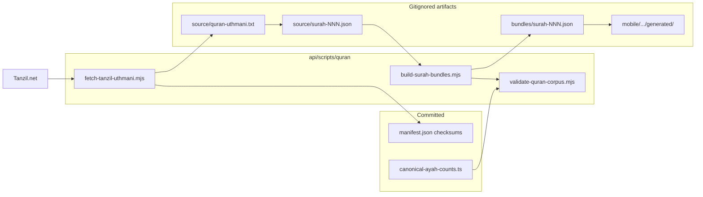

# Quran Data Integrity Architecture

Verified Uthmani Arabic from [Tanzil.net](https://tanzil.net/) (v1.1). **Never hand-type or AI-generate verse text.**

---

## 1. Source of truth

| Layer | Source | Notes |
|-------|--------|-------|
| Arabic (Uthmani) | **Tanzil.net** v1.1 | POST `https://tanzil.net/pub/download/index.php` (`quranType=uthmani`, `outType=txt-2`) |
| Surah metadata | `mobile/.../surahMetadata.ts` + `quran_surahs` PG table | Names, counts, juz — no ayah bodies |
| Translations | Licensed APIs / bundles | `en.sahih`, `ur.jalandhry` via alquran.cloud at runtime; future S3 bundles |
| Tafsir / audio | S3 + PG catalog | `quran_tafsir`, `quran_audio_tracks` (migration `0013`) |

**Attribution (required):** `Tanzil.net Uthmani v1.1` — link to https://tanzil.net/download/

---

## 2. Data architecture



### Directory layout

```
api/data/quran/
├── manifest.json          # checksums + metadata (safe to commit after fetch)
├── source/                # gitignored — raw Tanzil + parsed JSON
│   ├── quran-uthmani.txt
│   └── surah-001.json … surah-114.json
└── bundles/               # gitignored — mobile-compatible SurahBundle JSON

mobile/src/features/quran/data/bundled/
├── index.ts               # loader entry
├── surah001.ts            # deprecated shim (no hand-typed ayahs)
└── generated/             # gitignored — output of quran:build
    ├── registry.ts
    └── surah-001.json … surah-114.json
```

---

## 3. Offline strategy

### Priority order (mobile `QuranRepository`)

1. **Generated Tanzil bundles** — `bundled/generated/` (after `npm run quran:build`)
2. **MMKV / FileSystem cache** — per-surah downloads from remote
3. **Remote fetch** — `api.alquran.cloud` (Arabic + translations when online)
4. **Offline preview** — metadata + placeholder (no fake Arabic)

### Production distribution

| Channel | Approach |
|---------|----------|
| App store binary | Optional: ship generated bundles in OTA update (large) |
| First install | CDN download of `bundles/v{N}/surah-NNN.json.gz` from `cdn.ahlulbayt.app` |
| CI / dev | `npm run quran:fetch && npm run quran:build` locally |

**Repo policy:** Full Arabic text is **gitignored**. Commit `manifest.json` (SHA256 only). Developers fetch Tanzil at build time.

---

## 4. Validation rules

`validate-quran-corpus.mjs` enforces:

- Exactly **114** surahs
- **6236** total ayahs (standard Hafs)
- Per-surah counts match `canonical-ayah-counts.ts`
- No duplicate `(surah, ayah)` keys
- No empty `arabic` fields
- Optional SHA256 match vs `manifest.json`

Exit code **1** on any failure.

```bash
cd api
npm run quran:fetch    # download Tanzil
npm run quran:build    # build mobile + API bundles
npm run quran:validate # verify corpus
npm run quran:test     # unit tests for canonical counts + validator
```

`npm run build` runs `quran:validate --if-present` (skips when bundles absent).

---

## 5. Search architecture

### Phase 1 — In-memory FTS (current)

`QuranSearchIndex` indexes:

- Surah names from `SURAH_METADATA`
- Ayah `arabic` + `translations` from `QuranRepository.getAllIndexedAyahs()`

When `GENERATED_CORPUS_READY`, all 114 surahs are searchable offline.

### Phase 2 — SQLite FTS5 (planned)

```sql
CREATE VIRTUAL TABLE quran_fts USING fts5(
  arabic, translation_en, translation_ur,
  surah UNINDEXED, ayah UNINDEXED,
  tokenize = 'unicode61 remove_diacritics 2'
);
```

- Populate from bundled/generated corpus on first launch
- Normalize Arabic (strip tashkeel) for matching — same as current `normalize()`
- Server-side: PostgreSQL `tsvector` on `quran_ayahs` when text ingested to DB

### Phase 3 — Semantic (existing)

See [`QURAN_AI_SEARCH.md`](./QURAN_AI_SEARCH.md) for pgvector / API search.

---

## 6. Database schema

Base tables: `0003_content_catalog.sql` (`quran_surahs`, `quran_ayahs`, `quran_translations`).

Extensions: `0013_quran_corpus.sql`:

- `idx_quran_ayahs_surah_ayah`
- `quran_translations.translation_source`
- `quran_tafsir` — per-ayah tafsir metadata + S3 body key
- `quran_audio_tracks` — reciter catalog

Ayah **text** remains on S3/CDN (`text_key` on `quran_ayahs`); PG stores metadata + references.

Drizzle ORM entries for content catalog tables are deferred (raw SQL migration pattern).

---

## 7. Production implementation plan

### Phase A — Toolchain (this deliverable)

- [x] Tanzil fetch + parse pipeline
- [x] Bundle builder + validator
- [x] Mobile loader prefers generated bundles
- [x] Migration 0013
- [x] npm scripts wired

### Phase B — CDN + first-install

- Upload `api/data/quran/bundles/*.json.gz` to S3
- `content_manifests` row with version + checksums
- Mobile `quranTextDownloadService` pulls manifest on first launch
- Validate manifest SHA256 before trusting

### Phase C — Translation licensing

- Ingest Shakir / Fooladvand / custom Shia translations with `translation_source`
- Separate bundles per translation edition
- UI shows source label per layer (see `TranslationBlock`)

### Phase D — Enrichment

- Word-by-word, tajweed segments, tafsir — layered on top of Tanzil base
- Audio timestamps synced to Tanzil ayah boundaries
- PostgreSQL ingest worker for server search

### Phase E — CI gate

```yaml
# .github/workflows/quran-integrity.yml
- run: npm run quran:fetch
- run: npm run quran:build
- run: npm run quran:validate
- run: npm run quran:test
```

---

## 8. Developer checklist

1. `cd api && npm run quran:fetch` — requires network; downloads ~1.3 MB Tanzil file
2. `npm run quran:build` — writes gitignored bundles + `generated/registry.ts`
3. `npm run quran:validate` — must pass before shipping offline builds
4. Do **not** commit `source/`, `bundles/`, or `generated/surah-*.json`
5. **Do** commit `api/data/quran/manifest.json` after fetch (checksums only)

---

## References

- [Tanzil Download](https://tanzil.net/download/)
- [Tanzil Uthmani docs](https://tanzil.net/docs/uthmani)
- [`ENGINES.md` § Quran Data Architecture](./ENGINES.md)
- [`QURAN_AUDIO.md`](./QURAN_AUDIO.md)
