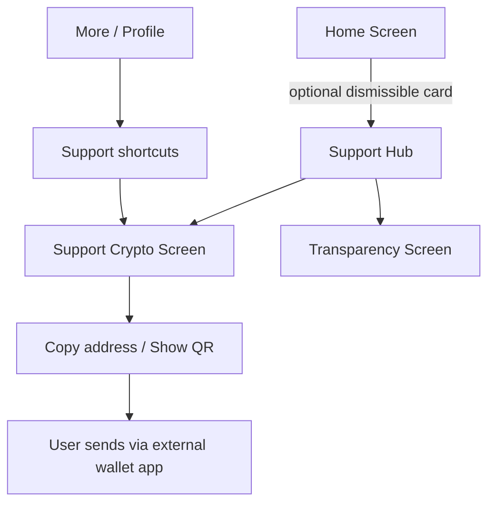
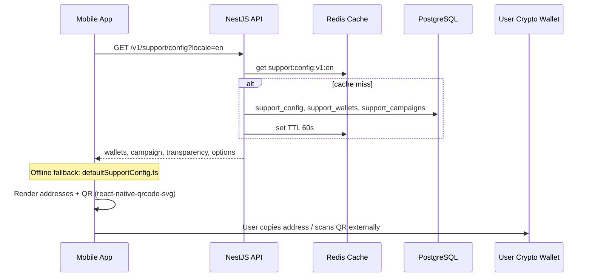
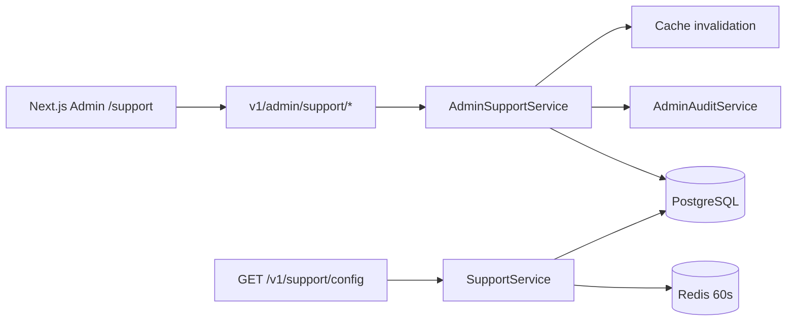

# Support & Donations Architecture

Community support for AhlulBayt+ — voluntary crypto donations only. No payment gateways, no ads, no paywalls, no forced donation screens.

## 1. Complete UX Flow



**Principles (Wikipedia / Signal / Buy Me A Coffee tone):**
- Voluntary only — never block worship features
- Home card: max once per cooldown period; permanently dismissible
- No launch popups or paywalls
- Copy + QR only — user completes payment outside the app

## 2. Crypto Donation Architecture



**Networks:** BTC, ETH, USDT (TRC20), USDT (ERC20)

**Explicitly excluded:** Stripe, Apple IAP, Google Play, PayPal, Wise, Easypaisa, JazzCash, bank transfer UI

## 3. Admin Management Architecture



**Admin capabilities:**
- CRUD crypto wallets (address, network, instructions, enable/disable, sort order)
- CRUD campaigns (localized title/body, active window)
- Singleton config (home card, transparency breakdown, preferred network, reminder cooldown)

**Permissions:** `support.read`, `support.write`

## 4. Database Schema

| Table | Purpose |
|-------|---------|
| `support_wallets` | Crypto wallet addresses per network |
| `support_campaigns` | Optional home/hub campaign copy (jsonb i18n) |
| `support_config` | Singleton: home_card_enabled, transparency, preferred_network, reminder_cooldown_days |

Migration: `api/drizzle/migrations/0015_support.sql`

## 5. Analytics Design

| Event | When |
|-------|------|
| `support.home_card_view` | Home card rendered |
| `support.home_card_click` | User taps Support Now |
| `support.home_card_dismiss` | User dismisses card |
| `support.hub_view` | Support hub opened |
| `support.option_click` | Support option selected |
| `support.crypto_view` | Crypto screen opened |
| `support.wallet_copy` | Address copied |
| `support.qr_view` | QR code expanded |

No payment amount or transaction IDs — we do not process payments.

## 6. Mobile Implementation Plan

```
mobile/src/features/support/
├── screens/          SupportHubScreen, SupportCryptoScreen, SupportTransparencyScreen
├── components/       SupportHomeCard, SupportOptionRow, CryptoWalletCard, SupporterBadge
├── stores/           supportDismissStore, supportReminderStore (MMKV)
├── services/         supportApi, supportAnalytics
├── hooks/            useSupportConfig, useSupportHomeCard
├── data/             defaultSupportConfig.ts (offline fallback)
└── types.ts
```

**Integration points:**
- `HomeScreen` — `SupportHomeCardWidget` after TasbihWidget
- `MoreScreen` — `MoreSupportSection` + menu item
- `RootNavigator` — Support, SupportCrypto, SupportTransparency routes

## 7. Security Considerations

- Wallet addresses are public config — no secrets in API response
- Admin mutations require JWT + RBAC + audit log
- No private keys or payment processor credentials anywhere
- QR codes encode address strings only
- Rate-limit public config endpoint via existing ThrottlerGuard
- Validate network enum server-side; sanitize admin input via class-validator DTOs

## 8. App Store Compliance Review

| Guideline | Approach |
|-----------|----------|
| No IAP for digital goods unlock | Support is voluntary; no feature gating |
| External payments (US/EU) | Crypto instructions only; user pays outside app — similar to donation link patterns |
| No misleading donation claims | Transparency screen; admin-configurable copy |
| No forced prompts | Dismissible card, 30-day cooldown, no launch modal |
| Privacy | No donation tracking; analytics are engagement-only (view/copy events) |

**Note:** Apple/Google policies on external donation links vary by region and app category. This MVP shares wallet addresses (not web checkout). Legal review recommended before production launch in restricted storefronts.

---

Version 1.0 — June 2026
