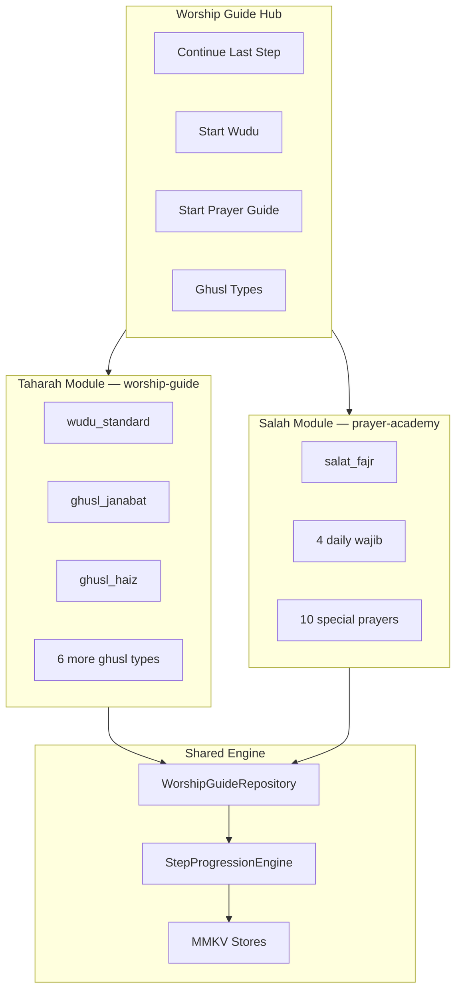

# Step-by-Step Worship Guide System

Unified **Fiqh Jafariya** learning platform for AhlulBayt+: Wudu, Ghusl, and Salah — Duolingo-style guided flow with offline-first content.

---

## 1. Vision

> Duolingo + Islamic Worship Academy + Premium Apple Learning Experience

| Pillar | Implementation |
|--------|----------------|
| Interactive wizard | One step at a time + scroll-all mode |
| Progress | MMKV per guide + global "continue last step" |
| Modes | Beginner → Standard → Scholar (fiqh depth) |
| Audio | Per-step narration hooks (bundled assets phase 2) |
| Offline | TypeScript bundles ship with app |
| Prerequisites | Salah conditions deep-link to Wudu guide |

---

## 2. Module map



### Mobile layout

```
mobile/src/features/
├── worship-guide/              # Taharah + unified hub
│   ├── types.ts
│   ├── schema/worship-guide.schema.json
│   ├── constants/catalog.ts
│   ├── data/bundled/           # wudu + 8 ghusl types
│   ├── engine/
│   │   ├── worshipGuideRepository.ts
│   │   └── stepProgressionEngine.ts
│   ├── stores/                 # progress, bookmarks, reader prefs
│   ├── components/
│   └── screens/
│       ├── WorshipGuideHubScreen.tsx
│       └── WorshipGuideSessionScreen.tsx
└── prayer-academy/             # Salah (existing v1 — 15 prayers)
```

---

## 3. Data model

### `WorshipGuideId`

| ID | Domain | Obligation |
|----|--------|------------|
| `wudu_standard` | Wudu | Prerequisite for salah |
| `ghusl_janabat` | Ghusl | Wajib when required |
| `ghusl_mayyit` | Ghusl | Wajib al-kifā'ī |
| `ghusl_haiz` | Ghusl | Wajib |
| `ghusl_nifas` | Ghusl | Wajib |
| `ghusl_jumuah` | Ghusl | Mustahab |
| `ghusl_istihada` | Ghusl | When applicable |
| `ghusl_mustahab` | Ghusl | Overview of recommended types |

Salah IDs remain in `PrayerAcademyId` (`salat_fajr`, …).

### `WorshipGuideStep` (canonical step)

| Field | Type | Purpose |
|-------|------|---------|
| `id` | string | Stable step key |
| `kind` | `WorshipStepKind` | UI template + animation hint |
| `title` | `LocalizedText` | Step heading |
| `body` | `LocalizedText` | Instructions |
| `arabicText` | string? | Duas / formulae |
| `transliteration` | `LocalizedText`? | Pronunciation |
| `translationEn` / via `body` | en/ur/ar in `LocalizedText` | Translations |
| `audioUrl` | string? | Remote narration |
| `audioAssetKey` | string? | Bundled audio |
| `isRequired` | boolean | Wajib vs mustahab step |
| `fiqhRefs` | `FiqhReference[]` | Scholar mode |
| `commonErrors` | `LocalizedText[]` | Mistakes to avoid |
| `visualHint` | enum | Lottie/SVG key (phase 2) |
| `checklist` | `LocalizedText[]` | Interactive checklist items |
| `scholarBody` | `LocalizedText`? | Extra fiqh in scholar mode |
| `confirmPrompt` | `LocalizedText`? | "Did you complete this step?" |

### Learning modes

| Mode | Audience | Content source |
|------|----------|----------------|
| `beginner` | First-time learners | Short body, no fiqh refs |
| `standard` | Regular users | Full body + checklist |
| `scholar` | Students of fiqh | + `scholarBody`, `fiqhRefs`, `commonErrors` |

Each bundle: `steps: { beginner[], standard[], scholar[] }`.

### `WorshipGuideBundle`

```typescript
interface WorshipGuideBundle {
  meta: WorshipGuideMeta;
  bundleVersion: number;
  domain: 'taharah' | 'salah';
  methodVariants?: GhuslMethodVariant[];  // tartibi | irtimasi
  invalidators?: WorshipInvalidator[];    // wudu/ghusl breakers
  waterRequirements?: LocalizedText;
  orderRules?: LocalizedText[];
  prerequisites?: WorshipGuideId[];
  audioCues?: WorshipAudioCue[];
  steps: Record<GuideLearningMode, WorshipGuideStep[]>;
}
```

---

## 4. JSON Schema

`mobile/src/features/worship-guide/schema/worship-guide.schema.json`

- `$id`: `https://ahlulbayt.app/schemas/worship-guide/v1.json`
- Validates wudu/ghusl bundles for CI + CMS
- Prayer Academy bundles remain on `prayer-academy/v1` until unified merge (v2)

---

## 5. Step progression engine

`stepProgressionEngine.ts`:

| Function | Behavior |
|----------|----------|
| `getSteps(bundle, mode)` | Returns step array for mode |
| `resolveStepIndex(guideId, lastStepId)` | Resume index |
| `advanceStep()` | Haptic `impactLight`, save MMKV, preload next audio |
| `preloadStepAudio(step)` | Cache audio to `{DocumentDirectory}/worship-audio/` |
| `getGlobalLastSession()` | Cross-guide "Continue" card |
| `markStepComplete(guideId, stepId)` | Checklist + wizard progress |

**Performance:** Step switch < 16ms (no network); audio preload async on step N while user reads step N−1.

---

## 6. UI flow

### Hub (`WorshipGuideHubScreen`)

```
┌─────────────────────────────────────┐
│  Worship Guide                      │
│  Learn Wudu, Ghusl & Salah          │
├─────────────────────────────────────┤
│  ▶ Continue: Wudu — Step 4/6        │  ← if lastSession exists
├─────────────────────────────────────┤
│  [ Start Wudu ]  [ Start Prayer ]   │  ← primary CTAs
├─────────────────────────────────────┤
│  Taharah                            │
│   • Wudu (6 steps)                  │
│   • Ghusl Janabat                   │
│   • Ghusl Haiz / Nifas / …          │
├─────────────────────────────────────┤
│  Salah — Prayer Academy →           │
│   Fajr · Dhuhr · … (15 guides)      │
└─────────────────────────────────────┘
```

### Session wizard (`WorshipGuideSessionScreen`)

```
┌─────────────────────────────────────┐
│  ← Wudu                    ♡        │
├─────────────────────────────────────┤
│  ●○○○○○  Step 2 of 6               │
├─────────────────────────────────────┤
│  Wash the face                      │
│  From hairline to chin, ear to ear  │
│                                     │
│  [Arabic dua if any]                │
│                                     │
│  ⚠ Common mistake: …               │  ← scholar / standard
├─────────────────────────────────────┤
│  ☐ Water reached entire face        │  ← checklist
├─────────────────────────────────────┤
│  🔊 Repeat audio    Beginner ▾      │
├─────────────────────────────────────┤
│  ← Prev    Did you complete?  Next →│
└─────────────────────────────────────┘
```

### Salah flow

Unchanged — `PrayerAcademyHubScreen` → `PrayerAcademyGuideScreen`. Hub links with `navigate('PrayerAcademy')`.

---

## 7. Wudu — Jafari content outline

| Step | Required | Jafari note |
|------|----------|-------------|
| Niyyah | ✓ | Heart intention; no spoken formula |
| Wash face | ✓ | Once; hairline to chin, ear to ear |
| Right arm | ✓ | Elbow included; from fingers upward |
| Left arm | ✓ | Same as right |
| Masah head | ✓ | Wipe with wet hands |
| Masah feet | ✓ | Wipe feet; order: head then feet (Jafari sequence) |

**Invalidators:** sleep, urination, flatulence, etc. — bundled as `invalidators[]` + scholar steps.

---

## 8. Ghusl types

| Type | Method | Notes |
|------|--------|-------|
| Janabat | Tartibi (+ Irtimasi scholar) | After intercourse, ejaculation |
| Mayyit | Tartibi | Funeral washing rules |
| Haiz | Tartibi | Menstruation |
| Nifas | Tartibi | Post-childbirth bleeding |
| Jumuah | Tartibi | Mustahab before Jumuah |
| Istihada | Tartibi | Irregular bleeding rules |
| Mustahab | Overview | Eid, rain, entering Makkah, etc. |

---

## 9. Salah — existing coverage

Prayer Academy v1 already provides:

- All 5 daily wajib with rakat breakdown
- Step kinds: niyyah, takbir, qiyam, ruku, sujud, tashahhud, salam
- Beginner / advanced (maps to beginner / standard)
- 10 special prayers

**Gap → v2:** Rename advanced → standard; add explicit **scholar** tier with fiqh refs surfaced by default.

---

## 10. Storage

| MMKV key | Data |
|----------|------|
| `ahlulbayt-worship-guide-progress` | Per-guide step completion |
| `ahlulbayt-worship-guide-reader` | Mode, haptics, audio prefs |
| `ahlulbayt-worship-guide-bookmarks` | Step bookmarks |
| `ahlulbayt-worship-guide-last-session` | Global resume pointer |

Prayer Academy keeps separate keys until v2 merge.

---

## 11. Backend API

Module: `api/src/worship-guide/`

| Method | Path | Description |
|--------|------|-------------|
| `GET` | `/v1/worship-guide/catalog` | All guides metadata |
| `GET` | `/v1/worship-guide/bundles/:id` | Full bundle JSON |
| `GET` | `/v1/worship-guide/manifest` | OTA version hashes |
| `GET` | `/v1/worship-guide/progress` | User progress (auth) |
| `PUT` | `/v1/worship-guide/progress` | Sync step state |
| `GET` | `/v1/worship-guide/audio/:assetKey` | Signed narration URL |

Mobile uses bundled TS today; API enables CMS updates without app release.

---

## 12. Implementation phases

### Phase 1 — Foundation (this PR)

- [x] Architecture doc
- [x] `worship-guide` types + schema
- [x] Wudu + 8 Ghusl bundled content
- [x] Hub + session screens
- [x] Progress engine + MMKV
- [x] Navigation from Prayer tab
- [x] API skeleton

### Phase 2 — Media & polish

- Bundled step audio (MP3 per step)
- Lottie `visualHint` animations
- Haptic on step confirm
- Deep links: Prayer conditions → Wudu session

### Phase 3 — Unification

- Merge Prayer Academy into worship-guide domain
- Scholar mode for all 15 prayers
- Postgres progress sync
- AI assistant routes: "How do I perform wudu?" → `WorshipGuideSession`

### Phase 4 — Advanced

- Marja branching (Sistani / Khamenei toggles)
- Tayammum + najasa modules
- Completion certificates / Insights integration

---

## 13. Performance targets

| Metric | Target |
|--------|--------|
| Step switch | < 16ms (local state) |
| First hub paint | < 100ms (catalog in memory) |
| Offline | 100% taharah content without network |
| Audio preload | Next step ready within 500ms on Wi‑Fi |

---

## 14. Related docs

- [`PRAYER_ACADEMY.md`](./PRAYER_ACADEMY.md) — Salah module detail
- [`PRAYER_ENGINE.md`](./PRAYER_ENGINE.md) — Live prayer times (future hub integration)
- [`OFFLINE_FIRST_SYNC.md`](./OFFLINE_FIRST_SYNC.md) — Manifest sync pattern
