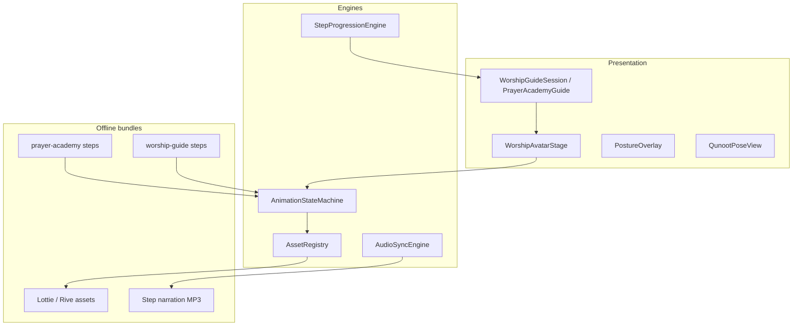
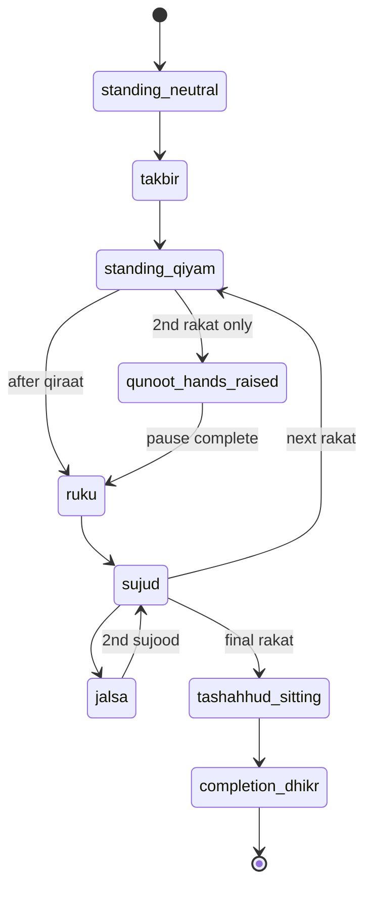
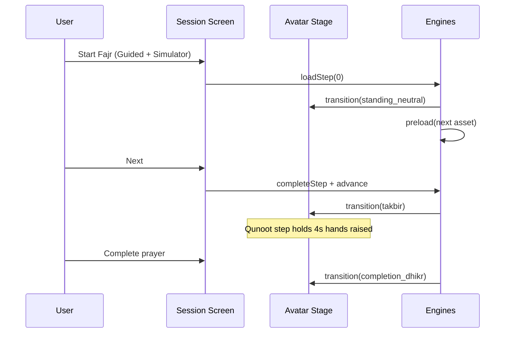

# Interactive Animated Worship Simulator

Fiqh Jafariya-accurate visual learning for Salah, Wudu, and Ghusl — Duolingo flow × Apple Fitness coaching × medical-precision posture overlays.

---

## 1. Module map



```
mobile/src/features/worship-simulator/
├── types.ts
├── constants/poses.ts
├── constants/transitions.ts
├── engine/
│   ├── animationStateMachine.ts
│   ├── audioSyncEngine.ts
│   └── assetRegistry.ts
├── components/
│   ├── WorshipAvatarStage.tsx
│   ├── PostureOverlay.tsx
│   ├── QunootPoseView.tsx
│   ├── WuduFlowVisual.tsx
│   └── GhuslZoneHighlight.tsx
└── hooks/
    └── useWorshipSimulator.ts
```

Integrates with existing modules — **does not duplicate content**:

| Domain | Content source | Simulator hook |
|--------|----------------|----------------|
| Salah | `prayer-academy` | `animationPose` on `PrayerGuideStep` |
| Wudu / Ghusl | `worship-guide` | `visualHint` + `animationAssetKey` |

---

## 2. Fiqh Jafariya corrections (Salah)

### Removed / corrected

| Issue | Fix |
|-------|-----|
| Mandatory **Salam ending** framed like Sunni dual-salam | Replaced with **`completion`** step: three takbirs (dhikr) |
| Combined "two sujud" as one step | Split: **Sujood 1 → Jalsa → Sujood 2** |
| Missing explicit **Qiyam** | Added standing step before qira'at |
| Missing **Qunoot** emphasis | Dedicated step with `pauseDurationMs` + raised-hands animation |

### Correct Shia sequence (2-rakat wajib)

```
Niyyah → Takbirat al-Ihram → Qiyam → Qira'at
  → Ruku → Sujood₁ → Jalsa → Sujood₂
  → [2nd rakat: Qiyam → Qira'at → Qunoot* → Ruku → Sujood₁ → Jalsa → Sujood₂]
  → Tashahhud (Shia formula + salawat)
  → Completion (3× Allahu Akbar — NOT Sunni salam framing)

* Qunoot in 2nd rakat: Fajr, Maghrib, Isha (not Asr); Dhuhr per marja
```

### 4-rakat middle rakats

Stand from tashahhud **without concluding** → al-Hamd or Tasbihat al-Arba' → ruku → sujud pair → repeat → final tashahhud → **completion**.

---

## 3. Animation state machine

### Pose enum (`SalahPose`)

| Pose | Salah | Wudu | Ghusl |
|------|-------|------|-------|
| `standing_neutral` | Niyyah | — | — |
| `takbir` | Takbirat al-Ihram | — | — |
| `standing_qiyam` | Qira'at | — | — |
| `qunoot_hands_raised` | **Qunoot pause** | — | — |
| `ruku` | Ruku | — | — |
| `sujud` | Sujood | — | — |
| `jalsa` | Between sujud | — | — |
| `tashahhud_sitting` | Tashahhud | — | — |
| `completion_dhikr` | 3 takbirs | — | — |
| `wash_hands` | — | Step 1 | — |
| `wash_face` | — | Face | Head wash |
| `wash_arm` | — | Arms | Side wash |
| `masah_head` | — | Masah | — |
| `masah_feet` | — | Masah | — |
| `ghusl_immersion` | — | — | Irtimasi |

### Transition graph (Salah core loop)



**Transition timing:** Reanimated `withTiming` 400–600ms; Qunoot holds 4000ms default (`pauseDurationMs`).

---

## 4. Step data model (simulator extensions)

```typescript
interface SimulatorCapableStep {
  animationPose?: SalahPose | WuduPose | GhuslPose;
  animationAssetKey?: string;      // Lottie/Rive bundle id
  pauseDurationMs?: number;        // Qunoot hold
  audioAssetKey?: string;
  highlightZones?: BodyZone[];     // ghusl / posture correction
  postureHints?: PostureHint[];    // correct vs incorrect overlay
}
```

Prayer Academy steps now include `animationPose` + `animationAssetKey`. Worship Guide wudu steps use `visualHint` mapped via `poseFromVisualHint()`.

---

## 5. Asset pipeline

### Directory layout (ship + OTA)

```
assets/worship-simulator/
├── salah/
│   ├── lottie/qiyam.json
│   ├── lottie/qunoot.json      ← hands raised, calm hold
│   ├── lottie/ruku.json
│   ├── lottie/sujud.json
│   ├── lottie/jalsa.json
│   └── lottie/completion.json
├── wudu/
│   ├── lottie/wash_face.json
│   └── lottie/water_flow.json  ← overlay particle
├── ghusl/
│   └── lottie/zone_head.json … zone_feet.json
└── audio/
    ├── en/ ur/ ar/             ← per-step narration
    └── manifest.json
```

### Pipeline stages

1. **Design** — Fiqh-reviewed storyboards (Shia posture references)
2. **Animate** — Rive (interactive) or Lottie (lightweight) at 60fps
3. **Validate** — Scholar sign-off per pose
4. **Bundle** — Metro `require()` for v1; manifest hash for OTA v2
5. **Preload** — Next step asset loaded during current step audio

### Technology choice

| Tool | Use |
|------|-----|
| **Reanimated 4** | Avatar transitions, progress, overlays (already in app) |
| **Lottie** | Phase 1 illustrations (add `lottie-react-native`) |
| **Rive** | Phase 2 interactive avatar (optional upgrade) |

---

## 6. Audio + text sync

`audioSyncEngine.ts`:

| Event | Behavior |
|-------|----------|
| `onStepEnter` | Play step narration (ar → optional ur/en) |
| `onQunootEnter` | Pause animation; sync dua lines to subtitles |
| `onPoseTransition` | Duck audio 200ms during motion |
| `onCompletion` | No Sunni-style closing narration |

**Sync model:** Each step = `{ audioAssetKey, durationMs, subtitleCues[] }`. Cues drive karaoke-style highlight on Arabic line.

---

## 7. UX flow



**Modes:**

| Mode | Simulator behavior |
|------|-------------------|
| Beginner | Avatar + short text; no fiqh overlay |
| Standard | Avatar + checklist + posture hints |
| Scholar | + fiqh refs + incorrect posture comparison |

---

## 8. Wudu visual enhancements

Added **hands wash** as first recommended step (mustahab per many marja).

| Step | Visual |
|------|--------|
| Wash hands | Water flow on hands |
| Face | Zone highlight + flow |
| Arms | Direction arrows (top → elbow) |
| Masah head/feet | Wipe trail animation |
| Confirm | Green check / red invalid flash |

---

## 9. Ghusl visual enhancements

| Method | Visual |
|--------|--------|
| Tartibi | Sequential zone highlight: head → right → left |
| Irtimasi | Full-body immersion fill animation |

Toggle in scholar mode via `methodVariants[]` on bundle.

---

## 10. Performance plan

| Target | Strategy |
|--------|----------|
| 60 FPS | Reanimated on UI thread; Lottie `renderMode="HARDWARE"` |
| <100ms step switch | Preload next Lottie JSON in memory map |
| No freeze during audio | Audio on separate native thread (expo-av / track player) |
| Offline | All assets in app bundle; optional OTA delta |
| Memory | Unmount off-screen Lottie; max 2 cached animations |

**Preload algorithm:**

```typescript
onStepEnter(index) {
  preload(steps[index + 1]?.animationAssetKey);
  preload(steps[index + 2]?.animationAssetKey);
}
```

---

## 11. React Native implementation phases

### Phase 1 — Foundation (current)

- [x] Fiqh-correct salah step content
- [x] Simulator types + animation state machine
- [x] `WorshipAvatarStage` (Reanimated placeholder silhouettes)
- [x] `QunootPoseView` with pause hold
- [ ] Wire into `PrayerAcademyGuideScreen` toggle

### Phase 2 — Assets

- Lottie salah pack (8 poses)
- Step narration MP3 (ar/ur/en)
- Wudu water-flow overlays

### Phase 3 — Polish

- Incorrect vs correct posture split-screen
- Ghusl zone body map
- AI deep-link: "Show me qunoot" → simulator step

---

## 12. Related docs

- [`WORSHIP_GUIDE_SYSTEM.md`](./WORSHIP_GUIDE_SYSTEM.md) — Taharah hub
- [`PRAYER_ACADEMY.md`](./PRAYER_ACADEMY.md) — Salah content
