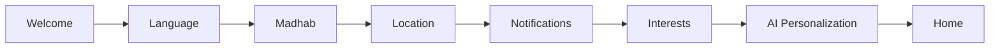

# AhlulBayt+ Onboarding
## UX Specification v1.0

---

## Goals

1. **Orient** — Welcome users to the app's spiritual purpose  
2. **Personalize** — Language, marja, interests, AI topics  
3. **Enable** — Location and notifications for core worship tools  
4. **Respect** — Skip always available on permissions; no dark patterns  

**Target completion time:** 2–3 minutes  
**Steps:** 7  

---

## Flow



| Step | Skippable | Required input |
|------|-----------|----------------|
| Welcome | — | Tap CTA |
| Language | — | Default pre-selected |
| Madhab | — | Default Sistani |
| Location | Yes | — |
| Notifications | Yes | — |
| Interests | — | ≥1 chip |
| AI | — | Toggle optional |

---

## Screen Copy (English)

### 1. Welcome
- **Title:** Welcome to AhlulBayt+  
- **Subtitle:** Your companion for prayer, Quran, and the path of Ahlul Bayt (as).  
- **CTA:** Begin your journey  
- **Verse:** Hadith al-Thaqalayn excerpt  

### 2. Language
- **Title:** Choose your language  
- Options: English · العربية · اردو  

### 3. Madhab / Marja
- **Title:** Your marja al-taqlid  
- Options: Sistani · Khamenei · Shirazi · Local mosque · Unsure  
- **Footer:** Does not issue fatwa  

### 4. Location
- **Title:** Enable location  
- **Skip:** Top-right  
- **Privacy:** Location stays on device  

### 5. Notifications
- **Title:** Stay on time  
- **Preview card:** Dhuhr notification mockup  

### 6. Interests
- **Title:** What matters to you?  
- 8 multi-select chips  

### 7. AI Personalization
- **Title:** AI companion  
- **CTA:** Enter AhlulBayt+  
- **Disclaimer:** Not for fatwa  

---

## Visual Design

- **Shell:** Progress bar (3px), step counter, back/skip header  
- **Animation:** 200ms fade between steps (Reanimated)  
- **Cards:** SelectionCard with radio for single-select  
- **Chips:** InterestChip for multi-select  
- **No illustrations** — typography + subtle icon circles  

---

## Data Persisted

| Field | Store |
|-------|-------|
| `isComplete` | onboardingStore + MMKV |
| `marja` | onboarding → settings |
| `interests` | onboarding → settings |
| `aiEnabled`, `aiTopics` | onboarding → settings |
| `locationGranted` | onboarding |
| `notificationsGranted` | onboarding |

---

## Engineering

```
mobile/src/features/onboarding/
├── OnboardingFlow.tsx
├── components/OnboardingShell.tsx, SelectionCard.tsx
├── steps/*.tsx
├── services/permissions.ts
└── types.ts

app/index.tsx          → redirect
app/onboarding/index.tsx
```

**Replay onboarding:** `useOnboardingStore.getState().resetOnboarding()`

---

*Onboarding UX v1.0 · June 2026*
